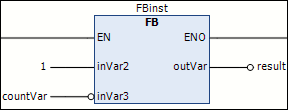
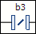
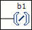

# Negate

## Overview

|  |  |
| --- | --- |
| Symbol |  |
| Shortcut | Ctrl + N |
| Call | * Ladder > Negate menu * Contextual menu |

## Function

The command negates the following elements:

* Input/output of a block
* Jump
* Return
* Coil
* Contact
* Variable

## Requirements

The element to be negated is selected.

## Examples

Negated input and negated output of a function block:

Negated contact:

Negated coil:

EIO0000002860.10