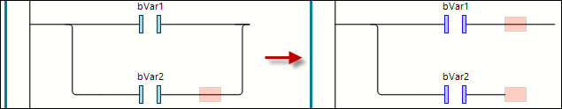

# Open Parallel Branch

## Overview

|  |  |
| --- | --- |
| Symbol |  |
| Shortcut | Ctrl + P |
| Call | * Ladder > Open Parallel Branch menu * Contextual menu |

## Function

The command opens a parallel branch.

## Requirements

One of the two lines of the closed branch that is to be opened is selected.

## Element: Branch

A branch splits the processing line into two or more branches that are executed in succession from top to bottom. You can further branch each branch, which results in multiple branches being created within a network.

A marker symbol (small box) is assigned to each branch at the branch point. Select the marker symbol to perform additional actions/commands for the subnet.

## Examples

EIO0000002860.10