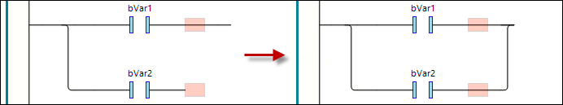

# Close Parallel Branch

## Overview

|  |  |
| --- | --- |
| Symbol |  |
| Shortcut | Ctrl + Shift + P |
| Call | * Ladder > Close Parallel Branch menu * Contextual menu |

## Function

The command closes the open parallel [branch](OpenParaBra-451EBC34.html#OpenParaBra-451EBC34__ElementBranch-45993B1E).

Alternatively, you can close an open branch by dragging the selection marker of one branch to the selection marker of the other branch.

## Requirements

Both lines of the branch to be closed are selected.

## Examples

EIO0000002860.10