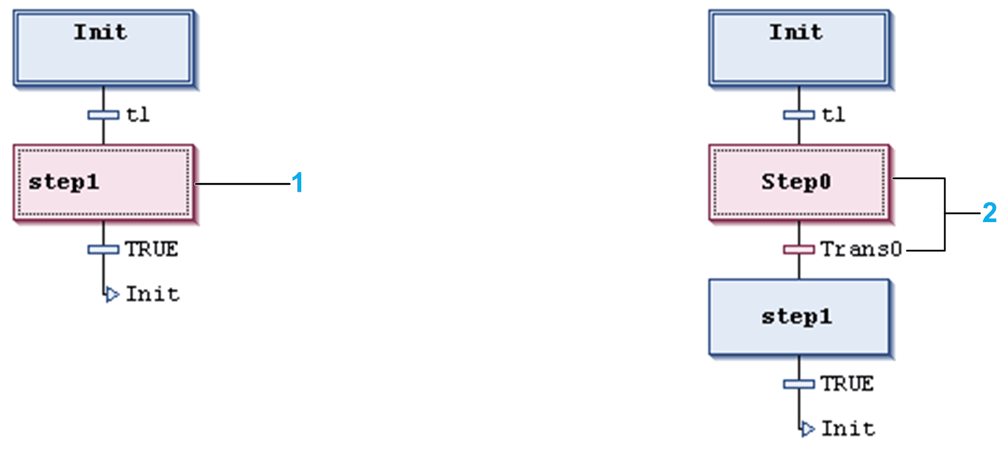
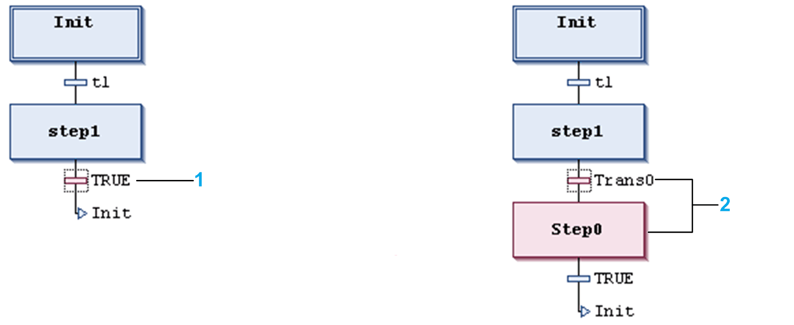

# Insert Step-Transition

## Overview

The SFC Editor > Insert Step-Transition command is used in the SFC editor to insert a [step](../../../../../api/crossBook?lang=en-US&virtualBookName=SoMProg&topicID=D_SE_0083503) and a transition before the currently selected position.

The positioning (sequence) of the new step and transition depends on whether a step or transition has been selected when executing the command. Automatically, the sequence step-transition-step-transition-... will be kept. See the following images for examples:

Step and transition inserted before step:

**1** Step 1 selected --> **Insert Step-Transition**

**2** New step + transition

Step and transition inserted after transition:

**1** Transition TRUE selected --> **Insert Step-Transition**

**2** New step + transition

By default, the new step is named Step<n>. `n` is a running number starting with 0 for the first step which is inserted in addition to the initial step.

The new transition correspondingly by default is named Trans <n>.

To modify the default names, click the name string to make it editable.

EIO0000002860.10