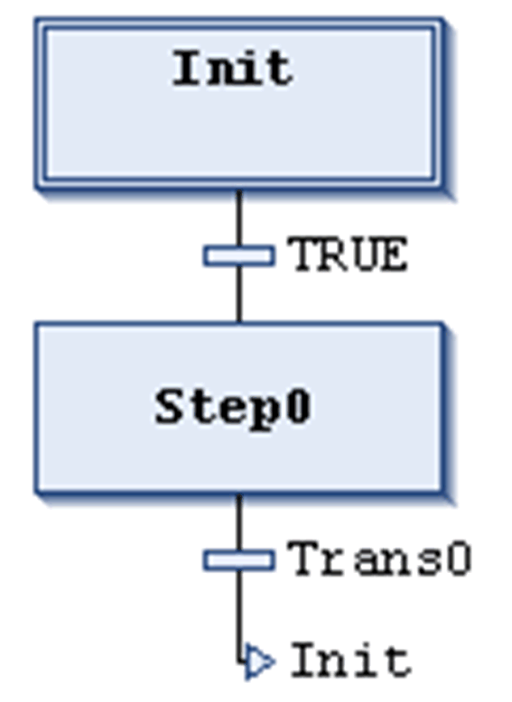

# Insert Step-Transition After

## Overview

The SFC Editor > Insert Step-Transition After command is used in the SFC editor to insert a [step](../../../../../api/crossBook?lang=en-US&virtualBookName=SoMProg&topicID=D_SE_0083503) and a transition after the currently selected step or transition.

The positioning (sequence) of the new step and transition depends on whether a step or transition has been selected when executing the command. Automatically, the sequence step-transition-step-transition... will be kept.

In this example, the new step and transition are placed after transition TRUE, which had been selected when executing the Insert Step-Transition After command.

By default, the new step is named Step<n> whereby n is a running number starting with 0 for the first step which is inserted in addition to the initial step.

The new transition correspondingly by default is named Trans<n>.

To modify the default names, click the name string to make it editable.

EIO0000002860.10