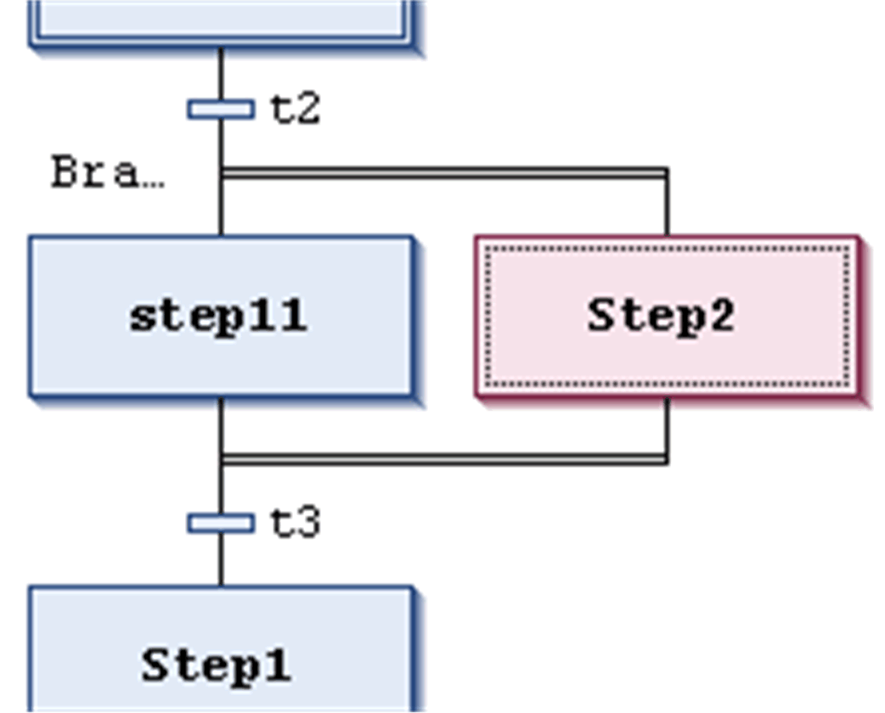
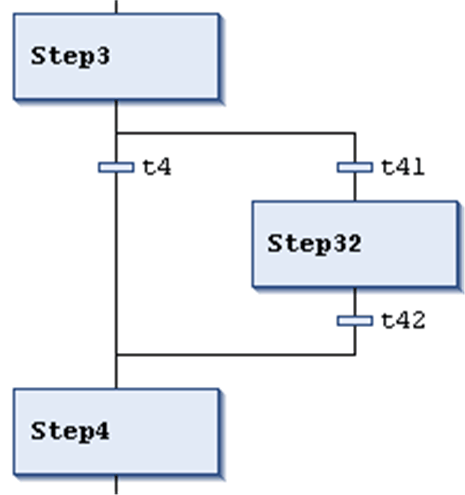

# Insert Branch / Insert Branch Right

## Insert Branch

The SFC Editor > Insert Branch command is used in the SFC editor to insert a [branch](../../../../../api/crossBook?lang=en-US&virtualBookName=SoMProg&topicID=D_SE_0083503) left to the currently selected elements.

## Insert Branch Right

The SFC Editor > Insert Branch Right command is used in the SFC editor to insert a [branch](../../../../../api/crossBook?lang=en-US&virtualBookName=SoMProg&topicID=D_SE_0083503) right to the currently selected elements. (To insert it to the left to the currently selected step, use the command Insert Branch).

* If the uppermost element of the current selection is a transition or an alternative branch, an [alternative branch](../../../../../api/crossBook?lang=en-US&virtualBookName=SoMProg&topicID=D_SE_0083503) will be created.
* If the uppermost element of the current selection is a step, a macro, a jump, or a parallel branch, a [parallel branch](../../../../../api/crossBook?lang=en-US&virtualBookName=SoMProg&topicID=D_SE_0083503) with label Branch<x> will be inserted. This is a default label name where `x` is a running number. You can edit the label name. The branch label can be used as a [jump](../../../../../api/crossBook?lang=en-US&virtualBookName=SoMProg&topicID=D_SE_0083503) target.
* If a common element of an existing branch is selected (horizontal line), the new branch will be added to the existing branches on the rightmost position. If a complete arm of an existing branch is selected (horizontal line), the new branch will be added directly to the right of this one.

NOTE: You can transform branches by executing the [commands](D-SE-0084155.html#D-SE-0084155) Alternative and Parallel.

## Parallel Branch Example

In the following image, see a new parallel branch, created by the command Insert branch right when step11 was selected. Automatically, a step (Step2 in the example) will be inserted.

Processing in online mode: When t2 is TRUE, Step2 will be executed immediately after step11 before t3 is noticed.

Therefore, both branches will be executed, in contrast to alternative branches.

Parallel branch

## Alternative Branch Example

In the following image, see a new alternative branch, created by the command Insert branch right when transition t4 was selected. Automatically, a step (Step32) and a preceding and a subsequent transition (t41, t42) will be inserted.

Processing in online mode: When Step3 is active, the following transitions (t4, t41) will be checked from left to right. The first branch whose transition is found to be TRUE, will be executed.

Therefore, only 1 branch is executed, in contrast to parallel branches.

Alternative branch

EIO0000002860.10