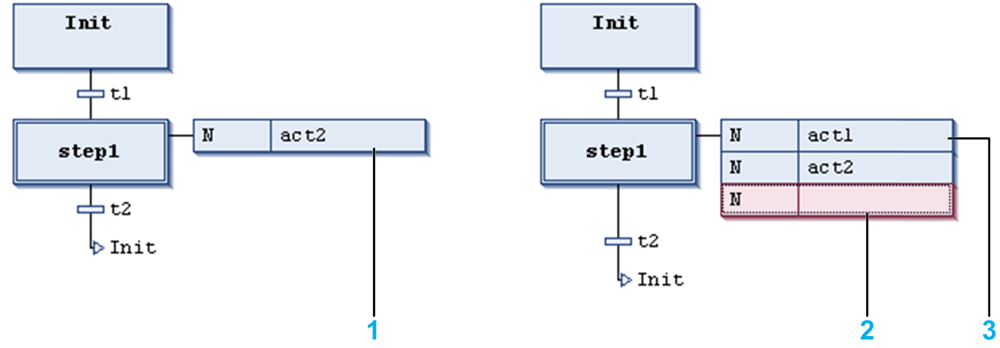

# Insert Action Association / Insert Action Association After

## Insert Action Association

The SFC Editor > Insert Action Association command is used in the SFC editor to associate an [action](../../../../../api/crossBook?lang=en-US&virtualBookName=SoMProg&topicID=D_SE_0083503) to a step.

Select the desired step and execute the command. The action box will be inserted right to the step box.

If already one or several actions are associated with a step, the new action element will be placed:

* as the first action (upper position) for the step if the step has been selected when executing the insert command.
* directly before the action, which was selected when executing the insert command.

The left part of an action box contains the action qualifier, by default N. In the right part, enter an action name. For this purpose, click the field to open an edit frame. The action has to be available in the project. For creating a new action, refer to the [**Add Object** command](D-SE-0083962.html#D-SE-0083962).

The qualifier can also be edited inline. For valid qualifiers, refer to the chapter [*Qualifier for Actions in SFC*](../../../../../api/crossBook?lang=en-US&virtualBookName=SoMProg&topicID=D_SE_0083504).

Actions associated to a step

**1** Action `act2` associated to step 1.

**2** Action associated for step 1.

**3** New action associated after.

## Insert Action Association After

The SFC Editor > Insert Action Association After command is used in the SFC editor to associate a further [action](../../../../../api/crossBook?lang=en-US&virtualBookName=SoMProg&topicID=D_SE_0083503) to a step after an existing one.

The difference to the Insert Action Association command is that with command Insert ...after the new action will not be positioned at the first, but at the last position of the action list. It. will not be positioned above, but below the action currently selected in this list.

EIO0000002860.10