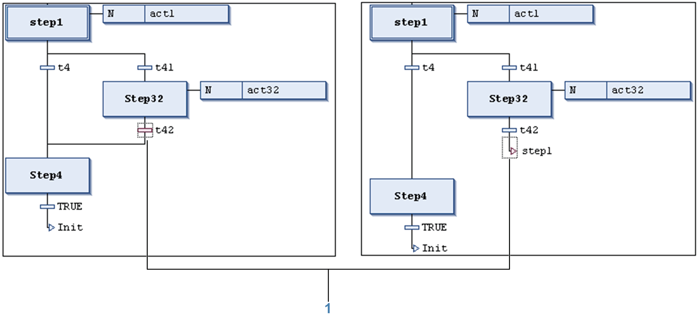

# Insert Jump / Insert Jump After

## Insert Jump

The SFC Editor > Insert Jump command is used in the SFC editor to insert a [jump element](../../../../../api/crossBook?lang=en-US&virtualBookName=SoMProg&topicID=D_SE_0083503) before the currently selected element.

The new jump is automatically provided with a step specifying the target of the jump. Replace this string by the name of a step or by the label of a [parallel branch](../../../../../api/crossBook?lang=en-US&virtualBookName=SoMProg&topicID=D_SE_0083503) which should be jumped to.

## Insert Jump After

The SFC Editor > Insert Jump After command is used in the SFC editor to insert a [jump element](../../../../../api/crossBook?lang=en-US&virtualBookName=SoMProg&topicID=D_SE_0083503) after the currently selected element.

Only use jumps at the end of an [alternative branch](../../../../../api/crossBook?lang=en-US&virtualBookName=SoMProg&topicID=D_SE_0083503).

The new jump is automatically provided with a step specifying the target of the jump. Replace this string by the name of a step or by the label of a [parallel branch](../../../../../api/crossBook?lang=en-US&virtualBookName=SoMProg&topicID=D_SE_0083503) which should be jumped to.

**1** **Insert Jump After**

EIO0000002860.10