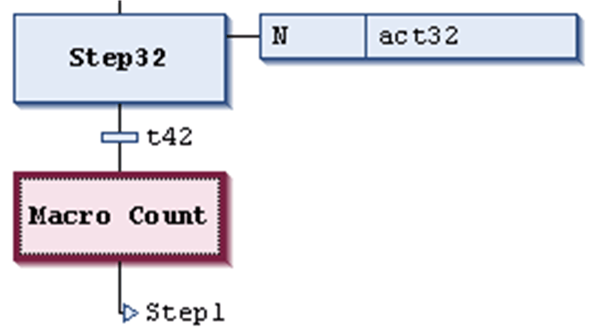

# Insert Macro / Insert Macro After

## Insert Macro

The SFC Editor > Insert Macro command is used in the SFC editor to insert a [macro box](../../../../../api/crossBook?lang=en-US&virtualBookName=SoMProg&topicID=D_SE_0083503) before the currently selected position in the diagram. By default, the macro name Macro<x> will be entered in the box, whereby x is a running number. You can edit the macro name.

To edit or view a macro, open the macro editor with the Zoom into macro [command](D-SE-0084160.html#D-SE-0084160__D-SE-0084160.2).

Macro (selected) in SFC diagram

## Insert Macro After

The SFC Editor > Insert Macro After command is used in the SFC editor to insert a [macro](../../../../../api/crossBook?lang=en-US&virtualBookName=SoMProg&topicID=D_SE_0083503) after the currently selected position in the diagram.

EIO0000002860.10