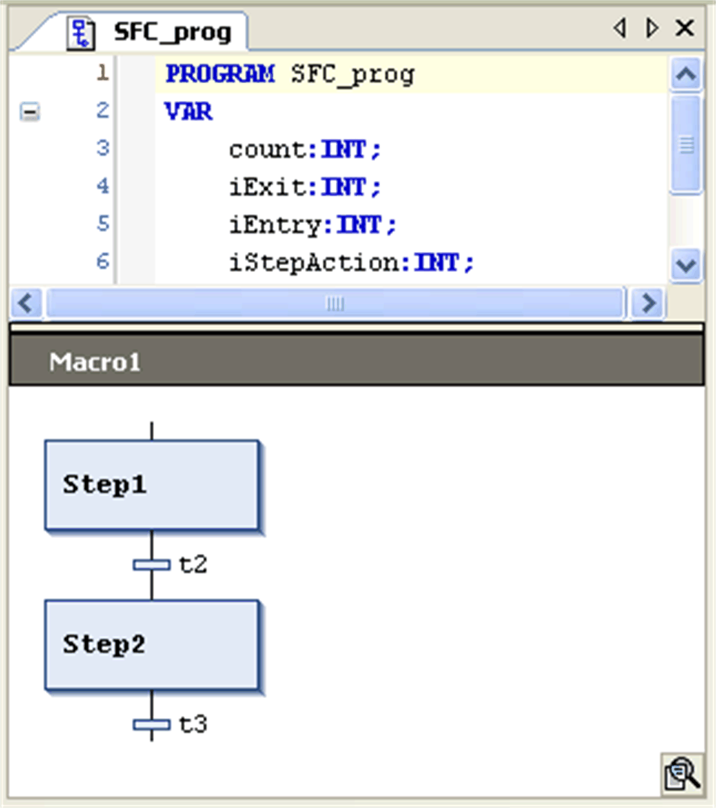

# Zoom Into Macro / Zoom out of Macro

## Zoom Into Macro

The SFC Editor > Zoom Into Macro command is used in the SFC editor to zoom into a [macro](../../../../../api/crossBook?lang=en-US&virtualBookName=SoMProg&topicID=D_SE_0083503) that is to open the macro editor view.

Select the macro box in the SFC diagram and execute the command. The main SFC editor view will disappear and the macro editor will be opened instead. Here you can edit or view the section of the chart which is represented by the macro box in the main SFC view. The zoom button is available in the lower right corner of the editor view.

To return to the SFC standard view, execute the command Zoom out of Macro.

Macro editor view

## Zoom out of Macro

The SFC Editor > Zoom out of Macro command is used in the SFC editor to close the macro editor that has been opened via the Zoom Into Macro command, returning to the main SFC editor view. The command can be used in offline and online mode.

EIO0000002860.10