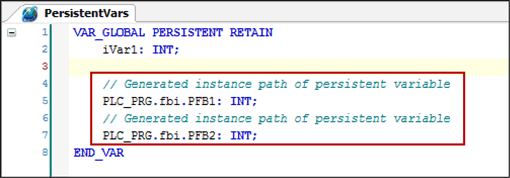

# Commands of the Persistent Variable Editor

## Add all Instance Paths

The Add all Instance Paths command scans the application for [persistent variables](../../../../../api/crossBook?lang=en-US&virtualBookName=SoMProg&topicID=D_SE_0083430) declared via `VAR_PERSISTENT` and adds the instance path of the persistent variables to the persistent variable list.

It helps to find persistent variables that are declared outside the persistent variable list.

NOTE: When a variable is added by using the command Add all Instance Paths, it will consume memory a second time and demand more cycle time. Therefore, it is a good practice to declare persistent variables in the persistent variable list only.

Instance path of persistent variables:

## Reorder List and Clear Gaps

The Reorder List and Clear Gaps command removes the gaps that can result from modifications in the declaration of persistent variables. Removing these gaps reduces memory consumption. It shifts persistent variables to new addresses. Thus, these variables will be reinitialized. When the command is executed, a message is displayed informing you that variable values may be lost.

| WARNING | |
| --- | --- |
|  | UNINTENDED EQUIPMENT OPERATION  Fully debug, verify, and validate the functionality of the program before putting it into service.  Failure to follow these instructions can result in death, serious injury, or equipment damage. |

To restore the values of persistent variables, execute the command Save Current Values to Recipe before executing the command Reorder List and Clear Gaps. This gives you the possibility to load these values to the controller after the next download by executing the command Restore Values From Recipe.

## Save Current Values to Recipe

The Save Current Values to Recipe command is available in online mode. It creates a recipe definition in the recipe manager and saves the present values of the persistent variables. To restore the values, execute the command Restore Values from Recipe.

NOTE: Before you clear gaps by executing the command Reorder List and Clear Gaps, execute this command to help to avoid data loss.

If you save a persistent variable list, and a list with corresponding variables already exists in the recipe manager, the persistent variables are treated as follows:

* New persistent variables are added to the list.
* Variables that are not in the persistent variable list are deleted.

You can therefore add more recipes to the list in the recipe manager. These recipes will be retained.

NOTE: If you add new variables to the list, they will be deleted the next time the command Save Current Values to Recipe is executed.

## Restore Values from Recipe

The Restore Values from Recipe command is available in online mode. It can be used to restore the values which have been saved to a recipe by executing the command Save Current Values to Recipe. It can be used after a Reorder List and Clear Gaps command.

EIO0000002860.10