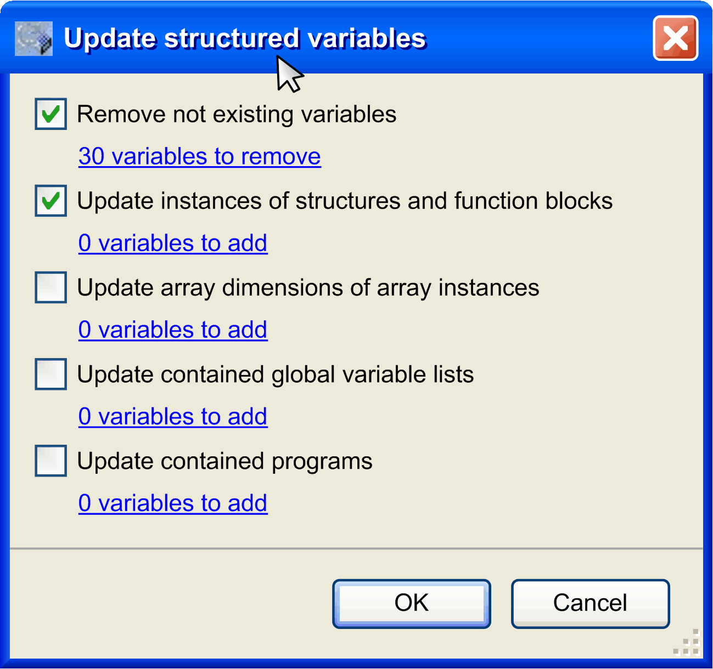

# Commands of the Recipe Manager Editor

## Recipe Commands

The recipe commands are available in the contextual menu and by default in the Recipes menu when a recipe definition is open in an editor view.

## Insert Variable

The Insert Variable command automatically inserts a variable in the opened recipe definition. The default string NewVariable is entered in the Variable column. Replace it by a valid variable name. The Input Assistant is available via the ... button.

Alternatively, you can enter a variable directly in the table cell.

## Add a New Recipe

The command Add a New Recipe is used to add a [new recipe](../../../../../api/crossBook?lang=en-US&virtualBookName=SoMProg&topicID=D_SE_0083555) to the active recipe definition table. The dialog box New Recipe opens where you have to enter the recipe name as a string. If you want to copy the values or an existing recipe, choose the desired one from the Copy from existing list.

NOTE: A new recipe can also be created in online mode via an appropriately configured visualization element with input configuration.

## Remove Recipes

The command Remove Recipes is used to remove an existing recipe from the active [recipe definition table](../../../../../api/crossBook?lang=en-US&virtualBookName=SoMProg&topicID=D_SE_0083555).

Select one of the fields in the column describing the respective recipe and execute the command. The column is removed.

NOTE: A recipe can also be removed in online mode via an appropriately configured visualization element with input configuration.

## Load Recipe

The command Load Recipe is used to load a recipe from a file.

Select one of the fields in the recipe column of a recipe definition and execute the command. The values of the selected recipe of the recipe definition are overwritten.

NOTE: If you have selected the option Recipe Management in the plc, an online change is required when you log in after you have changed recipes in the project by executing the command Load Recipe or Read Recipe.

In order to overwrite the values of individual recipe variables, remove the values for the other variables of the recipe file before loading it. Entries without value definitions are not read. Thus, these variables are left unchanged in the project (and on the controller).

The example shows a recipe file that will only modify the value of the variable PLC\_PRG.iVar to `6` when it is loaded:

```
PLC_PRG.bVar:=
PLC_PRG.iVar:=6
PLC_PRG.dwVar:=
PLC_PRG.stVar:=
PLC_PRG.wstVar:=
```

## Save Recipe

The command Save Recipe is used to save the variable values of a recipe to a file.

Select a value of a recipe in the recipe definition and execute the command. You can define the format of the file in the Storage tab of the Recipe Manager [editor](../../../../../api/crossBook?lang=en-US&virtualBookName=SoMProg&topicID=D_SE_0083554).

## Read Recipe

The command Read Recipe is used to read the variable values of a recipe from the controller.

If your application is in online mode, select the value of a recipe in the recipe definition and execute the command. The values of the selected recipe are overwritten by the values read from the controller.

NOTE: If you have selected the option Recipe Management in the plc, an online change is required when you log in after you have changed recipes in the project by executing the command Load Recipe or Read Recipe.

## Write Recipe

The command Write Recipe is used to write the values of a recipe to the variables in the controller.

If your application is in online mode, select the value of a recipe in the recipe definition and execute the command. The values in the controller are overwritten by the values of the selected recipe.

## Load and Write Recipe

The command Load and Write Recipe is used to load a recipe from a file and to write the values to the variables in the controller.

If your application is in online mode, select the value of a recipe in the recipe definition and execute the command. You are prompted to select either to write the variable values only to the controller or also to the recipe in the project. Updating the values in the project recipe could require an online change when logging in again.

Depending on your choice, the values of the selected recipe of the recipe definition are overwritten. Additionally, these recipe values overwrite the variable values in the controller.

In order to overwrite the values of individual recipe variables, remove the values for the other variables of the recipe file before loading it. Entries without value definitions are not read. Thus, these variables are left unchanged on the controller and in the project.

The example shows a recipe file that will only modify the value of the variable PLC\_PRG.iVar to `6` when it is loaded:

```
PLC_PRG.bVar:=
PLC_PRG.iVar:=6
PLC_PRG.dwVar:=
PLC_PRG.stVar:=
PLC_PRG.wstVar:=
```

## Read and Save Recipe

The command Read and save Recipe is used to read the variable values of a recipe from the controller and to save them to a file.

If your application is in online mode, select the value of a recipe in the recipe definition and execute the command. You are prompted either to read the variable values to the recipe or only to save them to a file. Updating the values in the recipe could require an online change when logging in again.

The values are saved with the default name for recipe files according to the settings in the Storage tab of the Recipe Manager [editor](../../../../../api/crossBook?lang=en-US&virtualBookName=SoMProg&topicID=D_SE_0083554).

## Remove Variables

The command Remove Variables removes the selected variables from the active [recipe definition table](../../../../../api/crossBook?lang=en-US&virtualBookName=SoMProg&topicID=D_SE_0083555).

By default, the command is not available in the menus. You can add this command via the Tools > Customize [menu](D-SE-0084066.html#D-SE-0084066).

## Upload Recipes from Device

The command Load recipes from device is used to initiate the synchronization of the recipes from the open recipe definition in the project and the recipes saved on the controller as recipe files.

If your application is in online mode and a recipe definition is open in the editor, execute the command.

The synchronization process consists of the following steps:

* The values for the recipe variables located in the project are overwritten by the values from the recipes on the controller. This may require an online change at the next login.
* If recipe variables are defined in the recipe files on the controller, and these recipe variables are not available in the recipe definition of the project, then these variables are ignored for the upload. A message is generated for each recipe file indicating the variables that are not available.
* If recipe variables are not available in the recipe files on the controller, but these recipe variables are included in the recipe definition of the project, then a message is generated for each recipe file indicating the variables that are not available.
* If more recipes for the variables are detected on the controller, then these new recipes are added to the recipe definition in the project.

## Update Structured Variables

The command Update structured variables can be used to update a recipe definition in case the declaration of a structured variable or function block is modified, which had been inserted in the recipe definition as an instance (refer to the Insert Variable command of the Recipes menu). If you have, for example, changed the dimension of an array, then the respective entries in the recipe definition can be automatically removed or added.

The command opens the Update structured variables dialog box that allows you to enable or disable update measures:



The following options are possible. Click the info text available for each option to open a dialog box listing the variables:

| Option | Description |
| --- | --- |
| Remove not existing variables | Variables which are not part of the project due to a modification of the structured element, are removed from the recipe definition. |
| Update instances of structures and function blocks | If the declaration of a structure or a function block, the instance of which is represented in the recipe definition, is extended, then the respective variables are added to the recipe definition. |
| Update array dimensions of array instances | If the dimension of an array, the instance of which is represented in the recipe definition, is extended, then the concerned variables are added to the recipe definition. |
| Update contained global variable lists | If the declaration of a global variable list, the instance of which is represented in the recipe definition, is extended, then the concerned variables are added to the recipe definition. |
| Update contained programs | If the declaration of a program, the instance of which is represented in the recipe definition, is extended, then the concerned variables are added to the recipe definition. |

EIO0000002860.10