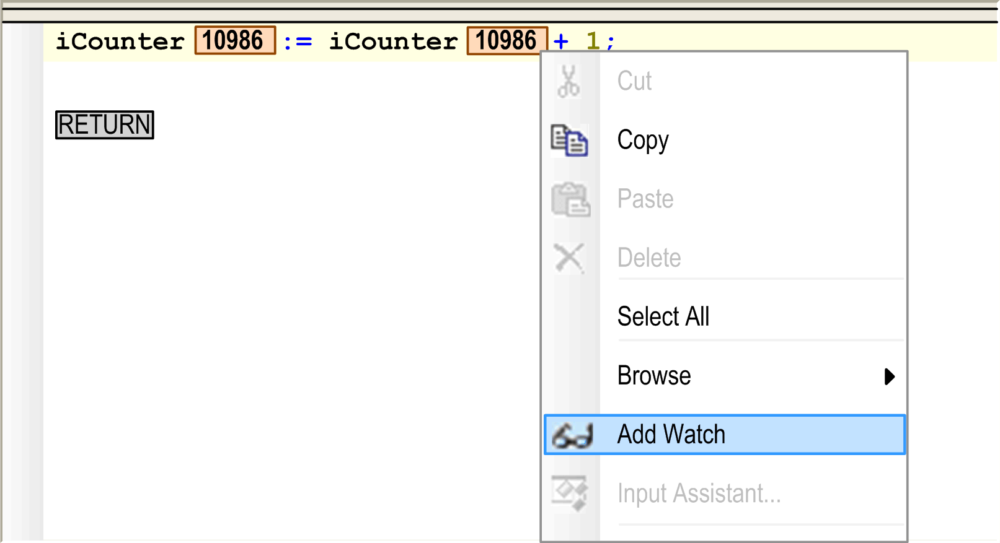

# Add Watch

## Overview

The Add Watch command of the contextual menu is only available in online mode. It can be used in each language editor view when the cursor is currently positioned on an identifier. It will add the expression to the currently active Watch view. If no Watch view is open, the expression will be added to the Watch 1 view. If an expression is already part of the Watch view, the existing item will be selected.

Add Watch command

EIO0000002860.10