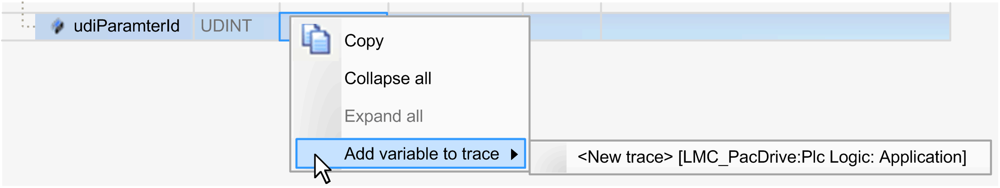
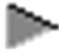

# Commands for Running the Trace

## General Information on Running Traces

If PC processor-consuming tasks are executed in EcoStruxure Machine Expert or on the PC running EcoStruxure Machine Expert while a trace is running, it may happen that variable values are not captured by the trace.

| NOTICE | |
| --- | --- |
|  | LOSS OF DATA  Avoid executing actions and/or PC applications that lead to a high processor load while running a trace.  Failure to follow these instructions can result in equipment damage. |

## Add Variable to Trace

The Add variable to trace command is available in the contextual menu that opens upon right-clicking a variable in a [logic editor](../../../../../api/crossBook?lang=en-US&virtualBookName=SoMProg&topicID=D_SE_0083457) or in the declaration part. It allows you to add the selected variable to one of the already available traces or to a new trace.

Additionally the Add variable to trace command is available as a contextual menu in Watch List views, parameter editor, I/O module mapping editor, or from a function block instance editor.

The table describes how to create a new trace:

| Step | Action |
| --- | --- |
| 1 | In the contextual menu, select the Add variable to trace command and <New trace>.  Result: The Create new trace dialog opens: |
| 2 | Enter a Trace name and click OK. The OK button is only enabled when the Trace name is valid. |

If you want the variable name to be displayed in the contextual menu, hold down the Ctrl key while opening the contextual menu.

For more information, refer also to *Creating a Trace Object* in the online help.

The Add variable to trace contextual menu is not displayed for the following not traceable expressions:

* Variables in function blocks in offline mode
* Structures that combine variables as a parent
* Strings
* Pointer
* Date
* Time
* Arrays
* User defined
* Not traceable parameters

NOTE: You may add a variable that may not be traceable once you download the trace to the controller. In this case, the message The variable is not traceable. appears. You have to remove the variable in order to use the trace.

## Add Variable

The Add Variable command is available in the Trace menu (that is only visible if you are working in the [trace editor](../../../../../api/crossBook?lang=en-US&virtualBookName=SoMProg&topicID=D_SE_0083557)). It opens the Trace Configuration > Variable Settings [dialog box](../../../../../api/crossBook?lang=en-US&virtualBookName=SoMProg&topicID=D_SE_0083562) that allows you to add a new variable.

## Download Trace

The Download Trace command is available in the Trace menu (that is only visible if you are working in the [trace editor](../../../../../api/crossBook?lang=en-US&virtualBookName=SoMProg&topicID=D_SE_0083557)). It will download the trace configuration in order to get the tracing activated on the device runtime system. This is necessary for the first tracing and possibly later after changes in the trace configuration or the application program. For further information, refer to [chapter *Trace Editor in Online Mode*](../../../../../api/crossBook?lang=en-US&virtualBookName=SoMProg&topicID=D_SE_0083568).

## Start/Stop Trace

The Start/Stop Trace command is available in the Trace menu (that is only visible if you are working in the [trace editor](../../../../../api/crossBook?lang=en-US&virtualBookName=SoMProg&topicID=D_SE_0083557)). It toggles between start and stop tracing.

If tracing is stopped, the  symbol is shown. Executing the command restarts the tracing. Thus, the data capturing starts on the run time system again and the current values are shown in the trace editor.

If tracing is running, the  symbol is shown. Executing the command stops the tracing on the run time system and the last captured values are shown in the trace editor.

## Reset Trigger

The Reset Trigger command is available in the Trace menu (that is only visible if you are working in the [trace editor](../../../../../api/crossBook?lang=en-US&virtualBookName=SoMProg&topicID=D_SE_0083557)). It will reset the trigger, thus the trace is restarted after the trigger has fired.

## Configuration

The Configuration command is available in the Trace menu (that is only visible if you are working in the [trace editor](../../../../../api/crossBook?lang=en-US&virtualBookName=SoMProg&topicID=D_SE_0083557)). It opens the Trace Configuration > Record Settings [dialog box](../../../../../api/crossBook?lang=en-US&virtualBookName=SoMProg&topicID=D_SE_0083563).

## Pin cursors to values

The Pin cursors to values option is available in the Trace menu (that is only visible if you are working in the [trace editor](../../../../../api/crossBook?lang=en-US&virtualBookName=SoMProg&topicID=D_SE_0083557)). If the option is activated, the cursor is pinned to the nearest trace value if you move the cursor (with the mouse) in the trace editor and release the mouse button.

EIO0000002860.10