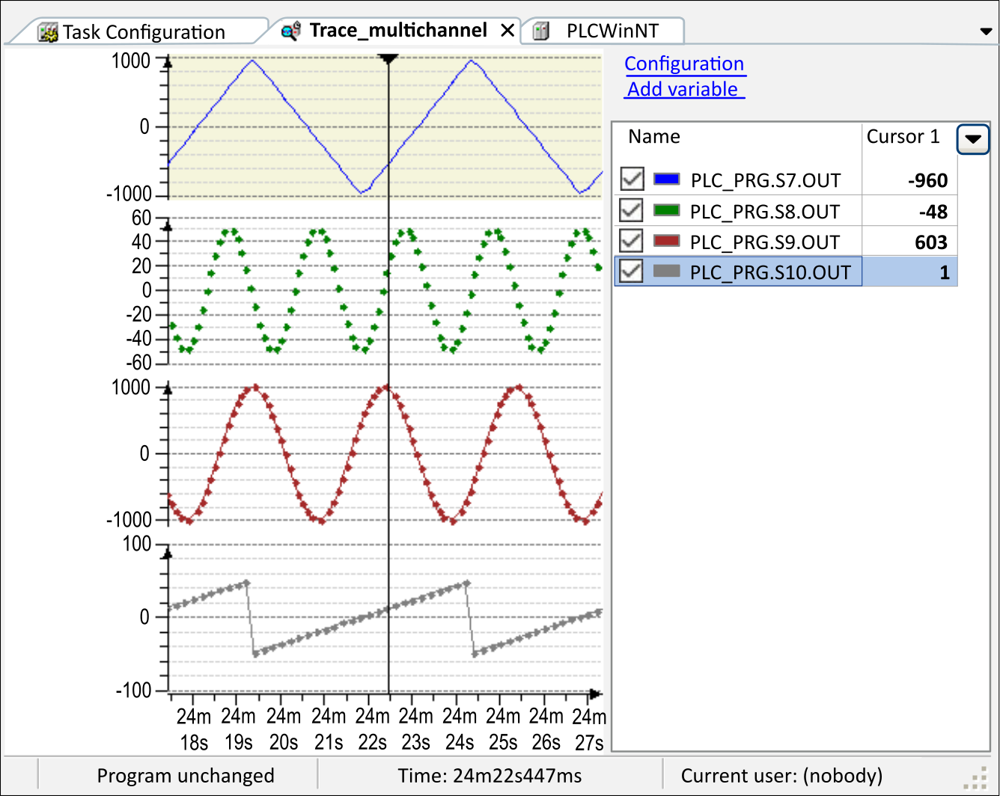
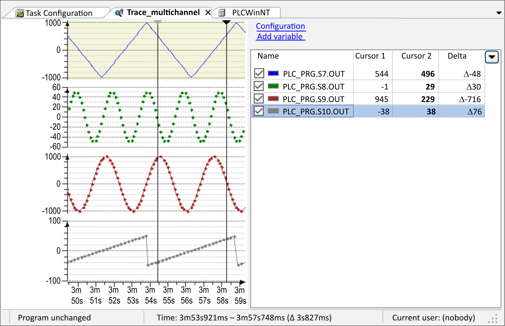
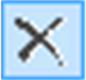
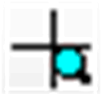
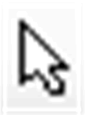
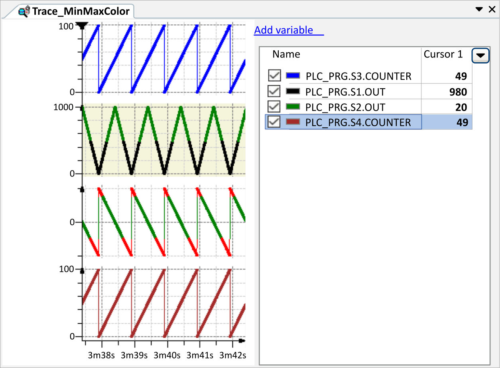
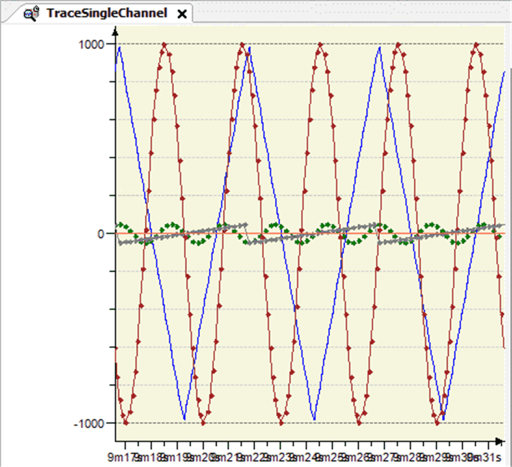

# Commands for Customizing the View of Graphs

## Cursor

The Cursor command is available in the Trace menu, in the contextual menu of the trace diagram, or it is part of the trace toolbar.

Execute the Cursor command to achieve the following:

* A cursor will be available in the trace diagram if previously no cursor has been available.
* Two cursors will be available in the trace diagram if previously one cursor has been available.
* The two cursors will be removed if previously two cursors have been available.

For a list of keyboard shortcuts, refer to the chapter [*Keyboard Operations for Trace Diagrams*](../../../../../api/crossBook?lang=en-US&virtualBookName=SoMProg&topicID=D_SE_0083569).

**One trace cursor**

Trace diagram with one cursor

A trace cursor is visualized by a black triangle at the top of the diagram and a fine black line, which ends at the bottom of the diagram. The Y-value of each trace variable, where the trace cursor crosses the trace graphs, is listed in the right part of the editor under the associated trace variable. The associated time value is displayed in the status line.

**Two trace cursors**

Trace diagram with two cursors

If there are 2 cursors, then 1 is selected, the other is grayed. The Y-values of each trace variable, where the two trace cursors cross the trace graph, are listed in the right part of the editor under the associated trace variable. Additionally, the difference between them is calculated and displayed next to them after the delta symbol. The associated time values of both cursors and their time difference shown in parentheses are displayed in the status bar.

**No trace cursor**

Status line: Time and Y-value of the present mouse cursor position

If there are no trace cursors in the diagram, then not only the time value but also the Y-value of the mouse cursor is displayed in the status line.

**Move trace cursor**

For information about moving the trace cursor, refer to the chapter [*Keyboard Operations for Trace Diagrams*](../../../../../api/crossBook?lang=en-US&virtualBookName=SoMProg&topicID=D_SE_0083569).

**Remove trace cursors**

If there are 2 cursors, execute the Cursor command, then both are removed. Press the DEL key, or click the  button to remove only the selected cursor with the black triangle.

## Mouse Zooming

The Mouse Zooming command is available in the Trace menu, in the contextual menu of the trace diagram, or it is part of the trace toolbar.

Executing the Mouse Zooming command changes the state of the command between

* Enabled and
* Disabled.

If the Convert to multi-channel command is enabled, then Mouse zooming is disabled and grayed and its state cannot be changed.

For a list of keyboard shortcuts, refer to the chapter [*Keyboard Operations for Trace Diagrams*](../../../../../api/crossBook?lang=en-US&virtualBookName=SoMProg&topicID=D_SE_0083569).

**Mouse zooming enabled**

The mouse zooming command is enabled and the shape of the mouse cursor in the trace diagram is . Then you can draw a rectangle in the trace window in order to redefine the area of the trace curves to be displayed. When you release the mouse button, the diagram in time- and Y-axis is zoomed to a degree so that the contents of the rectangle fills the entire diagram.

To reset the view, execute the command Reset View.

**Mouse zooming disabled**

The mouse zooming command is disabled and the shape of the mouse cursor in the trace diagram changes to . Then you can shift the trace graph by drag and drop along the time axis while the shape of the cursor is .

To reset the view, execute the command Reset View.

## Reset View

The Reset View command resets the view to its default settings after they have been changed, for example by zooming.

## AutoFit

Execute the AutoFit command from the Trace menu or from the contextual menu to scale the graph of the signal along the Y-axis in a way that the Y-values fit in the coordinate system. After it has been selected, the command is displayed with a check mark in the menu. To deselect and return to the originally configured fixed display, click the command again.

The following prerequisites must be fulfilled for the command to be selectable:

* A trace has been created.
* A fixed scale is defined for the Y-axis (the Y-axis is not auto-scaled).
* The Download Trace command has been executed.
* The trace is running.

In multi-channel mode, only the scaling of the Y-axis of the selected graph is relevant for the AutoFit command.

## Compress

The Compress command enlarges the time range shown in the trace editor by a fixed percentage. The trace graph will be compressed. Multiple execution of the command is possible.

This command is the counterpart to Stretch.

## Stretch

The Stretch command scales up the time range shown in the trace editor by a fixed percentage. The graph is stretched. Multiple execution of the command is possible.

This command is the counterpart to Compress.

## Move all variables to individual diagrams

The Move all variables to individual diagrams command moves every variable of the trace into its own diagram with an identical time (X-) axis. Zooming and scrolling commands are affecting the X-axes of all diagrams simultaneously. Default view is a diagram with one X- and Y-axis and all variables are visualized there.

Trace in multi channel mode

For a list of keyboard shortcuts, refer to the chapter [*Keyboard Operations for Trace Diagrams*](../../../../../api/crossBook?lang=en-US&virtualBookName=SoMProg&topicID=D_SE_0083569).

## Move all variables to first diagram

The Move all variables to first diagram command moves every variable of the trace into the first diagram, with an identical time (X-) axis and Y-axis. The other existing diagrams are deleted.

This is the default view of a trace.

Trace in single channel mode

EIO0000002860.10