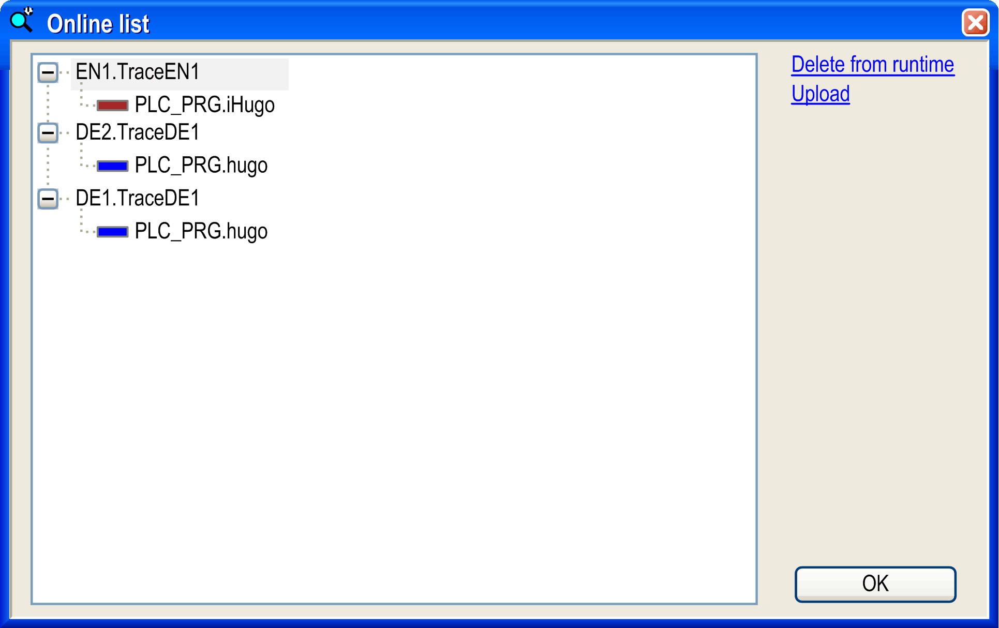

# Commands for Access to Traces Stored on the Runtime System

## Online List

The Online List command opens a dialog box listing the traces existing on the device. If the trace object is placed under an application, the traces running under this application are listed. If the trace object is placed under the device (DeviceTrace), the traces of the applications below are listed and, additionally, the vendor-specific traces implemented in the device.

Online list dialog box

Delete from runtime: With this command, the selected trace is removed.

Upload: With this command, the selected trace is uploaded from the runtime system.

The Online List command is only available when tracing is performed in the runtime system component CmpTraceMgr.

NOTE: The connection to the controller is terminated when the last open DeviceTrace editor is closed. In order for device traces to be displayed again in the project, you have to reload them into the DeviceTrace objects. To definitely terminate the connection to the controller, close the editor. Logging out does not terminate the connection.

## Upload Trace

The Upload Trace command will upload existing traces. If the trace object is positioned below an application, the runtime system trace with the same name as the trace object will be uploaded into the trace editor, overwriting the current trace configuration and samples. If the trace object is positioned below a device (DeviceTrace), any trace running in the runtime system can be uploaded.

The extended name with instance path provides non-ambiguous names (for example, *Application.Trace.MyRecord*).

NOTE: The Upload Trace command copies the number of samples configured with the parameter [Recommended runtime buffer size (samples) in the Advanced Trace Settings dialog box](../../../../../api/crossBook?lang=en-US&virtualBookName=SoMProg&topicID=D_SE_0083564).

The Upload Trace command is only available when tracing is performed in the runtime system component CmpTraceMgr.

NOTE: The connection to the controller is terminated when the last open DeviceTrace editor is closed. In order for device traces to be displayed again in the project, you have to reload them into the DeviceTrace objects. To definitely terminate the connection to the controller, close the editor. Logging out does not terminate the connection.

EIO0000002860.10