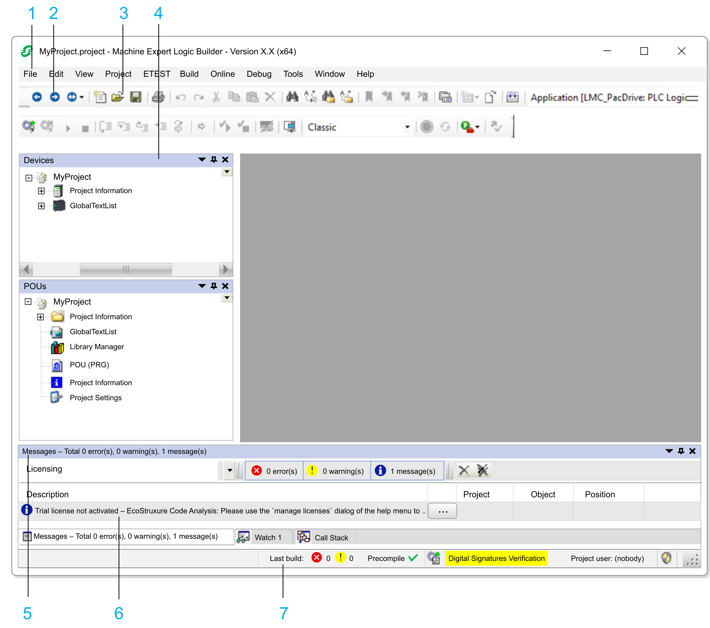

# Elements of the Logic Builder Screen

## Overview

Logic Builder consists of the following elements:

* Menus and toolbars
* Navigator views
* Catalog views
* Main editor pane

When you open the Logic Builder, it provides a default screen layout. This document describes the default positions.

You can adapt the elements according to your individual requirements as described in the [*Customizing the User Interface* chapter](D-SE-0083359.html#D-SE-0083359). You can see and modify the present settings in the Customize dialog box. It is by default available in the Tools menu.

You can also arrange the views and windows by shifting, docking/undocking views, resizing or closing windows. The positions are saved with the project. When you reopen a project, the elements are placed at the positions where they were when the project was saved. The positions of views are saved separately in [perspectives](D-SE-0083359.html#D-SE-0083359__D-SE-0083359.6).

## Default Logic Builder Screen

Default positions of menus, bars, and views on the Logic Builder screen

**1** Menu bar

**2** Buttons for navigation within editors

**3** Toolbar

**4** Multi-tabbed **Navigators**: **Devices tree, Tools tree, Applications tree, Functional tree**

**5** **Messages** view

**6** Information bar

**7** Status bar

## Default Components

The Logic Builder screen contains the following components that are visible by default:

| Component | Description |
| --- | --- |
| Menu bar | Provides menus which contain the available commands as defined in the Tools > Customize dialog box. |
| Buttons for navigation within editors | Three buttons for navigating within editor views:   * Navigate backward: Allows you to jump to the last cursor position within an editor view. As a history of last cursor positions is stored, click the button again to move to previous positions. * Navigate forward: Allows you to move forward in the history of cursor positions within editor views. * Navigate to: Click to open the list of last visited editor views. If supported by the editor, position data (such as line and column in the declaration or implementation part of a logic editor) is provided. Select an entry to open the editor with the cursor being placed at the position that is indicated. Editors that do not support position data, open at a random cursor position. |
| Toolbar | Contains buttons to execute the available tools as defined in the Tools > Customize dialog box. |
| Multi-tabbed Navigators | The following Navigators are available as tabs where the different objects of a project are organized in a tree structure:   * Devices tree * Applications tree * Tools tree * Functional tree   For further information, refer to the chapter [*Multi-Tabbed Navigators*](D-SE-0083356.html#D-SE-0083356). |
| Messages view | Provides messages on precompile, compile, build, download operations. Refer to the description of the Messages [view commands for details](../../../../../api/crossBook?lang=en-US&virtualBookName=SoMMenu&topicID=D_SE_0083911). |
| Information bar of the Messages view | Provides information messages, for example on the license status. |
| Status bar | Provides the following information:   * Information about the user account. * Information about the editing mode and position if an editor is open.   For further information, refer to the *Status Bar* paragraph in this chapter. |
| Multi-tabbed Catalog view | The Catalog view consists of different tabs:   * Hardware Catalog    + Controller   + HMI & iPC   + Devices & Modules   + Diverse * Software Catalog    + ToolBox   For further information, refer to the chapter [*Multi-Tabbed Catalog Views*](D-SE-0083358.html#D-SE-0083358). |
| Status & Staging view | The Status & Staging view is used for version control support.  For further information, refer to the [Status & Staging view](../../../../../api/crossBook?lang=en-US&virtualBookName=SoMProg&topicID=StatusStaging_2CE9FB60). |
| Multi-tabbed editor view | Used for creating the particular object in the respective editor.  In the case of language editors (for example, ST editor, CFC editor), usually the window combines the language editor in the lower part and the declaration editor in the upper part.  In the case of other editors, it can provide dialog boxes (for example, task editor, device editor). The name of the POU or the resource object is displayed in the title bar of this view. You can open the objects in the editor view in offline or online mode by executing the Edit Object command. |

## Status Bar

The bar at the lower border of the Logic Builder screen provides various types of information:

* Information on the logged-in user.
* If you are working in an editor view: the position of the cursor and the status of editing mode.
* In offline mode: the status of the program (such as compiler messages and precompile status). Double-click an icon to open the Messages [view](../../../../../api/crossBook?lang=en-US&virtualBookName=SoMMenu&topicID=D_SE_0083922) with the Build category selected.
* In online mode: the status of the program.

**Information on the logged-in user**

Each project has a user and access management setting (refer to the Project > User Management > Permissions... [command](../../../../../api/crossBook?lang=en-US&virtualBookName=SoMMenu&topicID=D_SE_0083978)). The logged-in user name is displayed in the status bar.

**Cursor positions in editor views**

The cursor position is counted from the left or upper margin of the editor view.

| Abbreviation | Description |
| --- | --- |
| Ln | Line in which the cursor is placed. |
| Col | Column in which the cursor is placed.  (A column includes exactly one space, character, or digit.) |
| Ch | Number of characters.  (In this context, a character can be a single character or digit as well as a tab including, for example, four columns.) |

Double-click to open the dialog box Go To Line. Here you can enter a different position where the cursor is placed.

The status of the editing mode is indicated by the following abbreviations:

| Abbreviation | Description |
| --- | --- |
| INS | Insert mode |
| OVR | Overwrite mode |

Double-click this field to toggle the setting.

The status of the active application is indicated in offline mode by an icon and a tooltip:

| Icon | Tooltips | Description |
| --- | --- | --- |
|  | No reference code generated | Application not downloaded. |
| Code unchanged | Application not modified. A connection to the controller can be established without download. |
| Online change possible | Application modified, can be downloaded by an online change. |
|  | Code download necessary | Application modified, cannot be downloaded by an online change. A full download is required. |

The following status of the program is indicated in online mode:

| Text | Description |
| --- | --- |
| Program unchanged | Program on device matches the active application in the programming system. |
| Program modified (Online Change) | Program on device differs from the active application in the programming system, online change required. |
| Program modified (Full download) | Program on device differs from the active application in the programming system, full download required. |

**Online mode information**

Status of the application on the device:

| Text | Background Color | Description |
| --- | --- | --- |
| RUN | Green | Program running. |
| STOP | Red | Program stopped. |
| HALT ON BP | Red | Program halted on a breakpoint. |
| The following status field is only available if the controller, depending on a setting in the device description, supports cycle-independent monitoring. | | |
| IN CYCLE | White | Indicates that the values of the monitored expressions are read within one cycle. |
| OUT OF CYCLE | Red | Indicates that the retrieval of the values of the monitored variables cannot be performed within one cycle. |

**Operating mode information**

The icon Debug, Locked or Operational indicates the present operating mode. For further information, refer to [Operating Modes](../../../../../api/crossBook?lang=en-US&virtualBookName=SoMMenu&topicID=D_SE_0084016).

**Security Information**

The icon  **Security** opens the Security Screen [editor](../../../../../api/crossBook?lang=en-US&virtualBookName=SoMMenu&topicID=D_SE_0099371).

## Watch Windows and Online Views of Editors

Watch windows and online editor views display a monitoring view of a POU or a user-defined list of watch expressions.

## Windows, Views, and Editors

There are two different types of windows in the Logic Builder:

* Some can be docked to any margin of the Logic Builder window or can be positioned on the screen as undocked windows independently from the Logic Builder window. Additionally they can be hidden by being represented as a tab in the Logic Builder window frame (refer to the [*Customizing the User Interface* chapter](../../../../../api/crossBook?lang=en-US&virtualBookName=D-SE-0083359.html#D-SE-0083359)). These windows display information which is not dependent on a single object of the project (for example Messages view or Devices tree). You can access them with the View [menu](../../SoMMenu&topicID=D_SE_0083916). Most views include a non-configurable toolbar with buttons for sorting, viewing, searching within the window.
* Other windows open when you are viewing or editing a specific project object in the respective editor. They are displayed in the multi-tabbed editor view. You cannot hide or undock them from the Logic Builder window. You can access them with the Window menu.

## Switching Windows

You can switch between open views and editors by pressing the Ctrl and Tab keys simultaneously. A window opens that lists the views and editors that are open. As long as the Ctrl key is pressed the window stays open. Use the Tab key or the Arrow keys simultaneously to select a specific view or editor.

EIO0000002854.09