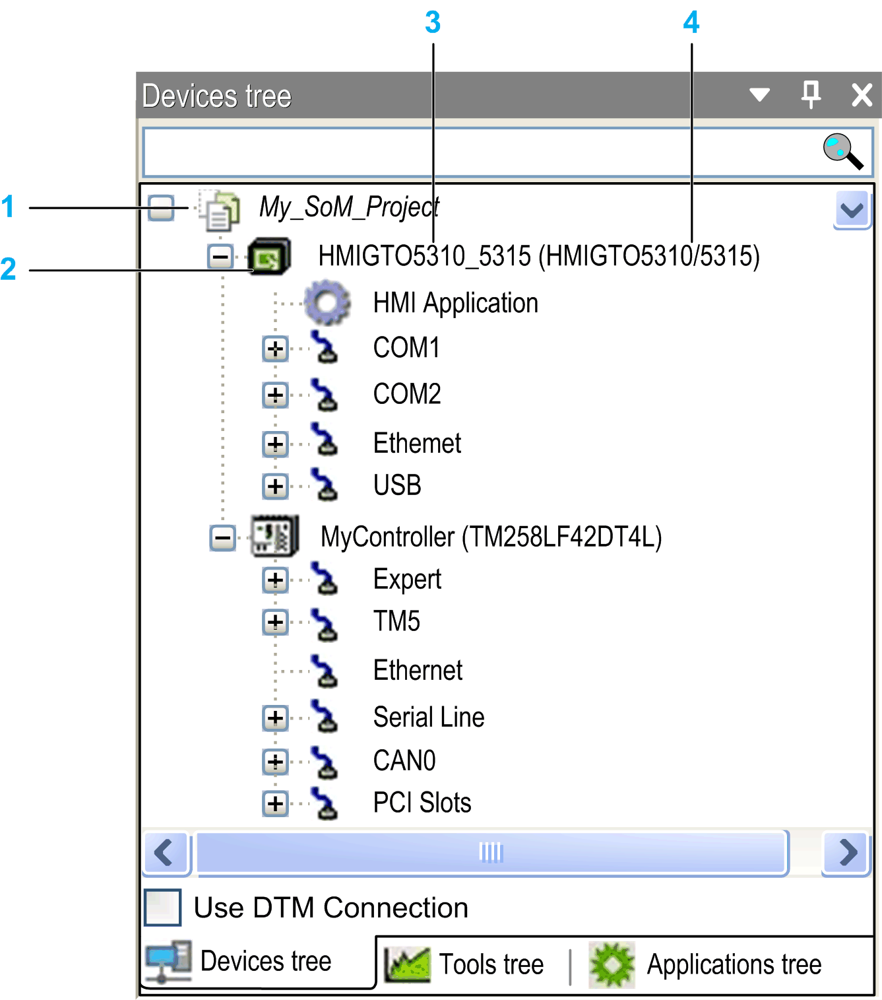

# Multi-Tabbed Navigators

## Overview

The multi-tabbed Navigators are default components of the Logic Builder screen.

By default, the following navigators are available:

* Devices tree: It allows you to manage the devices on which the application is to run.
* Applications tree: It allows you to manage project-specific as well as global POUs, and tasks in a single view.
* Tools tree: It allows you to manage project-specific as well as global libraries or other elements in a single view.
* Functional tree: It allows you to group the content of a controller according to your individual requirements.
* Modules view: It allows you to manage Smart Template modules. For detailed information, refer to the [Smart Template Modules User Guide](../../../../../api/crossBook?lang=en-US&virtualBookName=SmrtTplt&topicID=).

You can access views with the View menu.

## Adding Elements to the Navigators

The root node of a navigator represents a programmable device. You can insert further elements below this root node.

To add elements to a node of a Navigator, select a device or object in the hardware or software catalog on the right-hand side of the Logic Builder screen and drag it to the Navigator (for example, the Devices tree). The node or nodes where the selected device or object fits are automatically expanded and displayed in bold. The other nodes where the selected device or object cannot be inserted are grayed. Drop the device or object on the suitable node and it is inserted automatically. If any further elements are required for the device or object, such as communication managers, they are inserted automatically.

Alternatively, you can select a node in the tree. If it is possible to add an object to the selected device or object, a green plus button is displayed. Click this plus button to open a menu providing the elements available for insertion.

It is also possible to add an object or a device, by right-clicking a node in a Navigator and running the command Add Object or Add Device. The device type which can be inserted depends on the selected object within the Navigator. For example, modules for a PROFIBUS DP slave cannot be inserted without having inserted an appropriate slave device before. Note that only devices correctly installed on the local system and matching the present position in the tree are available for insertion.

## Repositioning Objects

To reposition objects, use the clipboard commands (Cut, Copy, Paste, Delete) from the Edit menu. Alternatively, you can drag the selected object with the mouse while the mouse-button (plus CTRL key for copying) is pressed. When you add devices using the copy and paste function, the new device gets the same name followed by an incrementing number.

## Updating the Version of a Device

A device that is already inserted in the Navigators can be updated to another version or converted to another device.

Refer to the description of the separate commands:

* Update Device [command](D-SE-0083377.html#D-SE-0083377)
* Convert Device [command](D-SE-0083379.html#D-SE-0083379)

## Description of the Devices Tree

Each device object in the Devices tree represents a specific (target) hardware object.

Examples: controller, fieldbus node, bus coupler, drive, I/O module

Devices and subdevices are managed in the Devices tree. Other objects which are needed to run an application on a controller are grouped in the other Navigators.

* The root node of the tree is a symbolic node entry: <projectname>
* The controller configuration is defined by the topological arrangement of the devices in the Devices tree. The configuration of the particular device or task parameters is performed in corresponding editor dialogs. Also refer to the chapter [*Task Configuration*](D-SE-0083437.html#D-SE-0083437).

  Thus the hardware structure is mapped and represented within the Devices tree by the corresponding arrangement of device objects, allowing you to set up a complex heterogeneous system of networked controllers and underlying fieldbusses.
* To add devices configured with DTMs (Device Type Managers) to your project, activate the check box Use DTM Connection in the lower part of the Devices tree. This has the effect that a node FdtConnections is added below the root node of the tree. Below the FdtConnections node, a communication manager node is inserted automatically. You can add the suitable DTM device to this node.

  For further information, refer to the [Device Type Manager (DTM) User Guide](../../../../../api/crossBook?lang=en-US&virtualBookName=TM57DIO&topicID=D_SE_0012082).
* To acknowledge diagnostic messages of an individual device with or without the subordinate devices, run the command Acknowledge Diagnosis or Acknowledge Diagnosis for Subtrees from the contextual menu of a device object.

  Device objects are marked when diagnostic messages are available:

  + A red exclamation mark indicates that the detected error is still valid.
  + A gray exclamation mark indicates that the detected error is no longer valid.

Example of a Devices tree:

**1** Root node

**2** Programmable device (with applications)

**3** Symbolic device name

**4** Device name defined in device description file

* Each entry in the Devices tree displays the symbol, the symbolic name (editable), and the device type (= device name as provided by the device description).
* The  symbol marks devices and tasks that are related to bus cycle settings and bus cycle tasks. For devices, a tooltip displays the related tasks. For tasks, a tooltip displays the related devices.
* A device is programmable or configurable. The type of the device determines the possible position within the tree and also which further resources can be inserted below the device.
* Within a single project, you can configure one or several programmable devices - regardless of manufacturer or type (multi-resource, multi-device, networking).
* Configure a device concerning communication, parameters, I/O mapping in the device dialog box (device editor). To open the device editor, double-click the device node in the Devices tree (refer to the description of the [device editor](D-SE-0083384.html#D-SE-0083384)).
* In online mode, the status of a device is indicated by an icon preceding the device entry:

  +  Controller is connected, application is running, device is in operation, data is exchanged. The option Update IO while in stop in the PLC settings [view of the device editor](D-SE-0083392.html#D-SE-0083392) can be enabled or disabled.
  +  Controller is connected and stopped (STOP). The option Update IO while in stop in the PLC settings [view of the device editor](D-SE-0083392.html#D-SE-0083392) is disabled.
  +  Device is not exchanging data, bus error detected, not configured or simulation mode (refer to the description of the Simulation command).
  +  Device is running in demo mode for 30 minutes. After this time, the demo mode expires and the fieldbus stops exchanging data.
  +  Device is configured but not fully operational. Data is not exchanged. For example, CANopen devices are in startup and preoperational.
  +  Redundancy mode active: The fieldbus master is not sending data because another master is in active mode.
  +  Device description was not found in device repository. For further information on installing and uninstalling devices in the Device Repository dialog box, refer to the description of the [**Device Repository**](../../../../../api/crossBook?lang=en-US&virtualBookName=SoMMenu&topicID=D_SE_0084041).
  +  The device is running, but a subordinate device is not running or a diagnostic message has been issued. The subordinate device is not visible because the Devices tree is collapsed.
  +  A diagnostic was pending. The issue that caused the error is no longer valid or has been solved. This symbol can be displayed in connection with various other symbols in this list.
  +  The device is not running or a diagnostic is pending. The issue that caused the error is still valid. This symbol can be displayed in connection with various other symbols in this list.
* The names of the connected devices and applications are displayed green shaded.
* The names of devices running in simulation mode (refer to the description of the Simulation command) are displayed in italics.
* Additional diagnostic information is provided in the Status [view of the device editor](D-SE-0083395.html#D-SE-0083395).

You can also run the active application on a simulation device which is by default automatically available within the programming system. Therefore, no real target device is needed to test the online behavior of an application (at least that which does not rely on hardware resources for execution). When you switch to [simulation mode](../../../../../api/crossBook?lang=en-US&virtualBookName=SoMMenu&topicID=D_SE_0084008), an entry in the Devices tree is displayed in italics, and you can log into the application.

For information on the conversion of device references when opening projects, refer to the [*Compatibility and Migration User Guide*](../../../../../api/crossBook?lang=en-US&virtualBookName=CompMigr&topicID=D_SE_0088853).

## Arranging and Configuring Objects in the Devices Tree

**Adding devices / objects**:

To add devices or objects to the Devices tree, select a device or object in the hardware catalog on the right-hand side of the Logic Builder screen and drag it to the Devices tree. The node or nodes where the selected device or object fits is expanded and is displayed in bold. The other nodes where the selected device or object cannot be inserted are grayed. Drop the device or object on the suitable node and it is inserted automatically.

Alternatively, you can select a node in the tree. If it is possible to add an object to the selected device or object, a green plus button is displayed. Click the plus button to open a menu providing the elements available for insertion.

Alternatively, you can add an object or a device, by right-clicking a node in the Devices tree and running the command Add Object or Add Device. The device type which can be inserted depends on the selected object within the Devices tree. For example, modules for a PROFIBUS DP slave cannot be inserted without having inserted an appropriate slave device before. No applications can be inserted below non-programmable devices.

Note that only devices correctly installed on the local system and matching the present position in the tree are available for insertion.

**Repositioning objects**:

To reposition objects, use the clipboard commands (Cut, Copy, Paste, Delete) from the Edit menu. Alternatively, you can draw the selected object with the mouse while the mouse-button (plus CTRL key for copying) is pressed. Consider for the Paste command: In case the object to be pasted can be inserted below or above the selected entry, the Select Paste Position dialog box opens. It allows you to define the insert position. When you add devices using the copy and paste function, the new device gets the same name followed by an incrementing number.

**Updating the version of a device**:

A device that is already inserted in the Devices tree can be replaced by another version of the same device type or by a device of another type (device update). In doing so, a configuration tree indented below the respective device is maintained as long as possible.

**Adding devices to the root node**:

Only devices can be positioned on the level directly below the root node <projectname>. If you choose another object type from the Add Object dialog box, such as a Text list object, it is added to the Global node of the Applications tree.

**Subnodes**:

A device is inserted as a node in the tree. If defined in the device description file, subnodes are inserted automatically. A subnode can be another programmable device.

**Inserting devices below a device object**:

You can insert further devices below a device object. If they are installed on the local system, they are available in the hardware catalog or in the Add Object or Add Device dialog box. The device objects are sorted within the tree from top to bottom: On a particular tree level first the programmable devices are arranged, followed by any further devices, sorted alphabetically.

## Description of the Applications Tree

The Application objects, task configuration, and task objects are managed in the Applications tree.

The objects needed for programming the device (applications, text lists, etc.) are managed in the Applications tree. Devices that are not programmable (configuration only) cannot be assigned as programming objects. You can edit the values of the device parameters in the parameter dialog box of the device editor.

Programming objects, like particular POUs or global variable lists can be managed in 2 different ways in the Applications tree, depending on their declaration:

* When they are declared as a subnode of the Global node, these objects can be accessed by any devices.
* When they are declared as a subnode of the Applications node, these objects can only be accessed by the other devices declared in this Applications node.

You can insert an Application object only in the Applications tree.

Below each application, you can insert additional programming objects, such as DUT, GVL, or visualization objects. Insert a task configuration below an application. In this task configuration, the program calls have to be defined (instances of POUs from the Global node of the Applications tree or device-specific POUs). Note that the application is defined in the I/O Mapping [view of the respective device editor](D-SE-0083398.html#D-SE-0083398).

The POUs are displayed in different colors that have the following meaning:

| Color | Description |
| --- | --- |
| Black | Default color. |
| Gray | Displayed after a code generation.  The POU is not used in the project |
| Blue | Displayed after a code generation and when the project has already been downloaded.  The POU has changed as compared to the POU on the controller and will be included with the next download. |
| Blue-green | The Exclude from build option is selected for the POU in the [Build tab of the Properties dialog box](../../../../../api/crossBook?lang=en-US&virtualBookName=SoMMenu&topicID=D_SE_0083921_10). |

## Comparing Objects

By right-clicking an object in the Applications tree, the following commands are provided in the contextual menu for comparison.

| Command | Description |
| --- | --- |
| Compare both selected objects... | This command is available if two objects are selected in a navigator. Execute the command to compare the two objects. If two objects of different types are selected, a corresponding message is displayed. |
| Select first object for compare... | The selected object is used as basis for the comparison. |
| Compare with selected object... | This command is available if a second object is selected that is of the same type as the object that has previously been selected with Select first object for compare....  Execute the command to compare the two objects. The result is displayed in a comparison view similar to the [Project Comparison - Differences view](../../../../../api/crossBook?lang=en-US&virtualBookName=SoMMenu&topicID=D_SE_0083939). |
| Compare with Selected (Raw) | This command is exclusive to projects stored in file-based storage format.  It is available if an object has previously been selected with Select first object for compare... and a second object is selected. The second object can have a different type than the first object.  This process compares the raw contents of the objects and allows you to compare, for example, the content of two Action objects that belong to two different function blocks. The result is displayed in a comparison view similar to the [Project Comparison - Differences view](../../../../../api/crossBook?lang=en-US&virtualBookName=SoMMenu&topicID=D_SE_0083939). |
| Compare with device... | Execute the command to compare the open project with the project that is running on a configured controller. For detailed information, refer to [Compare with device...](../../../../../api/crossBook?lang=en-US&virtualBookName=SoMMenu&topicID=D_SE_0098535). |
| Compare with target device... | Execute the command to compare the loaded project with the project that is running on a configured controller, whereas configured means that you must have downloaded the source code to the controller beforehand. For detailed information, refer to [Compare with target device...](../../../../../api/crossBook?lang=en-US&virtualBookName=SoMMenu&topicID=D_SE_0098536). |

## Description of the Tools Tree

The Tools tree contains objects, that are supplemental to the application, as, for example, libraries, visualizations, recipe manager, alarm configuration. Devices that are only configured (not programmed) cannot be assigned the programming objects described above. You can edit the values of the device parameters in the parameter dialog box of the device editor.

Programming objects, like the Library Manager,can be managed in 2 different ways in the Tools tree, depending on their declaration:

* When they are declared as a subnode of the Global node; then these objects can be accessed by any devices.
* When they are declared as a subnode of the Applications node; then these objects can only be accessed by the other devices declared in this Applications node.

EIO0000002854.09