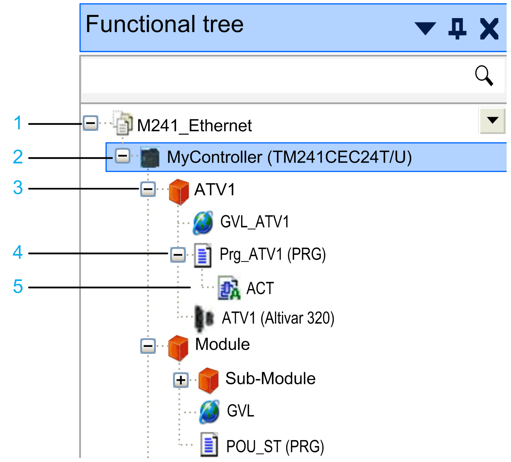

# Functional tree

## Overview

The Functional tree is available for controllers that have a Functional Model node in the Devices tree. It allows you to group multiple objects, such as IEC code or devices, and link them to a function. Once this function is created, you can reuse it. By creating this modularity, reuse your developments to improve your vision of the project. You can export / import the Functional tree and reuse it in another project.

## Description of the Functional tree

Example of a Functional tree:

**1** Root node: corresponds to the name of the open project

**2** Controller node: only those controllers that have a **Functional Model** node in the **Devices tree** are displayed

**3** Functional module: nodes for structuring the **Functional tree**

**4** Attached object: object attached to the functional module

**5** Child object: child object of the attached object

## Selecting Controllers

Select controllers for the Functional tree as follows:

| Step | Action | Result |
| --- | --- | --- |
| 1 | In the Functional tree, right-click the root node, and run the command Select Controllers. | A new subnode Functional Model is inserted for each selected controller in the Devices tree. |
| 2 | In the Select Controllers dialog box, select the controllers you want to add to the Functional tree, and click OK. | New controller nodes are added to the Functional tree below the root node for each selected controller. |

## Adding Nodes

To group the content of a controller according to your individual requirements, the Functional tree allows you to create subnodes below the controller nodes.

| Node | Description | How to create |
| --- | --- | --- |
| Functional module | A functional module is a group of program elements intended to perform an application function.  Functional module nodes create a hierarchical structure in the Functional tree. To create a meaningful structure, edit the default name and assign a name of your choice to each functional module. | Select a parent node (for example, the controller node), and click the green plus button. |
| Attached object | Attached objects are nodes of the other navigators (Devices tree, Applications tree, Tools tree) that represent the content of the controller.  Note the following:   * One object can only be attached to one functional module. * An object can only be attached to a function module of the same controller. * You can attach only those objects that are also allowed in [function templates](D-SE-0083799.html#D-SE-0083799__D-SE-0083799.4). | Right-click a functional module node, and run the command Select Objects from the contextual menu. From the Select Objects dialog box, select the node you want to attach and click OK. |
| Child object | Child objects of the attached objects. | Child objects are displayed in the Functional tree. |

## Deleting Nodes

To delete a node from the Functional tree, right-click on it, and run the command Delete from the contextual menu. You are requested to delete the selected object, with its child objects, only from the Functional tree or from the whole project.

Child objects cannot be removed from the Functional tree only. If you intend to delete a child object, you are prompted to confirm that the object is removed from the whole project.

## Reusing Functional Modules

If you have created a functional module that you want to reuse in the same or in another project, use the function templates as they can resolve the dependencies between the attached objects. The Import/Export commands and the copy/paste functions can also be used, but they only serve special cases as described in the following sections.

## Reusing Functional Modules by Using Function Templates

You can save a functional module to a function template by right-clicking the node and run the command Save as Function Template from the contextual menu.

To instantiate a functional module from a function template, right-click a node in the Functional tree, and run the command Add Function From Template from the contextual menu.

For further information, refer to the [*Managing Function Templates* chapter](D-SE-0083797.html#D-SE-0083797).

## Reusing Functional Modules by Using the Import/Export Commands

When you use the Project > Export [command](../../../../../api/crossBook?lang=en-US&virtualBookName=SoMMenu&topicID=D_SE_0083968) and the Project > Import [command](../../../../../api/crossBook?lang=en-US&virtualBookName=SoMMenu&topicID=D_SE_0083969) for reusing functional modules, note the following:

| If... | Then ... |
| --- | --- |
| If you export a complete controller device, and then import it in the same or in another project, | Then the functional model is recreated. |
| If you export and import the functional model only, | Then the attached objects are not recreated. |

## Reusing Functional Modules by Using the Copy and Paste Functions

When you use the copy and paste functions for reusing functional modules, note the following:

| If... | Then ... |
| --- | --- |
| If you copy a complete controller device, and then paste it in the same or in another project, | Then the functional model is recreated. |
| If you copy and paste one or more functional modules only, | Then the attached objects are not recreated. |

It is not possible to copy and paste attached objects in the Functional tree.

EIO0000002854.09