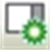

# Multi-Tabbed Catalog View

## Overview

The multi-tabbed Hardware Catalog is a default component of the Logic Builder screen.

It contains the following tabs:

* Controller: Contains the Logic, HMI, and Motion controllers that can be inserted in your project.
* Devices & Modules: Contains the PLC Components, I/O Modules, and the Communication, Motor Control, Safety, and Sensor devices that can be inserted in your project. It also allows you to insert devices by using a device template.
* HMI & iPC: Contains the HMI and iPC devices that can be inserted in your project.
* Diverse: Contains third-party devices that can be inserted in your project.

The content of the individual tabs depends on the project. If the controllers integrated in the project do not support, for example, CANopen, then CANopen devices are not displayed in the catalogs.

You can extend this view by the Software Catalog > ToolBox via the menu View > Software Catalog.

The buttons Hardware Catalog  and Software Catalog  in the toolbar allow you to display or hide the catalog views.

You can add the elements from the catalogs to the project by drag and drop as described in the [*Adding Devices by Drag and Drop* chapter](D-SE-0083369.html#D-SE-0083369).

## Searching Within Catalogs

Each tab of the catalog view contains a search box. The sublists of the tab are analyzed for the string you enter in the search box. In open sublists, the identified entries are marked yellow. Any other items of the list that do not correspond to the search string are hidden. The number of items found in closed sublists is displayed in bold in the title bar of each sublist.

By default, the search is executed on the names of the items in the lists. But the tagging mechanism is also supported. It allows you to assign search strings of your choice to any item included in the Catalog view.

## Favorites List

Each tab of the catalog view contains a Favorites list. To provide quick access, you can add frequently used elements to this Favorites list by drag and drop.

## Adding Devices From Device Templates in the Devices & Modules Tab

The Devices & Modules tab contains the option Device Template at the bottom. Activate this option to display the available templates of field devices in the lists of the Devices & Modules tab. Add them to the Devices tree as described in the [*Adding Devices from Template* chapter](D-SE-0083791.html#D-SE-0083791).

EIO0000002854.09