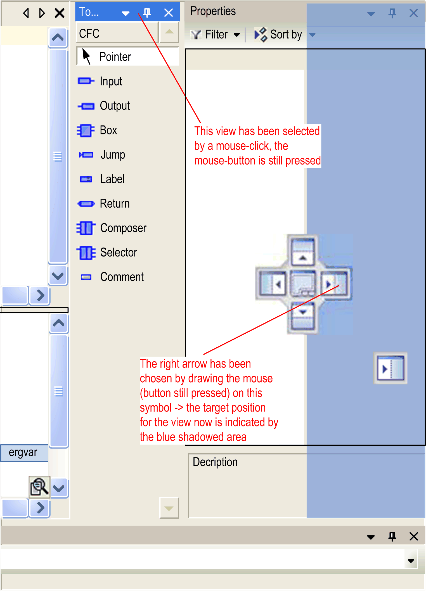
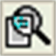

# Customizing the User Interface

## Overview

The look of the user interface, in terms of arrangement and configuration of the particular components, depends on the following:

* Default pre-settings for menus, keyboard functions, and toolbars. You can overwrite the default settings by using the Customize [dialog box](../../../../../api/crossBook?lang=en-US&virtualBookName=SoMMenu&topicID=D_SE_0084066) (by default available in the Tools menu). The present settings are saved on the local system. A reset function is available for restoring the default values at any time.
* Properties of an editor as defined in the respective Tools > Options [dialog box](../../../../../api/crossBook?lang=en-US&virtualBookName=SoMMenu&topicID=D_SE_0084044). You can also overwrite these settings. The present configuration is saved on the local system.
* The way you arrange views or editor windows within the project. The present positions are saved with the project (see below).
* The selected perspective. By default, the Logic Configuration perspective is selected. For further information, refer to the [*Perspectives* paragraph in this chapter](#D-SE-0083359__D-SE-0083359.6).

## Arranging Menu Bars and Toolbars

The menu bar is positioned at the top of the user interface, between the window title bar and view windows. You can position a toolbar within the same area as the menu bar (fix) or as an independent window anywhere on the screen.

In view windows, such as the Devices tree, a special toolbar is available. It provides elements for sorting, viewing, and searching within the window. You cannot configure this toolbar.

## Arranging Windows and Views

Closing a view or editor window: Click the cross button in the upper right corner.

Opening a closed view: you can reopen the views of default components with the View menu. To open an editor window, run the command Project > Edit object or double-click an entry in the Devices tree, Applications tree, or in the Tools tree.

Resizing a view or window within the frame window: Move the separator lines between neighboring views. You can resize independent view windows on the desktop by moving the window borders.

Moving a view to another position on your desk top or within the frame window: Click the title bar or, in the case of tabbed views, click the tab of the view, keep the mouse-button pressed, and move the view to the desired place. Arrow symbols indicate possible target positions. The target position is indicated by a blue-shadowed area.

Arrow symbols indicating new position

| Arrow symbol | Description |
| --- | --- |
|  | View is placed above. |
|  | View is placed below. |
|  | View is placed to the right. |
|  | View is placed to the left. |
|  | View is placed here: the view currently placed at this position and the new one are arranged as icons. |

Example of navigation by the arrow symbols

When you release the mouse-button, the view is placed at the new position.

Views with an Auto Hide button can be placed as independent windows (floating) anywhere on the screen by moving them and not dragging them on one of the arrow symbols. In this case, the view looses the Auto Hide button. As an alternative, run the commands Dock and Float from the Window menu.

Hiding views: You can hide views with Auto Hide buttons at the border of the window. Click the Auto Hide down button in the upper right corner of the view. The view will be displayed as a tab at the nearest border of the frame window. The content of the view is only visible as long as the cursor is moved on this tab. The tab displays the icon and the name of the view. This state of the view is indicated by the docking button changed to Auto Hide.

Unhiding views: To unhide a view, click the Auto Hide button.

An alternative way of hiding and unhiding a view is provided by the Auto Hide command that is by default available in the Window menu.

It is not possible to reposition the [information and status bar on the lower border of the user interface](D-SE-0083355.html#D-SE-0083355__D-SE-0083355.3).

## Perspectives

A perspective is used to save the layout of views. It stores whether the Messages and Watch views are open and at which position the view windows are located (docked or independent windows).

By default, the following perspectives for specific use cases in the Window > Switch Perspective menu or in the perspective table in the toolbar are provided.

| Perspective name | Use case | Navigators (on the left side) | Catalog views (on the right side) | Views at the bottom of the screen |
| --- | --- | --- | --- | --- |
| Classic | Default views. | * Devices * POUs | – | * Messages (in Auto Hide mode) * Watch 1 * CallStack |
| ETest | For working within the ETEST framework. | * Devices * POUs | – | * Messages * Watch 1 * CallStack * Testruns |
| Device Configuration | For adding / configuring devices. | * Devices tree | Hardware catalog   * Controller * Devices & Modules * HMI & iPC * Diverse | Messages (in Auto Hide mode) |
| Online | For online mode. | * Devices tree * Applications tree * Tools tree | – | * Messages (in Auto Hide mode) * Watch 1 |
| Smart Template | For working with Smart Template modules. | * Devices * POUs * Modules | – | Messages (in Auto Hide mode) |
| Logic Configuration | For adding / creating logic. | * Devices tree * Applications tree * Tools tree | Hardware catalog   * Controller * Devices & Modules * HMI & iPC * Diverse | Messages (in Auto Hide mode) |

The Online perspective is automatically selected when the application is switched to online mode.

Creating your own perspective:

In addition to these default perspectives, you can create your own view layout and save it in different perspectives according to your individual requirements.

To create your own perspective, proceed as follows:

| Step | Action |
| --- | --- |
| 1 | Resize, open, or close views according to your individual requirements. |
| 2 | Run the command Save Perspective from the Window menu to save your modifications to a new perspective. |
| 3 | In the Save Perspective dialog box, enter a name for your perspective.  **Result**: The present view layout is saved. The new perspective is available in the Window > Switch Perspective menu and in the perspective table in the toolbar. |

Resetting a perspective to its initial state:

To reset a modified perspective to its initial state, run the command Reset current Perspective from the Window menu.

Importing / exporting perspectives:

To be able to exchange perspectives between different installations or between different users, the Tools > Options > Perspectives [dialog box](../../../../../api/crossBook?lang=en-US&virtualBookName=SoMMenu&topicID=D_SE_0084061) allows you to export perspectives to an XML file and to import already available perspective XML files.

## Zoom

Each editor window provides a zoom function. Click the zoom button  in the lower right corner of the window to open a list. It allows you to choose one of the zoom levels 25, 50, 100, 150, 200, and 400 percent or to enter a zoom factor of your choice. A printout always refers to the 100% view.

Customization of the user interface is possible in offline and in online mode.

EIO0000002854.09