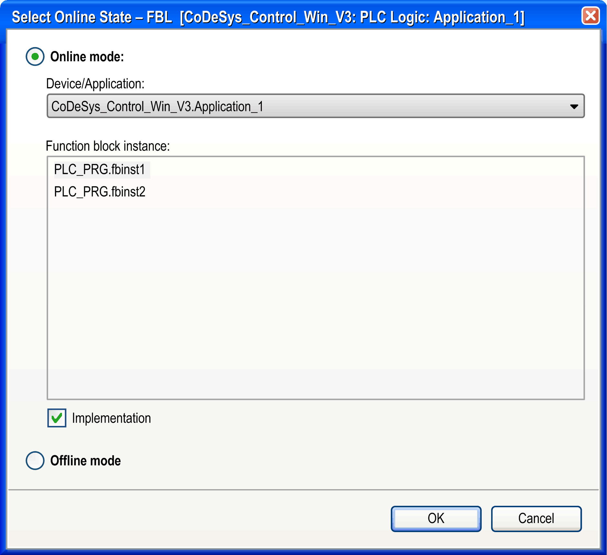

# User Interface in Online Mode

## Overview

As soon as you log in with the project, the objects which have already been opened in offline mode are automatically viewed in online mode. The perspective is automatically switched to the Online [perspective](D-SE-0083359.html#D-SE-0083359__D-SE-0083359.6) which means that the Watch view opens by default.

To open an object in online mode, double-click the node in the Applications tree or execute the Project > Edit Object command.

If there are several instances of the selected object (such as function blocks) contained in the project, a dialog box named Select Online State <object name> is displayed. It allows you to choose whether an instance or the base implementation of the object should be viewed and whether the object should be displayed in online or offline mode.

Select Online State dialog box

The Device/Application field contains the device and application to which the object is associated.

To open the online view of the object, activate the option Online mode and click OK. To see the offline view, activate the option Offline mode.

If the object is a function block, the Function block instance field contains a list of the instances currently used in the application.

In this case, the options available are:

* Either select one of the instances and activate Online or Offline mode.
* Or select the option Implementation which - independently of the selected instance - will open the base implementation view of the function block. The Implementation option has no affect for non-instantiated objects.

For more information on the online views of the particular editors, refer to the respective editor descriptions.

The [status bar](D-SE-0083355.html#D-SE-0083355__D-SE-0083355.3) provides information on the current status of the application.

EIO0000002854.09