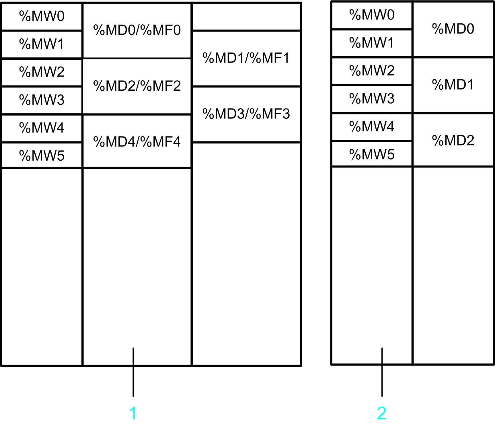

# Converting SoMachine Basic and Twido Projects

## Introduction

You can [convert a SoMachine Basic or TwidoSoft/TwidoSuite project and the configured controller to a selectable EcoStruxure Machine Expert logic controller](D-SE-0083879.html#D-SE-0083879). The controller and the corresponding logic are converted and integrated in the EcoStruxure Machine Expert project.

For the conversion process, execute the File > Convert SoMachine Basic Project or the File > Convert Twido Project command. The Convert SoMachine Basic Project dialog box or Convert Twido Project dialog box opens. If the commands are not available, you can insert them in a menu of your choice by using the Tools > Customize [dialog box](../../../../../api/crossBook?lang=en-US&virtualBookName=SoMMenu&topicID=D_SE_0084066).

If you convert a SoMachine Basic project that was created with a SoMachine Basic version that is newer than the latest supported version, this is indicated by a message in the Messages [view](../../../../../api/crossBook?lang=en-US&virtualBookName=SoMMenu&topicID=D_SE_0083922). You can then continue or cancel the conversion. If you continue, the application will be converted, but it may not be possible to do so without encountering errors that will need to be rectified. In this case, review and verify both the message view and your application before attempting to put it into service.

NOTE: Verify that the SoMachine Basic or Twido project is valid before you convert it into EcoStruxure Machine Expert.

NOTE: It is not possible to convert password-protected projects.

To help to avoid unintended behavior after a project was converted, verify that the target controller supports the functions and communication ports that are required in your project.

| WARNING | |
| --- | --- |
|  | UNINTENDED EQUIPMENT OPERATION  * Verify that the program for the target controller contains the intended configurations and provides the intended functions after you have converted the project. * Fully debug, verify, and validate the functionality of the converted program before putting it into service. * Before converting a program, verify that the source program is valid, i.e., is downloadable to the source controller.  Failure to follow these instructions can result in death, serious injury, or equipment damage. |

NOTE: For more information, advice and important safety information concerning importing projects into EcoStruxure Machine Expert, see the [*Compatibility and Migration User Guide*](../../../../../api/crossBook?lang=en-US&virtualBookName=CompMigr&topicID=D_SE_0088853).

## Converting a SoMachine Basic or a Twido Project

To convert a SoMachine Basic or a Twido project, proceed as follows:

| Step | Action |
| --- | --- |
| 1 | To start the conversion process, perform one of the three actions in the EcoStruxure Machine Expert Logic Builder (as listed in the *Introduction* [block of this chapter](#D-SE-0083381__D-SE-0083381.2)).  **Result**: The Convert SoMachine Basic Project dialog box or Convert Twido Project dialog box opens: |
| 2 | Enter a name for the controller in the Device Name field. |
| 3 | Enter the path to the SoMachine Basic or Twido project file in the Project File box, or click the ... button to browse for the file.  NOTE: If you already browsed for your SoMachine Basic or Twido project in the Open project dialog box, the path has been entered automatically in the Project File field and cannot be edited. |
| 4 | Select the programming language in which the logic will be converted from the Implementation Language list.  The following programming languages are supported:   * Ladder diagram (LD) * Function block diagram (FBD) * Instruction list (IL) * Continuous function chart (CFC) |
| 5 | Select the target controller from the Devices list in which you want to convert your SoMachine Basic or Twido controller. Further information on the selected device is displayed in the Information area of the dialog box. |
| 6 | Click Convert to start the conversion.  **Result**: The SoMachine Basic or Twido project is converted and integrated in the open EcoStruxure Machine Expert project. Modifications or configurations that could not be converted are listed in the Messages [view](../../../../../api/crossBook?lang=en-US&virtualBookName=SoMMenu&topicID=D_SE_0083922). |
| 7 | Consult the category Project Conversion of the Messages view and verify the errors and alerts detected and listed. |
| 8 | Verify whether the converted project contains the intended configurations and provides the intended functions. If not, adapt the configuration. |

## IEC Compatibility of Object and Variable Names

Object names and variable names in EcoStruxure Machine Expert projects have to comply with the naming conventions defined in the IEC standard. Any names in your SoMachine Basic or Twido project that do not comply with the standard are automatically adapted to IEC conventions by the converter.

If you want to preserve names that are not IEC-compatible in the converted EcoStruxure Machine Expert project, activate the option Allow unicode characters for identifiers in the Project Settings > Compile options [dialog box](../../../../../api/crossBook?lang=en-US&virtualBookName=SoMMenu&topicID=D_SE_0083949).

## TwidoEmulationSupport Library

The TwidoEmulationSupport [library](../../../../../api/crossBook?lang=en-US&virtualBookName=TwiEmSup&topicID=D_SE_0036795) contains functions and function blocks that provide SoMachine Basic and TwidoSoft/TwidoSuite functionality in an EcoStruxure Machine Expert application. The TwidoEmulationSupport library is automatically integrated in the EcoStruxure Machine Expert project with the converted controller.

## Conversion of the Application Program

In the target EcoStruxure Machine Expert project, separate programs are created for each SoMachine Basic POU and free POU and for each Twido subroutine and program section. The programming language that is used for these programs is determined by the Implementation Language selected in the Convert SoMachine Basic Project / Convert Twido Project dialog box. An exception is made for POUs that were programmed in graphical Grafcet. They are converted to an SFC program. For detailed information, refer to the [Grafcet section in this chapter](#D-SE-0083381__D-SE-0083381.9).

For each language object (such as memory objects or function blocks) being used by the application program, one global variable is created. Separate [global variable lists](D-SE-0083428.html#D-SE-0083428) for the different object categories (one for memory bits, one for memory words and so forth) are created.

The following restrictions apply for the conversion of the application program concerning the program structure:

* In EcoStruxure Machine Expert, it is not possible to jump to a [label](D-SE-0083477.html#D-SE-0083477) in another program.
* It is not possible to define Grafcet steps in a subprogram.
* It is not possible to activate or deactivate Grafcet steps (per `#` and `D#` instruction) in a subprogram.

## Conversion of Memory Objects

The areas provided for memory objects in SoMachine Basic and Twido differ from EcoStruxure Machine Expert.

In SoMachine Basic and Twido, there are three distinct areas for memory objects:

| Area | Memory objects included |
| --- | --- |
| memory bit area | memory bits (`%M`) |
| memory word area | * memory words (`%MW`) * double words (`%MD`) * floating point values (`%MF`) |
| constant area | * constant words (`%KW`) * double words (`%KD`) * floating point values (`%KF`) |

In EcoStruxure Machine Expert, there is only the memory word area for memory objects:

| Area | Memory objects included |
| --- | --- |
| memory word area | * memory words (`%MW`) * double words (`%MD`) * floating point values  There is no specific addressing format for floating point values. Floating point variables can be mapped on a `%MD` address. |

The graphic provides an overview of the different layouts of `%MD` and `%MF` addresses in SoMachine Basic / Twido and EcoStruxure Machine Expert.

**1** Memory addresses in SoMachine Basic / Twido

**2** Memory addresses in EcoStruxure Machine Expert

Memory objects are converted as follows:

| Source memory objects | Target memory object | Further information |
| --- | --- | --- |
| `%MW` | Mapped to the same `%MW` address  **Example**  `%MW2` is mapped on `%MW2`. | For each `%MW` object, a global variable of type INT is created. |
| `%MD`  and `%MF` with even addresses | Mapped such that they are located on the same `%MW` address as before.  **Example**  `%MD4` / `%MF4` are mapped on `%MD2`. | For each `%MD` object, a global variable of type DINT is created.  For each used `%MF` object, a global variable of type REAL is created. |
| `%MD`  and `%MF` with uneven addresses | Cannot be mapped because a DINT variable cannot be located on an odd word address. | A variable is created to help ensure that the converted application can be built. However, you need to examine the effect that such variable creation has on the overall functionality of your program. |
| `%M` | Mapped as a packed bit field to a fix location in the `%MW` area. | For each `%M` object, a global variable of type BOOL is created. |
| `%KW` | Mapped to consecutive addresses of the `%MW` area. | For each used `%KW` object, a global variable of type INT is created. |

The relationship between `%KW`, `%KD`, and `%KF` objects is the same as for `%MW`, `%MD`, and `%MF` objects. For example, `%KD4` / `%KF4` are mapped on the same location as `%KW4`. Uneven `%KD` / `%KF` addresses cannot be mapped.

**Remote Access**

Memory objects (`%MW`, `%MD`, `%MF`, and `%M`) can be accessed by a remote device through Modbus services:

* If a remote device accesses `%MW`, `%MD` or `%MF` objects in the source application, this access will still be available in the EcoStruxure Machine Expert application.
* If a remote device accesses `%M` objects in the source application, this access will no longer be available in the EcoStruxure Machine Expert application.

**Handling Rising and Falling Edges**

A rising/falling edge contact is converted as follows:

1. An additional global variable with the suffix \_Rise/\_Fall is created (for example, M1\_Rise for a rising edge contact for %M1).
2. This variable is set via an R\_TRIG/F\_TRIG instance in the SystemFunctions program.

Edge detection is performed at the beginning of the controller cycle.

A FALLING/RISING instruction is directly converted into an R\_TRIG/F\_TRIG instance.

Edge detection is performed at the same place of the execution sequence as in the original application.

## Conversion of Function Blocks

For the following function blocks in SoMachine Basic / Twido, the TwidoEmulationSupport library provides function blocks with compatible functions:

| SoMachine Basic / Twido function block | TwidoEmulationSupport library function block |
| --- | --- |
| Timers `%TM` | `FB_Timer` |
| Counters `%C` | `FB_Counter` |
| Register `%R` | `FB_FiFo` / `FB_LiFo` |
| Drum `%DR` | `FB_Drum` |
| Shift bit register `%SBR` | `FB_ShiftBitRegister` |
| Step counter `%SC` | `FB_StepCounter` |
| Schedule `%SCH` | `FB_ScheduleBlock` |
| PID | `FB_PID` |
| Exchange / message `%MSG` | `FB_EXCH` |
| High-speed counter `%HSC` / `%VFC` | They are converted as described in the section [*Conversion of Fast Counters, High-speed Counters (*Twido*: Very Fast Counters) and Pulse Generators*](#D-SE-0083381__D-SE-0083381.8) of this chapter. |
| Fast counter `%FC` |
| PLS pulse generator `%PLS` |
| PWM pulse generator `%PWM` |
| PTO function blocks `%PTO`, `%MC_xxx_PTO` |
| Frequency generator `%FREQGEN` |
| Communication function blocks `READ_VAR, WRITE_VAR, WRITE_READ_VAR` , and `SEND_RECV_MSG` | `FB_ReadVar, FB_WriteVar, FB_WriteReadVar`, and `FB_SendRecvMsg` |
| SMS function block `SEND_RECV_SMS` | They are not converted. |
| `MC_MotionTask_PTO` |
| Drive function blocks `%MC_xxx_ATV` |
| `%DATALOG` |

For the conversion of function blocks, note the following:

* The TwidoEmulationSupport library does not provide any function blocks for hardware-related functions, such as high-speed counters, fast counters, and the pulse generators. They must be controlled through function blocks provided by the platform-specific HSC and PTO\_PWM libraries. These function blocks are not compatible with the source function blocks. In short, a full conversion is not possible if the source program contains functions based on controller hardware resources. For further information, refer to the description [*Conversion of Fast Counters, High-speed Counters (Twido: Very Fast Counters) and Pulse Generators*](#D-SE-0083381__D-SE-0083381.8).
* In SoMachine Basic / Twido, the messaging function is provided by the `EXCHx` instruction and the `%MSGx` function block. In the EcoStruxure Machine Expert application, this function is performed by a single function block `FB_EXCH`.
* In SoMachine Basic / Twido, certain function blocks can be configured using special configuration dialog boxes. This configuration data is provided to the function blocks of the TwidoEmulationSupport library by dedicated parameters.
* If a rung contains multiple function blocks, the converter may split the rung into multiple logic networks.

## Conversion of Network Objects

The table indicates the network object types that are supported by the conversion:

| Network object | Object function | Supported |
| --- | --- | --- |
| %QWE | Input assembly (EtherNet/IP) | Yes |
| %IWE | Output assembly (EtherNet/IP) | Yes |
| %QWM | Input registers (Modbus TCP) | Yes |
| %IWM | Output registers (Modbus TCP) | Yes |
| %IN | Digital inputs (IO scanner) | Only Serial IO scanner |
| %QN | Digital outputs (IO scanner) | Only Serial IO scanner |
| %IWN | Input registers (IO scanner) | Only Serial IO scanner |
| %QWN | Output registers (IO scanner) | Only Serial IO scanner |
| %IWNS | (IO scanner Diagnostics) | Only Serial IO scanner |

## Conversion of System Variables

The following system bits and words are converted:

| System bit / word | Further information |
| --- | --- |
| `%S0` | Is set to 1 in the first cycle after a cold start.  NOTE: It is not possible to trigger a cold start by writing to this system bit. |
| `%S1` | Is set to 1 in the first cycle after a warm start.  NOTE: It is not possible to trigger a warm start by writing to this system bit. |
| `%S4` | Pulse with the time base 10 ms. |
| `%S5` | Pulse with the time base 100 ms. |
| `%S6` | Pulse with the time base 1 s. |
| `%S7` | Pulse with the time base 1 min. |
| `%S13` | Is set to 1 in the first cycle after the controller was started. |
| `%S18` | Is set to 1 if an arithmetic overflow occurs.  NOTE: This flag is provided by the TwidoEmulationSupport library and is only set by functions provided by this library. |
| `%S21` , `%S22` | Are only written. Reading is not supported for these variables. |
| `%S113` | Stops the Modbus Serial IOScanner on serial line 1. |
| `%S114` | Stops the Modbus Serial IOScanner on serial line 2. |
| `%SW63...65` | Error code of the `MSG` blocks 1...3. |
| `%SW114` | Enable flags for the schedule blocks. |

Other system variables are not supported by the conversion. If an unsupported system variable is used by the source application program, a message is generated in the category Project Conversion of the Messages [view](../../../../../api/crossBook?lang=en-US&virtualBookName=SoMMenu&topicID=D_SE_0083922).

## Conversion of Retain Behavior

The variables and function blocks in SoMachine Basic / Twido are retain variables. This means, they keep their values and states even after an unanticipated shutdown of the controller as well as after a normal power cycle of the controller.

This retain behavior is not conserved during conversion. In EcoStruxure Machine Expert, the converted variables and function blocks are regular, which means that they are initialized during unanticipated shutdown and power cycle of the controller. If you need retain variables in your EcoStruxure Machine Expert application, you have to declare this [attribute keyword](D-SE-0083608.html#D-SE-0083608__D-SE-0083608.4) manually.

## Conversion of Animation Tables

Management of animation tables differs in the source and target applications:

* SoMachine Basic / Twido allow you to define multiple animation lists identified by name. Each animation list can contain multiple entries for objects to be animated. For each variable, you can select the option Trace.
* In EcoStruxure Machine Expert, there are 4 predefined [watchlists](D-SE-0083544.html#D-SE-0083544) (Watch 1...Watch 4). Each watchlist can contain multiple variables to be animated. One watchlist can contain variables from different controllers.

  For those variables that have the option Trace selected in SoMachine Basic / Twido, EcoStruxure Machine Expert creates a trace object. You can view these variables in the [trace editor](D-SE-0083557.html#D-SE-0083557).

During the conversion process, the entries of the source animation tables are added at the end of watchlist Watch 1.

## Conversion of Symbols

Symbols defined in a SoMachine Basic / Twido project are automatically transferred into the EcoStruxure Machine Expert project.

The following restrictions apply to the naming of symbols:

| If... | Then ... |
| --- | --- |
| a symbol name does not comply with the naming rules of EcoStruxure Machine Expert, | the name of the symbol is modified. |
| a symbol name is equal to a keyword of EcoStruxure Machine Expert, | the name of the symbol is modified. |
| no variable is created for a language object, | the name of the symbol is discarded. |
| a symbol is not used anywhere in the application program, | the name of the symbol may be discarded. |

For the complete list of symbol modifications that were required, refer to the Messages view.

## Conversion of Fast Counters, High-Speed Counters (Twido: Very Fast Counters) and Pulse Generators

The function blocks provided by EcoStruxure Machine Expert differ from the function blocks provided by SoMachine Basic / Twido. Nevertheless, the configuration of fast counters, high-speed counters, and pulse generators is converted as far as possible. The following sections provide an overview of the restrictions that apply.

**General Restrictions**

The following general restrictions apply:

| Restriction | Solution |
| --- | --- |
| The inputs and outputs used by the converted high-speed counters and pulse generators may differ from the used inputs and outputs of the source application. | Take this into account in the wiring of the converted controller.  The reassignment of inputs and outputs is reported in the Messages [view](../../../../../api/crossBook?lang=en-US&virtualBookName=SoMMenu&topicID=D_SE_0083922). |
| The SoMachine Basic controller may support a different number of counters and pulse generators than the selected target controller. The conversion function only converts the counters and pulse generators that are supported by the target controller. | You have to adapt your application manually. |

**Constraints Regarding the Conversion of** `%FC`, `%HSC` / `%VFC`, `%PLS`, and `%PWM`

For each `%FC`, `%HSC` / `%VFC`, `%PLS`, and `%PWM` function block being used in the SoMachine Basic / Twido application, a single program is created in EcoStruxure Machine Expert. You can improve this basic implementation according to the needs of your application.

The following restrictions apply:

| Restriction | Solution |
| --- | --- |
| The access to function block parameters is performed differently in SoMachine Basic and EcoStruxure Machine Expert.  In SoMachine Basic, the parameters of a function block can be accessed directly by the application program, for example, `%HSC.P = 100`.  In EcoStruxure Machine Expert, a controller-specific function block (for example, `EXPERTSetParam`) has to be used to access a parameter. | If the source application accesses parameters of the function block, you have to extend the converted application accordingly. |
| The behavior of counters differs in EcoStruxure Machine Expert from SoMachine Basic / Twido when the preset value is set.  In Twido:   * The down counter continues counting if zero is reached. * The up counter continues counting if the preset value is reached.   In EcoStruxure Machine Expert:   * The down counter stops counting if zero is reached. * The up counter starts to count from the beginning if the preset value is reached. | You have to adapt your application manually. |
| The following parameters of SoMachine Basic function blocks cannot be converted to EcoStruxure Machine Expert:  Function block `%PLS`:   * Output parameter D [Done] * Parameter R [Duty Cycle]   Function block `%PWM`:   * Parameter R [Duty Cycle]   Function block `%HSC`:   * Output parameter U [Counting Direction] | You have to adapt your application manually. |

**Constraints Regarding the Conversion of PTO Function Blocks** `%PTO` and `%MC_xxxx`

For M241:

The PTO function blocks provided by EcoStruxure Machine Expert for M241 controllers are compatible with the PTO function blocks provided by SoMachine Basic. PTO function blocks are converted without restrictions. The only exception is the `MC_MotionTask_PTO` function block. The `MC_MotionTask_PTO` is not converted.

For HMISCU:

The PTO function blocks provided by EcoStruxure Machine Expert for HMISCU controllers are not compatible with the PTO function blocks provided by SoMachine Basic. PTO function blocks are not converted.

**Constraints Regarding the Conversion of Frequency Generator Function Block** `%FREQGEN`

The frequency generator function block `%FREQGEN` is converted without restrictions for both M241 and HMISCU controllers.

## Conversion of Loop Elements (FOR / ENDFOR)

The destination languages for the conversion do not support loops. For that reason, a FOR loop is broken up into a functionally equivalent sequence of logical networks using label and jump elements.

## Conversion of Conditional Elements (IF / ELSE / ENDIF)

The destination languages for the conversion do not support conditional statements (except EN / ENO, which are already used for other purposes). For that reason, an IF structure is broken up into a functionally equivalent sequence of logical networks using label and jump elements.

## Conversion of a Grafcet Program

You can write a Grafcet program in a textual or in a graphical way.

| Grafcet type | Description | Supported by |
| --- | --- | --- |
| Textual | Various IL and LD programming elements are available for the definition, activation, and deactivation of Grafcet states. | * TwidoSoft/TwidoSuite * SoMachine Basic |
| Graphical | Allows you to draw the layout of steps, transitions, and branches in a graphical manner. | Only SoMachine Basic V1.4 and later versions. |

**Conversion of Textual Grafcet**

The programming languages of EcoStruxure Machine Expert do not support the programming with Grafcet.

For that reason, a converted Grafcet application contains additional language elements that implement the Grafcet management.

| Additional element | Description |
| --- | --- |
| folder Grafcet | This folder contains the following language elements used for the management of the Grafcet state machine. |
| data structure `GRAFCET_STATES` | This data structure has one bit element for each allowed Grafcet state.  If it is an initial state, the element is initialized to TRUE, otherwise it is FALSE. |
| global variable list GrafcetVariables | This global variable list contains the following variables:   * 1 variable `STATES` that contains 1 bit for each Grafcet state. Each bit represents the present value of the corresponding Grafcet state (`%Xi` object). * 1 variable `ACTIVATE_STATES` that contains 1 bit for each Grafcet state. If the bit is TRUE, the Grafcet state is activated in the next cycle. * 1 variable `DEACTIVATE_STATES` that contains 1 bit for each Grafcet state. If the bit is TRUE, the Grafcet state is deactivated in the next cycle. |
| program Grafcet | This program implements the Grafcet state machine. It contains the logic for the activation and deactivation of Grafcet steps.  The program contains the following actions:   * `Init` initializes the Grafcet steps to their initial states. It is executed when the system bit `%S21` is set by the application program. * `Reset` resets the Grafcet steps to FALSE. It is executed when the system bit `%S22` is set by the application program. |

The Grafcet instructions in the application program are converted as follows:

* The beginning of each Grafcet step is marked by a label with the name of the step.

  The first statement within the Grafcet step checks if the step is active. If not, it jumps to the label of the next Grafcet step.
* The access to the `%Xi` is converted to an access to the `STATES.Xi` variable.
* A Grafcet activation instruction `#i` is converted to setting the activation bit of state `i` and the deactivation bit of the present state.
* A Grafcet deactivation instruction `#Di` is converted to setting the deactivation bit of state `i` and the deactivation bit of the present state.

You can extend the converted Grafcet program if you consider the information given in this section.

**Conversion of graphical Grafcet**

Graphical Grafcet is similar to the programming language SFC provided by EcoStruxure Machine Expert. For this reason, a graphical Grafcet POU is converted to an SFC program, as much as possible.

There are the following differences between graphical Grafcet and SFC:

| Graphical Grafcet | SFC | Further information |
| --- | --- | --- |
| Can have an arbitrary number of initial steps. | Must have exactly one initial step. | If the graphical Grafcet POU has several initial steps, then the converter creates several initial steps in SFC. This has the effect, that the converted application cannot be built without errors being detected.  Adapt the converted program. |
| Activation of multiple steps of an alternative branch is allowed. | Only one step of an alternative branch can be activated. | Verify that the converted program is working as expected. |
| The output transitions of a step are evaluated right after the step has been executed. | The transitions of the SFC program are evaluated after the execution of the active steps. | Verify that the converted program is working as expected. |
| The layout of steps, transitions, and branches is relatively free. | The layout of steps, transitions, and branches is more restricted. | The graphical layout is converted to SFC as far as possible. The incompatibilities encountered during the conversion are reported in the Messages view.  The step actions and transition sections are fully converted.  Complete the created SFC as necessary. |

A graphical Grafcet POU can be initialized by setting the system bit `%S21`. If this bit is set in the SoMachine Basic project, the converter activates the implicit variable `SFCInit` and uses it to initialize the SFC program.

## Conversion of TM2 Expansion Modules to TM3 Expansion Modules

Twido controllers only use TM2 expansion modules. Even though M221 and M241 Logic Controllers can handle TM2 as well as TM3 modules, it is a good practice to use TM3 modules. To convert the TM2 modules used in your Twido project into TM3 modules for the EcoStruxure Machine Expert project, the option Upgrade TM2 Modules to TM3 is by default selected.

The TM2 expansion modules are converted into TM3 expansion modules as listed in the table:

| Source TM2 expansion module | Target TM3 expansion module | Further information |
| --- | --- | --- |
| TM2DDI8DT | TM3DI8 | – |
| TM2DAI8DT | TM3DI8A | – |
| TM2DDO8UT | TM3DQ8U | – |
| TM2DDO8TT | TM3DQ8T | – |
| TM2DRA8RT | TM3DQ8R | – |
| TM2DDI16DT | TM3DI16 | – |
| TM2DDI16DK | TM3DI16K | – |
| TM2DRA16RT | TM3DQ16R | – |
| TM2DDO16UK | TM3DQ16UK | – |
| TM2DDO16TK | TM3DQ16TK | – |
| TM2DDI32DK | TM3DI32K | – |
| TM2DDO32UK | TM3DQ32UK | – |
| TM2DDO32TK | TM3DQ32TK | – |
| TM2DMM8DRT | TM3DM8R | – |
| TM2DMM24DRF | TM3DM24R | – |
| TM2AMI2HT | TM3AI2H | – |
| TM2AMI4LT | TM3TI4 | It is possible that the behavior of the converted temperature module differs from the original module. Verify the converted module. |
| TM2AMI8HT | TM3AI8 | – |
| TM2ARI8HT | – | This TM2 module is not converted because there is no corresponding TM3 expansion module. You can replace this module by two TM3TI4 modules. |
| TM2AMO1HT | TM3AQ2 | The target TM3 expansion module has more I/O channels than the source TM2 module. |
| TM2AVO2HT | – |
| TM2AMM3HT | TM3TM3 | – |
| TM2ALM3LT | It is possible that the behavior of the converted temperature module differs from the original module. Verify the converted module. |
| TM2AMI2LT | TM3TI4 | The target TM3 expansion module has more I/O channels than the source TM2 module.  It is possible that the behavior of the converted temperature module differs from the original module. Verify the converted module. |
| TM2AMM6HT | TM3AM6 | – |
| TM2ARI8LRJ | – | This TM2 module is not converted because there is no corresponding TM3 expansion module. You can replace this module by two TM3TI4 modules. |
| TM2ARI8LT | – | This TM2 module is not converted because there is no corresponding TM3 expansion module. You can replace this module by two TM3TI4 modules. |

NOTE: If you are using TM2 as well as TM3 expansion modules in your EcoStruxure Machine Expert project, note their position in the tree structure: If TM3 nodes are located below TM2 nodes in the tree structure, this is detected as a Build error in the Messages view.

## Conversion of Modbus Serial IOScanner

Due to the differences between controller platforms, and especially for connected controller equipment that depend on the proper functioning of the converted program, you must verify the results of the conversion process. Whether or not errors or alerts are detected during the conversion, it is imperative that you thoroughly test and validate your entire system within your machine or process.

| WARNING | |
| --- | --- |
|  | UNINTENDED EQUIPMENT OPERATION  * Verify that the program for the target controller contains the intended configurations and provides the intended functions after you have converted the project. * Fully debug, verify, and validate the functionality of the converted program before putting it into service. * Before converting a program, verify that the source program is valid, i.e., is downloadable to the source controller.  Failure to follow these instructions can result in death, serious injury, or equipment damage. |

**Configuration**

The IOScanner configuration is completely converted:

* The devices are converted to the Generic Modbus Slave device. The source device type is not preserved.
* The device configuration is completely converted. This includes initialization requests, channel settings, and reset variable.

**Function Blocks**

The drive function blocks for the control of Altivar drives over the Modbus IOScanner (MC\_xxx\_ATV) are not converted.

**Status Handling**

Since the IOScanner status handling differs for SoMachine Basic and EcoStruxure Machine Expert, these features can only be partly converted. If your application uses IOScanner status information, verify that this logic still works.

| IOScanner Status | Further information |
| --- | --- |
| Device Status (`%IWNSx`) | Both SoMachine Basic and EcoStruxure Machine Expert provide status information for a slave device, but the status values are different. The status logic is partly converted. |
| Channel Status (`%IWNSx.y`) | EcoStruxure Machine Expert does not provide status information for single channels. The channel status is converted to the device status. |
| System words and bits: | |
| `%S110/%S111` (IOScanner reset) | They are not converted. |
| `%S113/%S114` (IOScanner stop) | They are converted. |
| `%SW210/%SW211` (IOScanner status) | They are not converted. |

## Conversion of Modbus TCP IO Scanner

The configuration of the Modbus TCP IO Scanner is not converted.

## Immediate I/O Access

The instructions `READ_IMM_IN` and `WRITE_IMM_OUT` of SoMachine Basic for immediate access to digital local I/O channels are not converted.

For M241 controllers, you can use the functions `GetImmediateFastInput` and `PhysicalWriteFastOutputs` provided by the PLCSystem library, but consider the following differences:

| `READ_IMM_IN`  and `WRITE_IMM_OUT`  instructions (M221 controllers) | `GetImmediateFastInput` and `PhysicalWriteFastOutputs` functions (M241 controllers) |
| --- | --- |
| Access to all local inputs and outputs. | Access only to fast inputs and outputs. |
| `WRITE_IMM_OUT` writes a single bit (similar to the read function).  `WRITE_IMM_OUT` returns an error code. | `PhysicalWriteFastOutputs` writes fast outputs at the same time.  `PhysicalWriteFastOutputs` only returns the information on which outputs have actually been written. |
| The error codes of `READ_IMM_IN` and `GetImmediateFastInput` differ. | |
| `READ_IMM_IN` updates the input object (`%I0.x`). | `GetImmediateFastInput` only returns the read value but does not update the input channel. |

NOTE: For HMISCU controllers, no equivalent function exists.

## Twido Communication Features

The following communication features of Twido are not converted:

* AS Interface
* CANopen
* remote link

If you use these communication features in your Twido application, you have to adapt the EcoStruxure Machine Expert application manually.

During conversion, one variable is created for each related I/O object in order to allow the EcoStruxure Machine Expert application to be built successfully. These variables are collected in separate global variable lists. This helps you in identifying the variables to be replaced.

## Detected Errors and Alerts Indicated in the Messages View

If errors or alerts are detected during the conversion process, a message box is displayed, indicating the number of errors and alerts detected. For further information, consult the category Project Conversion of the Messages [view](../../../../../api/crossBook?lang=en-US&virtualBookName=SoMMenu&topicID=D_SE_0083922). Verify each entry carefully to see whether you have to adapt your application.

| WARNING | |
| --- | --- |
|  | UNINTENDED EQUIPMENT OPERATION  * Verify that the program for the target controller contains the intended configurations and provides the intended functions after you have converted the project. * Fully debug, verify, and validate the functionality of the converted program before putting it into service. * Before converting a program, verify that the source program is valid, i.e., is downloadable to the source controller.  Failure to follow these instructions can result in death, serious injury, or equipment damage. |

* A warning message indicates an advisory that the conversion process made some adjustments that, in all likelihood, do not have impact on the functions of your application.
* An error message indicates that some parts of the application could not be fully converted. In this case, you have to adapt the application manually in order to preserve the same functionality in the target application.
* If the application program makes use of functionality that cannot be completely converted, the converter creates variables for the unsupported language objects. This allows you to compile your application successfully. However, verify this unsupported functionality after the conversion.

To save the information displayed in the Messages view, you can copy it to the Clipboard (press CTRL + C) and paste it to a data file (press CTRL + V).

EIO0000002854.09