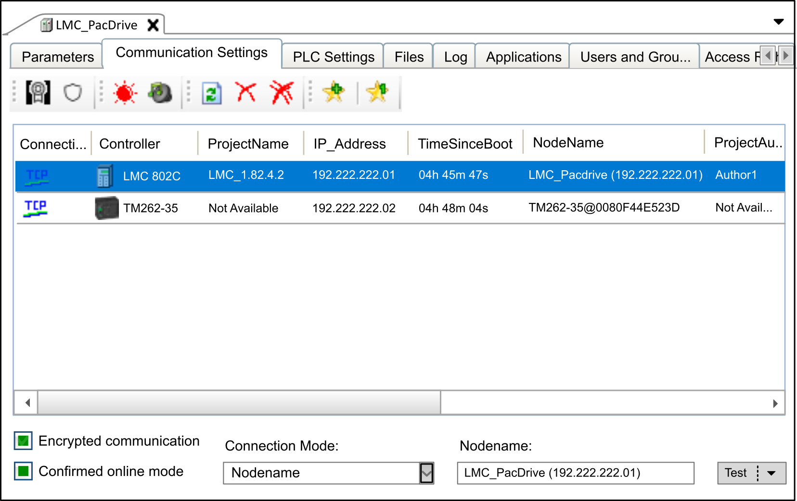
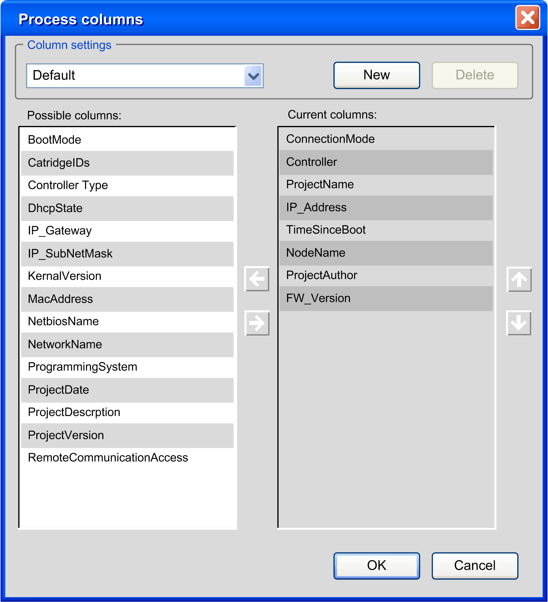
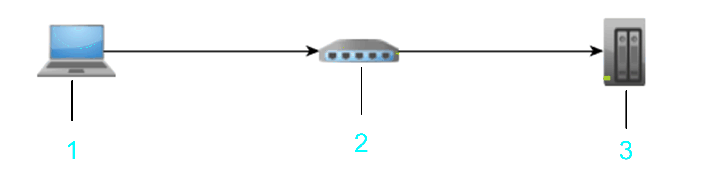
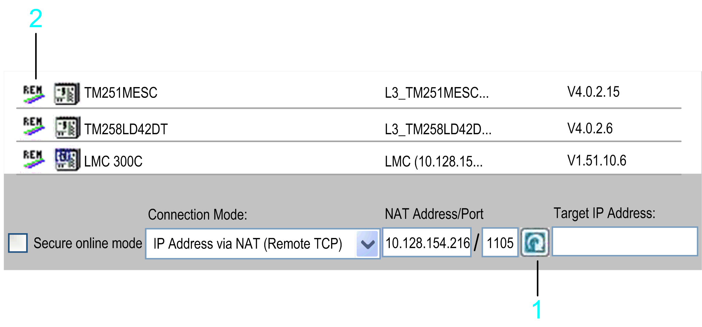
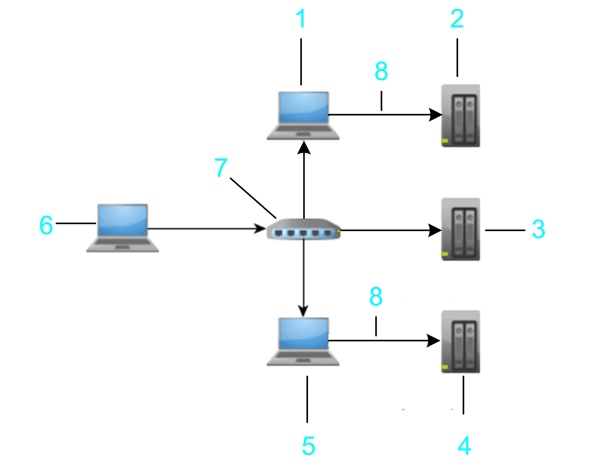
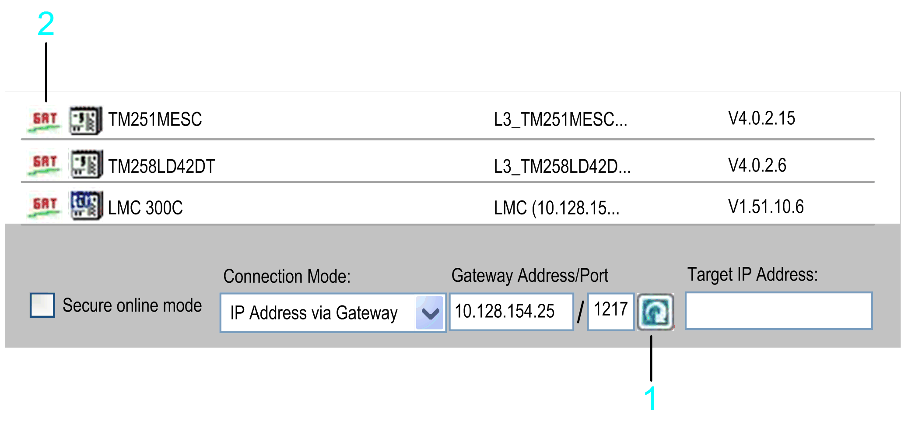
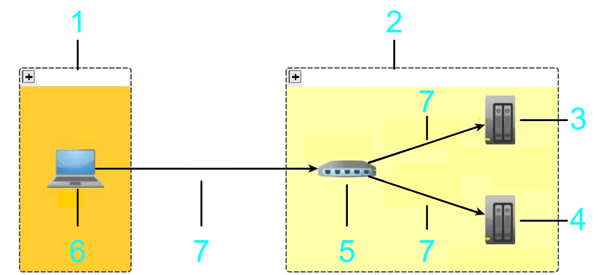
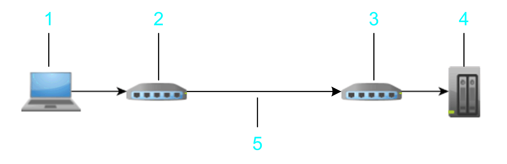

# Communication Settings in Controller Selection Mode

## Overview

The Communication Settings tab in controller selection mode is displayed when the mode Controller selection mode has been selected for the parameter Communication page in the Tools > Options > Device editor [dialog box](../../../../../api/crossBook?lang=en-US&virtualBookName=SoMMenu&topicID=D_SE_0084057). The tab provides access to the Network Device Identification service that allows you to scan the Ethernet network for available controllers and to display them in a list. You can configure the parameters for the communication between the devices (referred to as *controllers* in this chapter) and the programming system.

The list of controllers contains those controllers in the network that have sent a response to the request. It may happen that the controller of your choice is not included in this list. This can have several causes. For causes and suitable solutions, refer to the chapter [*Accessing Controllers - Troubleshooting and FAQ*](D-SE-0083814.html#D-SE-0083814).

NOTE: Whenever you attempt to gain access to a controller with device user rights management enabled, the credentials are requested.

Communication Settings tab in controller selection mode

The Communication Settings tab provides the following elements:

* Buttons in the toolbar
* List providing information on the available controllers
* Options, list, box, and Test button at the bottom of the tab

## Description of the Buttons in the Toolbar

The following buttons are available in the toolbar:

| Button | Icon | Description |
| --- | --- | --- |
| Change Runtime Security Policy... |  | Click this button to open the Change Runtime Security Policy [dialog box](D-SE-0083386.html#D-SE-0083386__D-SE-0083386.9) that allows you to configure the Communication, Code Signing and Device User Management policy. |
| Security Settings... |  | Opens the Device Security Settings dialog box that displays the security settings of the connected device. It allows you to modify the OpenSSL, user management and app settings in the Value column. Click OK to write them to the device.  For further information about the settings related to password policy, refer to the [Change Runtime Password Policy dialog box](D-SE-0083386.html#D-SE-0083386__ChangeRuntimePasswordPolicyDialogBo-9C3C10B5). |
| Optical |  | Click this button to make the selected controller indicate an optical signal: it flashes a control LED. This can help you to identify one controller if several controllers are used.  The function stops on a second click or automatically after about 30 seconds.  NOTE: The optical signal is issued only by controllers that support this function.  The command is transmitted to the controller using the Local Network. To transmit it with a specific communication mode selected, execute the command from the [contextual menu of the controller](#D-SE-0083385__ContextMenuCommands-C13598B5) or from the  [list of the Test button](#D-SE-0083385__TestingTheConnection-C1576382). |
| Optical and acoustical |  | Click this button to make the selected controller indicate an optical and an acoustical signal: it starts to beep and flashes a control LED. This can help you to identify one controller if several controllers are used.  The function stops on a second click or automatically after about 30 seconds.  NOTE: The optical and acoustical signals are issued only by controllers that support this function.  The command is transmitted to the controller using the Local Network. To transmit it with a specific communication mode selected, execute the command from the [contextual menu of the controller](#D-SE-0083385__ContextMenuCommands-C13598B5) or from the  [list of the Test button](#D-SE-0083385__TestingTheConnection-C1576382). |
| Refresh list |  | Click this button to refresh the list of controllers. A request is sent to the controllers in the network. Controllers that respond to the request are listed with the updated values.  Pre-existing entries of controllers are updated with every new request.  Controllers that are already in the list but do not respond to a new request are not deleted. They are marked as inactive by a red cross being added to the controller icon.  This command is also provided in the [contextual menu if you right-click a controller in the list](#D-SE-0083385__ContextMenuCommands-C13598B5).  To refresh the information of a selected controller, the contextual menu provides the command Refresh this controller using. This command requests more detailed information from the selected controller.  NOTE: The Refresh this controller using command can also refresh the information of other controllers. |
| Remove inactive controllers from list |  | Controllers that do not respond to a network scan are marked as inactive in the list. This is indicated by a red cross being added to the controller icon. Click this button to remove the controllers that are marked as inactive from the list.  NOTE: A controller may be marked as inactive. To update the controller state, right-click the controller and execute the command Refresh this controller using from the contextual menu. |
| Remove all controllers from list |  | Click this button to remove all controllers from the list and to clear previous connection information from the cache. This command is also available in the contextual menu upon right-clicking a controller. Also refer to [Contextual Menu Commands for the Controllers](#D-SE-0083385__ContextMenuCommands-C13598B5). |
| New Favorite... and Favorite 1 |  | You can use Favorites to adjust the selection of controllers to your personal requirements. This can help you keep track of many controllers in the network.  A Favorite describes a collection of controllers that are recognized by a unique identifier.  Click a favorite button (such as Favorite 1) to select or deselect it. If you have not selected a favorite, all detected controllers are visible.  You can also access Favorites from the contextual menu when right-clicking a controller in the list.  Move the cursor over a favorite button in the toolbar to view the associated controllers as a tooltip. |

## List of Controllers

The list of controllers in the middle of the Communication Settings tab of the device editor lists those controllers that have sent a response to the network scan. It provides information on each controller in several columns. You can adapt the columns displayed in the list of controllers according to your individual requirements.

To achieve this, right-click the header of a column to open the Process columns dialog box.

You can create your own layout of this table. Click New, and enter a name for your layout. Shift columns from the list of Possible columns to the list of Current columns and vice versa by clicking the horizontal arrow buttons. To change the order of the columns in the Current columns list, click the arrow up and arrow down buttons.

## Connection Modes Indicated in the ConnectionMode Column

The connection mode category is displayed in the column ConnectionMode. It is added to the respective controller entry with every connection established to a controller or login. The [Test button](#D-SE-0083385__TestingTheConnection-C1576382) allows you to actively add the icon to a controller entry.

| Connection mode | Description |
| --- | --- |
| ETH | The controller was scanned in the local network or using [Connection Mode > Nodename](#D-SE-0083385__D-SE-0083385.11) or [Connection Mode > IP Address](#D-SE-0083385__D-SE-0083385.12). |
| GAT | The controller was scanned by a given gateway using one of the via Gateway connection modes:   * [Connection Mode > Nodename via Gateway](#D-SE-0083385__D-SE-0083385.15) * [Connection Mode > IP Address via Gateway](#D-SE-0083385__D-SE-0083385.16)   The gateway can run either on the local or a different PC. |
| REM | The controller was scanned by a given gateway using one of the ...via NAT (Remote TCP) connection modes:   * [Connection Mode > Nodename via NAT (Remote TCP)](#D-SE-0083385__D-SE-0083385.13) * [Connection Mode > IP Address via NAT (Remote TCP)](#D-SE-0083385__D-SE-0083385.14)   The gateway runs on a controller. |
| TCP | The [Connection Mode > IP Address (Fast TCP)](#D-SE-0083385__D-SE-0083385.21) was used that connects directly to a controller using TCP. |

## Contextual Menu Commands for the Controllers

Upon right-clicking a controller row in the list of controllers, the following commands are provided:

| Command | Description |
| --- | --- |
| Edit communication settings using | Select the command to display a list of the connection modes that are in use for the controller.  In addition to the connection modes listed in the [Specifying the Connection Mode](#D-SE-0083385__D-SE-0083385.8) section of this chapter, the Local Network mode can be available if the controller was detected in the local network.  Select an entry to open the Edit communication settings dialog box for modifying the communication settings of the selected connection mode.  NOTE: Controller-specific parameters, such as RemoteCommunicationAccess can inhibit access with the Edit communication settings using command. Consult the *Programming Guide* specific to your controller for further information. |
| Remove selected controller from list | The selected controller is removed from the list.  Alternatively, select a controller and press the Delete key on the keyboard to delete. |
| Remove all controllers from list | Execute this command to remove all controllers from the list and to clear previous connection information from the cache. |
| Refresh this controller using | Lists the connection modes that are in use for the controller. Select an entry to send a request to the controller using the selected [connection mode](#D-SE-0083385__D-SE-0083385.8) and to update the displayed values. The Local Network mode is available if the controller was detected in the local network.  NOTE: The Refresh this controller using Local Network command can also refresh the information of other controllers. |
| Refresh list | Execute this command to send a request to the controllers in the network. Controllers that respond to the request are listed with the updated values. Alternatively, press the F5 key.  Pre-existing entries of controllers are updated.  Controllers that reside in the local network and are already in the list but do not respond to a new request are not deleted. They are marked as inactive by a red cross being added to the controller icon.  In contrast to the Refresh this controller using command, this command does not establish a connection to each controller and retrieves less detailed information (not updating, for example, the TimeSinceReboot information). |
| Signal optical using... | Select this command together with the connection mode sub command to send a request to the controller for emitting an optical signal.  If the controller is already emitting an optical or acoustical signal when this request is received, it stops both actions. Otherwise it starts flashing rapidly. |
| Signal optical and acoustical using | Select this command together with the connection mode sub command to send a request to the controller for emitting an optical and acoustical signal.  If the controller is already emitting an optical or acoustic signal when this request is received, it stops both actions. Otherwise it starts flashing rapidly and beeping. |
| Copy to clipboard | Copies the information provided by the selected controller to the clipboard. Alternatively, press the Ctrl+C keys. |
| Favorites | Refer to the description of New Favorite... and Favorite 0 in [Description of the Buttons in the Toolbar](#D-SE-0083385__D-SE-0083385.3). |
| Change device name using | Select this command together with the connection mode sub command to send a request to the controller to display the nodename. If supported by the controller, the nodename can be modified. For further information, refer to [Specifying Unique Device Names (NodeNames)](#D-SE-0083385__D-SE-0083385.7). |
| Send echo service using | Select this command together with the connection mode sub command to send an echo service request to the controller.  The Logic Builder implements the echo service that is similar to a ping tool.  In order to verify the quality of the network connection, five echo data packets are sent to the controller. The amount of user data that is consecutively added to these packets depends on the communication buffer size of the controller.  A result message is displayed that indicates the average round-trip delay time and the amount of user data that has been echoed through the connection. |

## Configuring Communication Settings

To set the parameters for communication between the programming system and a controller, proceed as follows:

| Step | Action |
| --- | --- |
| 1 | Select the controller in the list of controllers. |
| 2 | Right-click the controller entry, and select the command Edit communication settings using with the suitable sub command for the connection mode from the contextual menu. For the available sub commands, refer to [Specifying the Connection Mode](#D-SE-0083385__D-SE-0083385.8).  When you attempt to gain access to a controller with device user management enabled, a dialog box is displayed requesting the credentials.  The additional option Local Network is available for controllers that reside in the local network. If supported by the controller, it can be detected with the NetManage UDP broadcast network protocol without credentials and even if the communication settings are invalid.  **Result:** The Edit communication settings dialog box opens with the settings of the controller.    NOTE: Most controllers provide a parameter (such as RemoteAccess) that helps prevent changing communication parameters of the controller. |
| 3 | Configure the communication parameters:   * Boot Mode    + FIXED: A fixed IP address is used according to the values entered below (IP address, Subnet mask, Gateway).   + BOOTP: The IP address is received dynamically by BOOTP (bootstrap protocol). The values below will be ignored.   + DHCP: The IP address is received dynamically by DHCP (dynamic host configuration protocol). The values below will be ignored. NOTE: Not all devices support BOOTP and/or DHCP. * IP address  When configuring IP addresses, refer to the hazard message below.  This box contains the IP address of the controller. It is a unique address that consists of four numbers in the range of 0...255 separated by periods. The IP address has to be unique in this (sub)network. * Subnet mask  The subnet mask specifies the network segment to which the controller belongs. It is an address that consists of four numbers in the range of 0...255 separated by periods. Generally, only the values 0 and 255 are used for standard subnet mask numbers. However, other numeric values are possible. The value of the subnet mask is generally the same for all controllers in the network. * Gateway  The gateway address is the address of a local IP router that is located on the same network as the controller. The IP router passes the data to destinations outside of the local network. It is an address that consists of four numbers in the range of 0...255 separated by periods. The value of the gateway is generally the same for all controllers in the network. * To save the communication settings in the controller even if it is restarted, activate the option Save settings permanently. |
| 4 | Click OK to transfer the settings to the controller. |

Carefully manage the IP addresses because each device on the network requires a unique address. Having multiple devices with the same IP address can cause unintended operation of your network and associated equipment.

| WARNING | |
| --- | --- |
|  | UNINTENDED EQUIPMENT OPERATION  * Verify that all devices have unique addresses. * Obtain your IP address from your system administrator. * Confirm that the device’s IP address is unique before placing the system into service. * Do not assign the same IP address to any other equipment on the network. * Update the IP address after cloning any application that includes Ethernet communications to a unique address.  Failure to follow these instructions can result in death, serious injury, or equipment damage. |

## Managing Favorites

To manage favorites in the list of controllers, proceed as follows:

| Step | Action |
| --- | --- |
| 1 | Select the controller in the list of controllers. |
| 2 | Right-click the controller and select one of the commands:   * New Favorite to create a new group of favorites. * Favorite n in order to    + Add the selected controller to this list of favorites   + Remove the selected controller from this list of favorites   + Remove all controllers from this list of favorites   + Select a favorite   + Rename a favorite   + Remove a favorite |

## Encrypted communication Option

When the Encrypted communication option is selected under the Communication Settings tab, communication to the controller will be encrypted.

NOTE: The following prerequisites must be fulfilled to perform encrypted communication with a controller:

* The controller must support TLS (Transport Layer Security).
* A certificate must be available on the controller.

Consult the *Programming Guide* specific to your controller for information on the support of TLS.

The following scenarios are possible when you attempt to log into a controller using encrypted communication:

| If... | Then ... | Comment |
| --- | --- | --- |
| If the controller does not support TLS (prerequisite 1 is not fulfilled) | Then a message will be displayed when you attempt to log into the controller, indicating that the controller does not support TLS. | The login is denied. |
| If a certificate is not available on the controller (prerequisite 2 is not fulfilled) | Then a message will be displayed when you attempt to log into the controller, indicating that encrypted communication could not be initialized successfully. | The login is denied. |
| If both prerequisites are fulfilled | Then a message will be displayed when you attempt to log into the controller for the first time, requesting you to install the (untrusted) controller certificate to the local Controller Certificates store of the PC running EcoStruxure Machine Expert. | If you confirm with OK:   * The login will be successful given that the user password, if required, is provided as well. * Communication to the controller will be encrypted. * The message will not be displayed again.   If you click Cancel:   * The login will be denied. * The message will be displayed with every new attempt to log in. |

For further information, refer to the document [How To Manage Certificates on the Controller](../../../../../api/crossBook?lang=en-US&virtualBookName=HowMgCer&topicID=D_SE_0095876).

## Confirmed online mode Option

The Confirmed online mode option causes EcoStruxure Machine Expert to display a message requiring confirmation when one of the following online commands is selected: Force values, Login, Multiple download, Release force list, Single cycle, Start, Stop, Write values. To disable the Confirmed online mode option and thereby delete the display of this message, clear this option.

## Specifying Unique Device Names (NodeNames)

The term NodeName is used as a synonym for the term device name. Since nodenames are also used to identify a controller after a network scan, manage them as carefully as IP addresses and verify that each nodename is unique in your network. Having multiple devices assigned the same nodename can cause unpredictable operation of your network and associated equipment.

| WARNING | |
| --- | --- |
|  | UNINTENDED EQUIPMENT OPERATION  * Ensure that all devices have unique nodenames. * Confirm that the device’s nodename is unique before placing the system into service. * Do not assign the same nodename to any other equipment on the network. * Update the nodename after cloning any application that includes Ethernet communications to a unique nodename. * Create a unique nodename for each device that does not create it automatically, such as M241 and M251 controllers.  Failure to follow these instructions can result in death, serious injury, or equipment damage. |

Depending on the type of controller, the automatic creation of the NodeName (device name) may differ in procedure. To create a unique name, some controllers integrate their IP address, others use the MAC address of the Ethernet adapter. In this case, you do not have to change the name.

You can also assign a unique device name (NodeName) as follows:

| Step | Action |
| --- | --- |
| 1 | Right-click the controller in the list and run the command Change device name using from the contextual menu.  **Result**: The Change device name dialog box opens. |
| 2 | In the Change device name dialog box, enter a unique device name in the box New. |
| 3 | Click the OK button to confirm.  **Result**: The device name you entered is assigned to the controller and is displayed in the column NodeName of the list.  NOTE: Device name and NodeName are synonymous. |

## Specifying the Connection Mode

The Connection Mode list at the lower left of the Communication Settings tab allows you to select a format for the connection address you have to enter in the Address fields.

The following formats are supported:

* [Automatic](#D-SE-0083385__D-SE-0083385.9)
* [Nodename](#D-SE-0083385__D-SE-0083385.11)
* [IP Address](#D-SE-0083385__D-SE-0083385.12)
* [IP Address (Fast TCP)](#D-SE-0083385__D-SE-0083385.21)
* [Nodename via NAT (Remote TCP)](#D-SE-0083385__D-SE-0083385.13) (NAT = network address translation)
* [IP Address via NAT (Remote TCP)](#D-SE-0083385__D-SE-0083385.14)
* [Nodename via Gateway](#D-SE-0083385__D-SE-0083385.15)
* [IP Address via Gateway](#D-SE-0083385__D-SE-0083385.16)
* [Nodename via MODEM](#D-SE-0083385__D-SE-0083385.17)
* [IP Address (PacDriveM only)](#D-SE-0083385__D-SE-0083385.20) (only available in service tools like Controller Assistant)

NOTE: After you have changed the Connection Mode, it may be required to perform the login procedure twice to gain access to the selected controller.

NOTE: When you attempt to gain access to a controller with device user management enabled, a dialog box is displayed requesting the credentials.

## Testing the Connection for each Connection Mode

For each of the connection modes, a Test button is provided. It allows you to establish a test connection to the controller with the selected connection mode. After the test connection has been established, a new row for the controller is added to the list if it is not already displayed. If a row for this controller is already displayed, it is verified whether the icon of the selected connection mode is already indicated in the column ConnectionMode. Otherwise, the icon is added. Refer to the list of [connection modes](#D-SE-0083385__ConnectionModes-C15C3277).

Alternatively, you can click the arrow right to the Test button to display a list of available commands.

* Signal optical
* Signal optical and acoustical
* Send echo service

The commands perform the same tasks as described in the table [Contextual Menu Commands for the Controllers](#D-SE-0083385__ContextMenuCommands-C13598B5) when executed upon right-clicking a specific controller.

## Connection Mode Automatic

If you select the option Automatic from the Connection Mode list, you can enter the nodename, the IP address, or the connection URL (uniform resource locator) to specify the Address.

NOTE: Do not use spaces at the beginning or end of the Address.

If you have selected another Connection Mode and you have specified an Address for this mode, the address you specified will still be available in the Address box if you switch to Connection Mode > Automatic.

Example:

Connection Mode > Nodename via NAT (Remote TCP) selected and address and nodename specified

If you switch to Connection Mode > Automatic, the information is converted to a URL, starting with the prefix `enodename3://`

If an IP address has been entered for the connection mode, the information is converted to a URL starting with a prefix. For the Connection Mode > IP Address , the prefix `etcp3://` is used. For the Connection Mode > IP Address (Fast TCP) , the prefix `etcp4://` is used. For example, `etcp4://<IpAddress>`.

NOTE: In the Controller Assistant and the Diagnostics tools, an IP address can additionally have the prefix `etcp2://`. This is only available for PacDrive M controllers.

If a nodename has been entered for the connection mode (for example, when Connection Mode > Nodename has been selected), the information is converted to a URL starting with the prefix `enodename3://`. For example, `enodename3://<Nodename>`.

## Connection Mode > Nodename

If you select the option Nodename from the Connection Mode list, you can enter the nodename of a controller to specify the Address. The text box is filled automatically if you double-click a controller in the list of controllers.

Example: Nodename: `MyM238 (10.128.158.106)`

If the controller you selected does not provide a nodename, the Connection Mode automatically changes to IP Address, and the IP address from the list is entered in the Address box.

## Connection Mode > IP Address

If you select the option IP Address from the Connection Mode list, you can enter the IP address of a controller to specify the Address. The box is filled automatically if you double-click a controller in the list of controllers.

Example: IP Address: `190.201.100.100`

If the controller you selected does not provide an IP address, the Connection Mode automatically changes to Nodename, and the nodename from the list is entered in the Address box.

NOTE: Enter the IP address according to the format `<Number>.<Number>.<Number>.<Number>`

## Connection Mode > IP Address (Fast TCP)

If you select the option IP Address (Fast TCP) from the Connection Mode list, you can connect to a controller using the TCP protocol. Enter the Target IP address/Port of the controller in the respective field. You can adapt the default setting 11740 for the Port if you are using network address translation (NAT).

Example: IP Address: `190.201.100.100`

NOTE: Enter the IP address according to the format `<Number>.<Number>.<Number>.<Number>`

If the controller is not listed in the list of controllers, click the Test button. If the controller sends a response to the network scan, an entry for this controller is added to the list of controllers. This entry is marked by the icon TCP being displayed in the first column.

NOTE: This function is not available for all controllers. Consult the *Programming Guide* specific to your controller to find out whether it supports the IP Address (Fast TCP) connection mode.

## Connection Mode > IP Address (PacDriveM only)

If you select the option IP Address (PacDriveM only) from the Connection Mode list, you can enter the IP address of a controller to specify the Address. The box is filled automatically if you double-click a PacDrive M controller in the list of controllers.

Example: IP Address: `190.201.100.100`

NOTE: Enter the IP address according to the format `<Number>.<Number>.<Number>.<Number>`

## Connection Mode > Nodename via NAT (Remote TCP)

If you select the option Nodename via NAT (Remote TCP) from the Connection Mode list, you can specify the address of a controller that resides behind a NAT router in the network. Enter the nodename of the controller, and the IP address or host name and port of the NAT router.

**1** PC

**2** NAT router

**3** Target device

Example: NAT Address/Port: `10.128.158.106`/`1105` Target Nodename: `MyM238 (10.128.158.106)`

NOTE: Enter a valid IP address (format `<Number>.<Number>.<Number>.<Number>`) or a valid host name for the NAT Address.

Enter the port of the NAT router to be used. Otherwise, the default port 1105 is used.

The information you enter is interpreted as a URL that creates a remote TCP bridge - using TCP block driver - and then connects by scanning for a controller with the given nodename on the local gateway.

NOTE: The NAT router can be located on the target controller itself. You can use it to create a TCP bridge to a controller.

You can also scan a remote network using a remote controller (bridge controller). To achieve this, enter the NAT Address/Port, and click the refresh button right to the NAT Address/Port text field. The controllers that send a response to the remote network scan are listed in the list of controllers. Each of these entries is marked by the icon REM being displayed in the first column. To fill the list with more detailed information, right-click a controller entry and run the command Refresh this controller. If the controller supports this function, further information on the controller is added to the list. Consult the *Programming Guide* specific to your controller.

**1** Refresh button

**2** **REM** icon

In the following example, the bridge controller, controller 2, and controller 3 are scanned.

**1** Local subnet

**2** Remote subnet

**3** Bridge controller

**4** Controller 3

**5** Controller 2

**6** NAT router

**7** PC

## Connection Mode > IP Address via NAT (Remote TCP)

If you select the option IP Address via NAT (Remote TCP) (NAT = network address translation) from the Connection Mode list, you can specify the address of a controller that resides behind a NAT router in the network. Enter the IP address of the controller, and the IP address or host name and port of the NAT router.

**1** PC

**2** NAT router

**3** Target device

Example: NAT Address/Port: `10.128.154.206`/`1105` Target IP Address: `192.168.1.55`

NOTE: Enter a valid IP address (format `<Number>.<Number>.<Number>.<Number>`) or a valid host name for the NAT Address.

Enter the port of the NAT router to be used. Otherwise, the default port 1105 is used.

Enter a valid IP address (format `<Number>.<Number>.<Number>.<Number>`) for the Target IP Address.

The information you enter is interpreted as a URL that creates a remote TCP bridge - using TCP block driver - and then connects by scanning for a controller with the given nodename on the local gateway. The IP address is searched in the nodename (such as `MyController (10.128.154.207)`).

NOTE: The NAT router can be located on the target controller itself. You can use it to create a TCP bridge to a controller.

You can also scan a remote network using a remote controller (bridge controller). To achieve this, enter the NAT Address/Port, and click the refresh button right to the NAT Address/Port text field. The controllers that send a response to the remote network scan are listed in the list of controllers. Each of these entries is marked by the icon REM being displayed in the first column. To fill the list with more detailed information, right-click a controller entry and run the command Refresh this controller. If the controller supports this function, further information on the controller is added to the list. Consult the *Programming Guide* specific to your controller.

**1** Refresh button

**2** **REM** icon

In the following example, the bridge controller, controller 2, and controller 3 are scanned.

**1** Local subnet

**2** Remote subnet

**3** Bridge controller

**4** Controller 3

**5** Controller 2

**6** NAT router

**7** PC

## Connection Mode > Nodename via Gateway

If you select the option Nodename via Gateway from the Connection Mode list, you can specify the address of a controller that resides behind or close to an EcoStruxure Machine Expert gateway router in the network. Enter the nodename of the controller, and the IP address or host name and port of the gateway router.

**1** PC / HMI

**2** PC / HMI / devices with installed EcoStruxure Machine Expert gateway

**3** Target device

Example: Gateway Address/Port: `10.128.156.28`/`1217` Target Nodename: `MyPLC`

NOTE: Enter a valid IP address (format `<Number>.<Number>.<Number>.<Number>`) or a valid host name for the Gateway Address/Port:.

Enter the port of the gateway router to be used. Otherwise, the default gateway port 1217 is used.

Do not use spaces at the beginning or end and do not use commas in the Target Nodename box.

The information you enter is interpreted as a URL. The gateway is scanned for a device with the given nodename that is directly connected to this gateway. Directly connected means in the gateway topology it is the root node itself or a child node of the root node.

NOTE: The EcoStruxure Machine Expert gateway can be located on an HMI, destination PC, or the local PC, making it possible to connect to a device that has no unique nodename but resides in a subnet behind an EcoStruxure Machine Expert network.

NOTE: To use the Connection Mode > Nodename via Gateway, on the PC where the gateway is running, select the option Enable remote gateway access in the [Gateway Configuration tab of the Gateway Management Console](../../../../../api/crossBook?lang=en-US&virtualBookName=GaManCon&topicID=D_SE_0056982_5).

The graphic shows an example that allows a connection from the PC to the target controller 3 (item 4 in the graphic) by using the address of hop PC2 (item 5 in the graphic) that must have an EcoStruxure Machine Expert gateway installed.

**1** Hop PC 1

**2** Target controller 1: MyNotUniqueNodename

**3** Target controller 2: MyNotUniqueNodename

**4** Target controller 3: MyNotUniqueNodename

**5** Hop PC 2

**6** PC / HMI

**7** Router

**8** Ethernet

To verify whether the connection to a specific controller can be established, enter the Gateway Address/Port, and click the Test button. If the controller sends a response to the network scan, an entry for this controller is added to the list of controllers. This entry is marked by the icon GAT being displayed in the first column.

To scan a specific gateway for available controllers, enter the Gateway Address/Port, and click the refresh button right to the Gateway Address/Port text field. The controllers that send a response to the gateway scan are listed in the list of controllers. Each of these entries is marked by the icon GAT being displayed in the first column. To fill the list with more detailed information, right-click a controller entry and run the command Refresh this controller. If the controller supports this function, further information on the controller is added to the list. Consult the *Programming Guide* specific to your controller.

**1** Refresh button

**2** **GAT** icon

The gateway that is scanned can be located on a PC or on an HMI that can reside in the local or in a remote subnet. In the following example, the bridge target controller 1 and target controller 2 are scanned.

**1** Local subnet

**2** Remote subnet

**3** Target controller 1

**4** Target controller 2

**5** Gateway

**6** PC

**7** Ethernet

You can connect to the listed devices using the gateway.

## Connection Mode > IP Address via Gateway

If you select the option IP Address via Gateway from the Connection Mode list, you can specify the address of a controller that resides behind or close to an EcoStruxure Machine Expert gateway router in the network. Enter the IP address of the controller, and the IP address or host name and port of the EcoStruxure Machine Expert gateway router.

**1** PC / HMI

**2** PC / HMI / devices with installed EcoStruxure Machine Expert gateway

**3** Target device

Example: Gateway Address/Port: `10.128.156.28`/`1217`Target IP Address: `10.128.156.222`

NOTE: Enter a valid IP address (format `<Number>.<Number>.<Number>.<Number>`) or a valid host name for the Gateway Address/Port:.

Enter the port of the gateway router to be used. Otherwise, the default EcoStruxure Machine Expert gateway port 1217 is used.

Enter a valid IP address (format `<Number>.<Number>.<Number>.<Number>`) for the Target IP Address.

The information you enter is interpreted as a URL. The gateway is scanned for a device with the given IP address. The IP address is searched in the nodename (such as `MyController (10.128.154.207)`).

NOTE: The EcoStruxure Machine Expert gateway can be located on an HMI, destination PC, or the local PC. It is therefore possible to connect to a device that has no unique nodename but resides in a subnet behind an EcoStruxure Machine Expert network.

NOTE: To use the Connection Mode > Nodename via Gateway, on the PC where the gateway is running, select the option Enable remote gateway access in the [Gateway Configuration tab of the Gateway Management Console](../../../../../api/crossBook?lang=en-US&virtualBookName=GaManCon&topicID=D_SE_0056982_5).

The graphic shows an example that allows a connection from hop PC2 (item 5 in the graphic) that must have an EcoStruxure Machine Expert gateway installed to the target controller 3 (item 4 in the graphic).

**1** Hop PC 1

**2** Target controller 1: 10.128.156.20

**3** Target controller 2: 10.128.156.20

**4** Target controller 3: 10.128.156.20

**5** Hop PC 2

**6** PC

**7** Router

**8** Ethernet

To verify whether the connection to a specific controller can be established, enter the Gateway Address/Port, and click the Test button. If the controller sends a response to the network scan, an entry for this controller is added to the list of controllers. This entry is marked by the icon GAT being displayed in the first column.

To scan a specific gateway for available controllers, enter the Gateway Address/Port, and click the refresh button right to the Gateway Address/Port text field. The controllers that send a response to the gateway scan are listed in the list of controllers. Each of these entries is marked by the icon GAT being displayed in the first column. To fill the list with more detailed information, right-click a controller entry and run the command Refresh this controller. If the controller supports this function, further information on the controller is added to the list. Consult the *Programming Guide* specific to your controller.

**1** Refresh button

**2** **GAT** icon

The gateway that is scanned can be located on a PC or on an HMI that can reside in the local or in a remote subnet. In the following example, the bridge target controller 1 and target controller 2 are scanned.

**1** Local subnet

**2** Remote subnet

**3** Target controller 1

**4** Target controller 2

**5** Gateway

**6** PC

**7** Ethernet

You can connect to the listed devices using the gateway.

## Connection Mode > Nodename via MODEM

If you select the option Nodename via MODEM from the Connection Mode list, you can specify a controller that resides behind a modem line.

**1** PC

**2** PC / MODEM

**3** Target modem

**4** Target device

**5** Phone line

To establish a connection to the modem, click the MODEM > Connect button. In the Modem Configuration dialog box, enter the Phone number of the target modem and configure the communication settings. Click OK to confirm and to establish a connection to the modem.

If the EcoStruxure Machine Expert gateway is stopped and restarted, any connection of the local gateway is terminated. A message is displayed that has to be confirmed before the restart process is started.

After the connection to the modem has been established successfully, the MODEM button changes from Connect to Disconnect. The list of controllers is cleared and refreshed scanning the modem connection for connected controllers. You can double-click an item from the list of controllers or enter a nodename in the Target Nodename: box to connect to a specific controller.

Click the MODEM > Disconnect button to terminate the modem connection and to stop and restart the gateway. The list of controllers is cleared and refreshed scanning the Ethernet network.

EIO0000002854.09