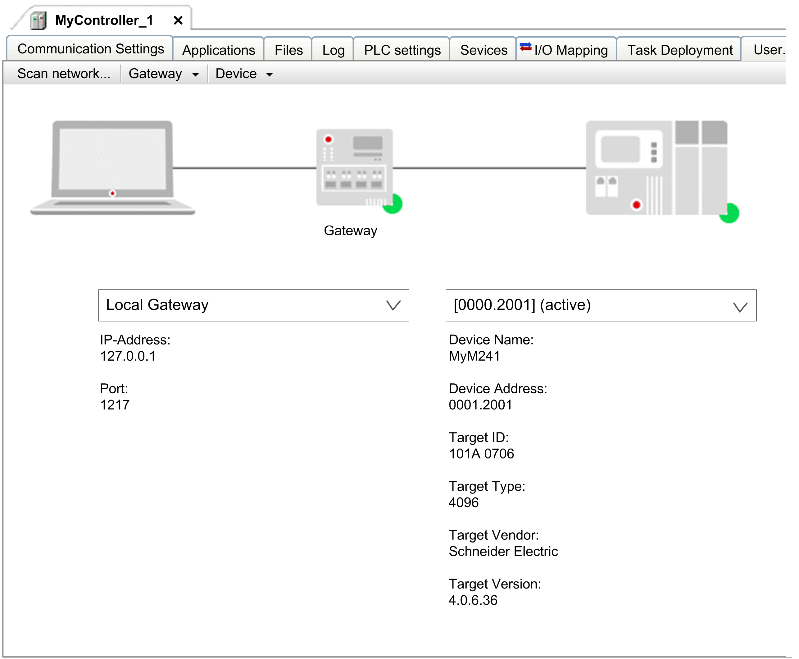

# Communication Settings in Simple Mode

## Overview

The Communication Settings tab in simple mode is displayed when the mode Simple mode has been selected for the parameter Communication page in the Tools > Options > Device editor [dialog box](../../../../../api/crossBook?lang=en-US&virtualBookName=SoMMenu&topicID=D_SE_0084057). It provides a graphic view to configure the parameters for the communication between device and programming system.

The Communication Settings tab in simple mode contains an illustration of the programming device, the present gateway, and the target device with the connection status.

Select a gateway and a target device in the selection fields. The list entries you can select are determined by the Manage gateways and Manage favorite devices parameters.

You can enter the target device in different ways:

* By the IP address, for example 192.168.101.109
* By the device address, for example [056D]
* By the device name, for example MyDevice

NOTE: To search for a device using the device name, unique device names are required within the network.

A status bullet at the right bottom of the gateway symbol indicates the communication status:

| Color | Description |
| --- | --- |
| Red | Connection cannot be established. |
| Green | Connection is established. |
| Black | Connection state is not defined. |

NOTE: Some communication protocols do not allow a periodic verification of the gateway. Thus, the status cannot be displayed.

Click the status bullet of the target device to start a network scan for the device. However, this is only possible if the gateway has not already started searching.

## Description of the Elements

Elements of the Communication Settings tab in simple mode:

| Element | | Description |
| --- | --- | --- |
| Scan network...  button | | Opens the Select Device dialog box that lists the configured gateways and their associated devices.  If Hide non-matching devices, filter by Target ID is selected, only the devices that have the same target ID as the devices configured in the project are displayed.  If Hide non-matching devices, filter by Target ID is not selected, all devices detected in the network are displayed. |
| Gateway list | | – |
|  | Add new gateway... | Opens the Gateway dialog box for [adding a new gateway](../../../../../api/crossBook?lang=en-US&virtualBookName=SoMMenu&topicID=D_SE_0084175). |
|  | Manage gateways... | Opens the Manage gateways dialog box showing an overview of all gateways. In this dialog box, you can add or remove gateways. You can change the order of the gateway entries by using the buttons. |
|  | Configure the Local Gateway... | Opens the Gateway Configuration [dialog box](../../../../../api/crossBook?lang=en-US&virtualBookName=SoMMenu&topicID=D_SE_0084177). It enables you to set up the block driver configuration for the local gateway. |
| Device list | | – |
|  | Add current device to favorites | Adds the defined device to the list of favorite devices. |
|  | Manage favorite devices... | Opens a dialog box showing the list of favorite devices. In this dialog box, you can add or remove devices or change the order of the entries. The device at top of the list defines the default device. |
|  | Rename active device... | Opens a dialog box for renaming the device. |
|  | Wink active device | The connected controller flashes during login. |
|  | Send echo service | The Logic Builder implements the echo service that is similar to a ping tool.  In order to verify the quality of the network connection, five echo data packets are sent to the controller. The amount of user data that is consecutively added to these packets depends on the communication buffer size of the controller.  A result message is displayed that indicates the average round-trip delay time and the amount of user data that has been echoed through the connection. |
|  | Store communication settings in project | If this option is activated, the communication settings can automatically be restored, even if you are going to open the project on another computer.  NOTE: If you use the project on another computer, you must reset the active path.  If this option is not selected, the settings are stored in the local EcoStruxure Machine Expert options on your computer. In this case, you must reconfigure them if you are going to use the project on another computer.  NOTE: If you use SVN, make sure to deactivate this option for the device object not to be blocked. |
|  | Confirmed online mode | If this option is activated, you are prompted for confirmation each time one of the following online commands is to be executed: Force values, Write values, Multiple download, Release force list, Single cycle, Start, Stop. |
|  | Hide non-matching devices, filter by Target ID | If this option is activated, the list is reduced to those devices which have the same target ID as the device configured in the project. |
|  | Encrypted Communication | If this option is activated, the communication to this controller is encrypted. A certificate is required to log in to the controller. If the certificate is not available, an error message is displayed requesting to display and install the certificate.  This option is not available if the option Security level > Enforce encrypted communication is selected in the Security Screen [editor](../../../../../api/crossBook?lang=en-US&virtualBookName=SoMMenu&topicID=D_SE_0099371). |
|  | Change Runtime Security Policy | Opens the Change Runtime Security Policy dialog box for modifying the controller settings for the encryption of communication. |
|  | Change Runtime Password Policy | Click this button to open the Change Runtime Password Policy [dialog box](D-SE-0083386.html#D-SE-0083386__ChangeRuntimePasswordPolicyDialogBo-9C3C10B5) that allows you to modify the controller settings regarding the password policy that is being used. |
|  | Security Settings | Opens the Device Security Settings dialog box that displays the security settings of the connected device. It allows you to modify the settings in the Value column. Click OK to write them to the device. |

## Change Runtime Security Policy Dialog Box

If you select a new communication policy in the Change Runtime Security Policy dialog box, the configuration on the controller is modified:

| Element | Description |
| --- | --- |
| Communication | |
| Current Policy | Displays the selected policy for the encryption of communication. |
| New Policy | Contains a list to select the new policy for encryption:   * No encryption. The controller does not support encrypted communication. * Optional encryption: The controller supports encrypted and unencrypted communication. * Enforced encryption: The controller supports encrypted communication only. |
| Code Signing | |
| Current Policy | Displays the selected policy for code signing. |
| New Policy | Contains a list to select the new policy for code signing:   * All: All types of application code are accepted. * Enforced signing: Signed application code is accepted (helping to prevent loading an application from untrusted sources). |
| Device User Management | |
| Current Policy | Displays the selected policy for user management. |
| New Policy | Contains a list to select the new policy for user management:   * Optional user management: The user management on the device is disabled or can be disabled manually. * Enforced user management: The user management on the device is enabled and cannot be disabled manually. |
| Allow anonymous login | If this option is activated, registered components (for example, OPC UA) can connect to the controller without providing credentials. However, the device user management configured for the controller remains active. |

## Change Runtime Password Policy Dialog Box

If you select a new password policy in the Change Runtime Security Policy dialog box, the configuration on the controller is modified:

| Element | | Description |
| --- | --- | --- |
| Password policy is active | | If this option is activated, a password policy is active for passwords of user accounts defined in the device user management. |
| Password settings area | | |
|  | Minimum length | Defines the minimum length of the password.  Default value: 8 |
|  | Number of unique characters | Defines the number of unique characters a password must contain.  Default value: 4 |
|  | Requires lowercase letter | If this option is activated, the password must contain at least one lowercase letter. |
|  | Requires uppercase letter | If this option is activated, the password must contain at least one uppercase letter. |
|  | Requires digit | If this option is activated, the password must contain at least one digit character. |
|  | Requires special character | If this option is activated, the password must contain at least one special character (such as # or !). |
|  | Must not contain username | If this option is activated, the password must not contain the username of the logged in user. |
| Password expiration is active | | If this option is activated, users are requested to change their password after a configurable time. |
| Password expiration settings area | | |
|  | Scope | Select the type of users to be considered by the password expiration mechanism:   * ADMINS * NONADMINS * ALL (default value) |
|  | Timeout [days] | Select the validity period of the password (in days).  Value range: 1...1000 days  The default value is controller-specific.  To change the password before it expires, the user requires read access for device user management. |
| Login lock is active | | If this option is activated, users are locked after several unsuccessful login attempts according to the parameters configured in the Login lock settings area. |
| Login lock settings area | | |
|  | Scope | Select the type of users to be considered by the locking mechanism:   * ADMINS (default value) * NONADMINS * ALL |
|  | Maximal Retries | Select the maximum number of unsuccessful login attempts before the user accounts gets locked for the time defined with Timeout [s].  If you select the value 0, the number of unsuccessful login attempts is not restricted. The user account is not locked.  Default value: 10 |
|  | Lock duration [s] | Select the time (in seconds) the user account is locked after the maximum number of unsuccessful login attempts (defined with Maximal Retries) have been performed.  To unlock a locked user, an administrator or a member of a user group with write permission for the user group of the locked user can assign a new password for the user.  Default value: 600 |

EIO0000002854.09