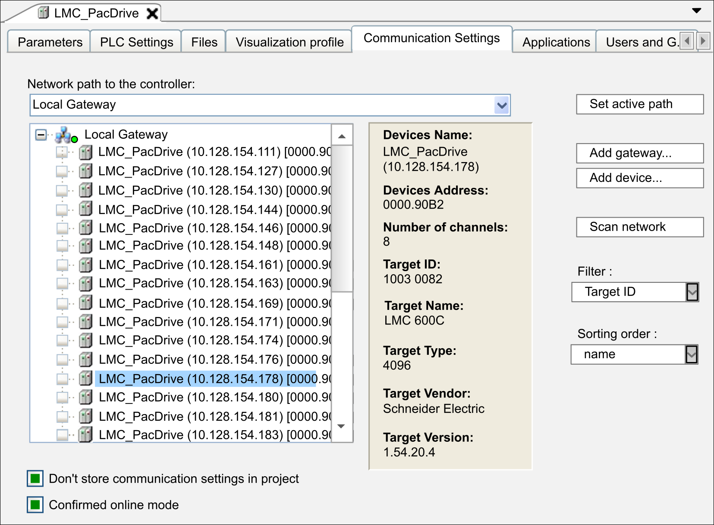
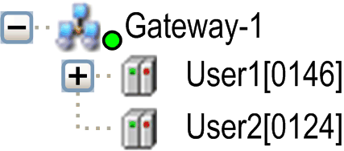

# Communication Settings in Classic Mode

## Overview

The Communication Settings tab in classic mode is displayed when the mode Classic mode has been selected for the parameter Communication page in the Tools > Options > Device editor [dialog box](../../../../../api/crossBook?lang=en-US&virtualBookName=SoMMenu&topicID=D_SE_0084057). It allows you to configure the parameters for the communication between device and programming system.

The Communication Settings tab in classic mode provides a tree structure to configure the parameters:

This tab is divided in 2 parts:

* The left part shows the configured gateway channels in a tree structure.
* The right part shows the corresponding data and information.

## Description of the Tree Structure

When you create the first project on your local system, the local Gateway is already available as a node in the tree. This gateway is started automatically during system start.

The settings of this gateway are displayed when you click the Add gateway...  button:

Example:

Device Name: Gateway-1

Port: 1217

IP-Address: 127.0.0.1

Driver: TCP/IP

A status bullet at the bottom right of the gateway symbol indicates the status of the connection:

| Color | Description |
| --- | --- |
| Red | Connection cannot be established. |
| Green | Connection is established. |
| Black | Connection state is undefined. |

NOTE: Some communication protocols do not allow a periodic verification of the gateway. Thus, the status cannot be displayed.

Indented below the Gateway node (open/close using the +/- sign), you will see entries for the devices which are reachable through this gateway. The device entries are preceded by a  symbol. Entries with a target ID different to that of the device configured in the project, are displayed in gray font. To obtain an up-to-date list of the available devices, use the button Scan network.

The device nodes consist of a symbol followed by the node name and the node address. In the right part of the window, the respective Device Name, Device Address, Block Driver, Encrypted Communication, Number of Channels, Serial Number, Target ID, Target Name, Target Type, Target Vendor, and Target Version are shown.

In the Network path to the controller field, the gateway channel is specified automatically by selecting the channel in the tree structure.

NOTE: The parameter Number of Channels displays the number of channels that is supported by the selected controller. You cannot monitor online the number of channels that are being used.

A channel is a connection to a client (such as Diagnostics, Logic Builder, WebVisu, OPC, HMI). Depending on the communication service, a client may occupy more than one channel for a short time. When all channels supported by the controller are being used, Logic Builder displays the message Connection denied by device: All available communication channels are already in use.

## Filter and Sorting Function

You can filter and sort the gateway and device nodes displayed in the tree by the selection boxes in the right part of the tab:

* Filter: Allows you to reduce the entries of the tree structure to those devices with a Target ID matching that of the device configured in the project.
* Sorting order: Allows you to sort the entries of the tree structure according to the Name or Device Address in alphabetical or ascending order.

## Description of the Buttons / Commands

For changing the communication configuration, the following buttons or commands are available:

| Button / Command | Description |
| --- | --- |
| Set active path | This command sets the selected communication channel as the active path to the controller. See the description of the Set Active Path command. Double-clicking the node in the tree structure has the same effect. |
| Add gateway... | This command opens the Gateway dialog box where you can define a gateway to be added to the configuration.  See the description of the Add Gateway [command](../../../../../api/crossBook?lang=en-US&virtualBookName=SoMMenu&topicID=D_SE_0084175). |
| Add device... | This command opens the Add Device dialog box where you can manually define a device to be added to the selected gateway entry (Consider the Scan network functionality).  See the [description for adding devices](D-SE-0083370.html#D-SE-0083370). |
| Edit Gateway... | This command opens the Gateway dialog box for editing the settings of the selected gateway.  See the description of the Edit Gateway... [command](../../../../../api/crossBook?lang=en-US&virtualBookName=SoMMenu&topicID=D_SE_0084181). |
| Delete selected Device | This command removes the selected device from the configuration tree. |
| Scan for device by address | This command scans the network for devices which have the address specified here in the configuration tree. Those which are found will then be represented in the gateway with the specified node address and their name. The scan refers to devices below that gateway under which an entry is selected.  By default, the command is not available in the menus. Add this command with the Tools > Customize [menu](../../../../../api/crossBook?lang=en-US&virtualBookName=SoMMenu&topicID=D_SE_0084066). |
| Scan for device by name | This command scans the network for devices which have the names specified here in the configuration tree (case-sensitive search). Those which are found will then be represented in the gateway with the specified name and their unique node address. The scan refers to devices below that gateway under which an entry is selected.  By default, the command is not available in the menus. Add this command with the Tools > Customize [menu](../../../../../api/crossBook?lang=en-US&virtualBookName=SoMMenu&topicID=D_SE_0084066). |
| Scan for device by IP address | This command scans the network for devices which have the IP address specified here in the configuration tree. Those which are found will then be represented in the gateway with the specified node address and their name. The scan refers to devices below that gateway under which an entry is selected.  By default, the command is not available in the menus. Add this command with the Tools > Customize [menu](../../../../../api/crossBook?lang=en-US&virtualBookName=SoMMenu&topicID=D_SE_0084066). |
| Send echo service | The Logic Builder implements the echo service that is similar to a ping tool.  In order to verify the quality of the network connection, five echo data packets are sent to the controller. The amount of user data that is consecutively added to these packets depends on the communication buffer size of the controller.  A result message is displayed that indicates the average round-trip delay time and the amount of user data that has been echoed through the connection. |
| Configure the local gateway | This command opens a dialog box for the configuration of a local gateway and therefore provides an alternative to manual editing the file *Gateway.cfg*.  See the description of the Configure the local gateway... [command](../../../../../api/crossBook?lang=en-US&virtualBookName=SoMMenu&topicID=D_SE_0084177). |
| Scan network | This command starts a search for available devices in your local network. The configuration tree of the concerned gateway will be updated accordingly. |

## Description of the Options

Two options are available below the tree structure:

| Option | Description |
| --- | --- |
| Don't store communication settings in project | Activate this option if the network path definition should not be stored in the project, but in the local option settings on your computer. Therefore, the path setting is restored if the project is reopened on the same computer. It will have to be redefined if the project is used on another system.  NOTE: If you are using [SVN](../../../../../api/crossBook?lang=en-US&virtualBookName=codesys_svn&topicID=_svn_f_codesys_svn), activate this option to help prevent a lock on the device object. |
| Confirmed online mode | Activate this option if the user should be prompted for confirmation when selecting one of the following online commands: Force values, Multiple download, Release force list, Single cycle, Start, Stop, Write values. |

EIO0000002854.09