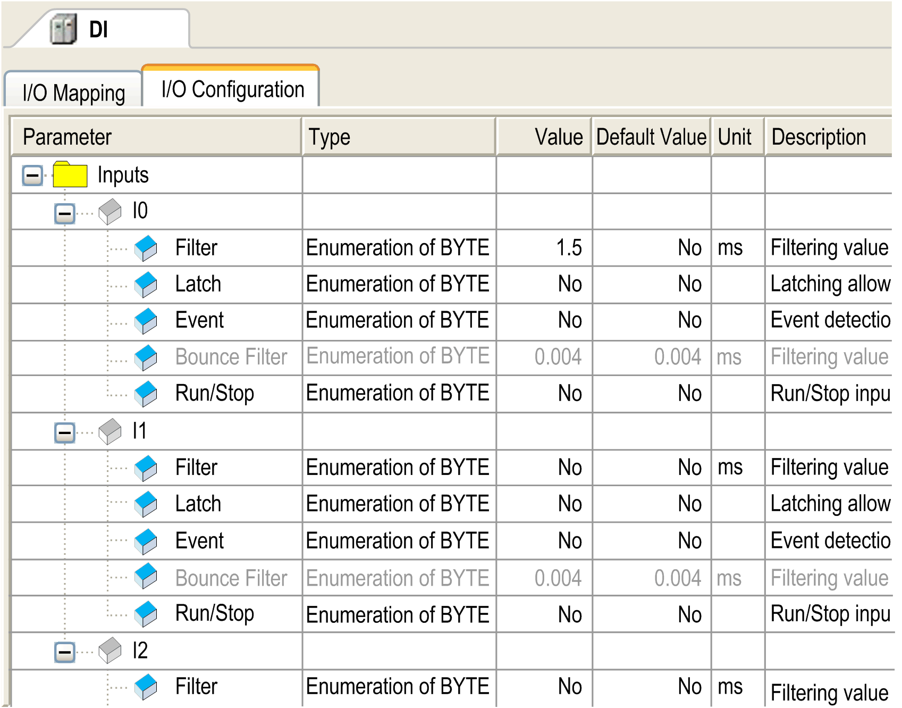

# Configuration

## Overview

The Configuration view is only available in the device editor if the option Show generic device configuration views in the Tools > Options > Device editor dialog box is activated. The Configuration view shows the device-specific parameters, and, if allowed by the device description, provides the possibility to edit the parameter values.

Configuration view of the device editor

The view contains the following elements:

| Element | Description |
| --- | --- |
| Parameter | Parameter name, not editable |
| Type | Data type of parameter, not editable |
| Value | Primarily, the default value of the parameter is displayed directly or by a symbolic name. If the parameter can be modified (this depends on the device description, non-editable parameters are displayed as gray-colored), click the table cell to open an edit frame or a selection list to change the value. If the value is a file specification, the dialog box for opening a file opens by double-clicking the cell. It allows you to select another file. |
| Default Value | Default parameter value, not editable |
| Unit | Unit of the parameter value (for example: ms for milliseconds), not editable |
| Description | Short description of the parameter, not editable |

EIO0000002854.09