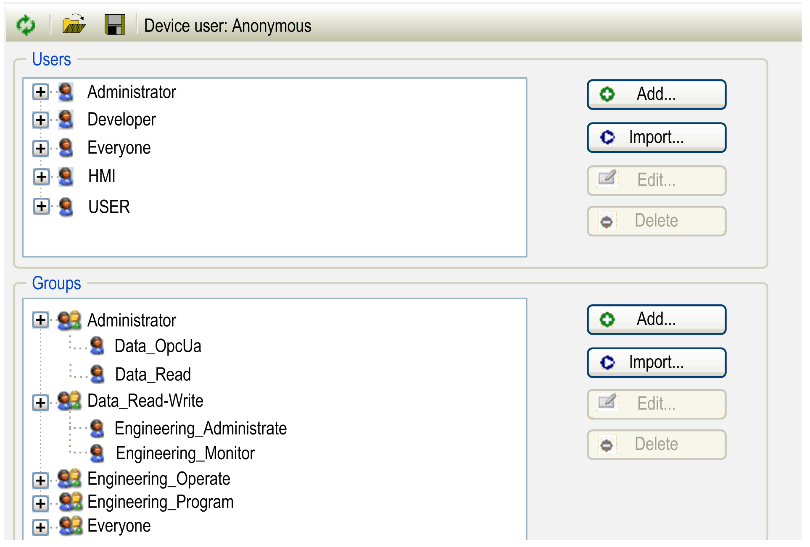

# Users and Groups

## Overview

The Users and Groups view of the device editor is provided for devices supporting device Users and Groups management. If supported by the device, you can view and edit the Users and Groups management for the device. Thereafter, you can assign rights to allow certain user groups to access objects on the controller at runtime by assigning Access Rights.

For the user management at the project level, refer to the Project > User Management > Permissions... [command](../../../../../api/crossBook?lang=en-US&virtualBookName=SoMMenu&topicID=D_SE_0083978).

If you want to encrypt your entire project, activate the option Enable project file encryption in the Project Settings > Security [dialog box](../../../../../api/crossBook?lang=en-US&virtualBookName=SoMMenu&topicID=D_SE_0083955).

If you want to encrypt only a part of your code inside the project, put this code inside a [compiled library](../../../../../api/crossBook?lang=en-US&virtualBookName=SoMMenu&topicID=D_SE_0083896).

The device Users and Groups management can be pre-defined in the device description.

As in the project user management, users have to be members of at least one user group. Only user groups can be assigned specific [access rights](D-SE-0083877.html#D-SE-0083877).

For managing Users and Groups, you have to login as a user with administrative rights.

NOTE: It is not intended that the Users and Groups feature be used to protect the EcoStruxure Machine Expert controllers against malicious access, but rather to help prevent mistakes from trusted users.

| CAUTION | |
| --- | --- |
|  | UNAUTHENTICATED, UNAUTHORIZED ACCESS  * Do not expose controllers and controller networks to public networks and the Internet as much as possible. * Use additional security layers like VPN for remote access and install firewall mechanisms. * Restrict access to authorized people. * Change default passwords at start-up and modify them frequently. * Validate the effectiveness of these measures regularly and frequently.  Failure to follow these instructions can result in injury or equipment damage. |

NOTE: You can use the [security-related commands](../../../../../api/crossBook?lang=en-US&virtualBookName=SoMMenu&topicID=D_SE_0084011) which provide a way to add, edit, and remove a user in the online Users and Groups management of the target device where you are logged in.

NOTE: You must establish user access-rights using EcoStruxure Machine Expert software. If you have *cloned* an application from one controller to another, you will need to enable and establish user access-rights in the targeted controller.

NOTE: The only way to gain access to a controller that has user access-rights enabled and for which you do not have the password(s) is by performing an Update firmware operation using an SD card or USB memory key (refer to the *Controller Assistant User Guide* for further information), depending on the support of your particular controller, or by running a script. Since the process of running a script is specific to each controller, refer to the chapters *File Transfer with SD Card* or *File Transfer with USB Memory Key* in the Programming Guide of the controller you are using. This will effectively remove the existing application from the controller memory, but will restore the ability to access the controller.

## Toolbar of the Users and Groups View

The toolbar provides the following elements:

| Element | Description |
| --- | --- |
| Synchronization | Click the Synchronization button to switch on / off the synchronization between the editor and the Users and Groups management in the controller.  If Synchronization is not activated, then the editor contains a Users and Groups management configuration that has been imported from disk, or it does not contain any configuration at all.  If Synchronization is activated, the data displayed in the editor is continuously synchronized with the Users and Groups management configuration on the connected controller.  If you invoke Synchronization while the editor contains a Users and Groups configuration that is not synchronized with the device, you are prompted to decide what will be displayed in the editor:   * Upload from the device and overwrite the editor content: The Users and Groups configuration from the controller is loaded to the editor. The contents of the editor is overwritten. * Download the editor content to the device and overwrite the user management there: The configuration from the editor is loaded to the controller. The contents of the controller is overwritten. |
| Import from disk | NOTE: EcoStruxure Machine Expert V2.0 and later versions no longer support *Device user management* files of type \*.dum. The import of a file of type \*.dum2 overwrites the user management on the device. Afterwards you will be requested to log in to the device as a user using the authentication data of the new user management.  When you click the Import from disk button, a dialog box opens requesting you to select a file of type \*.dum2 from your hard disk. After you have selected the file, the Enter Password dialog box opens requesting you to enter the password that was assigned when the file was exported. The user management is enabled.  The Import from disk is available when you are in offline mode or Synchronization is deactivated. |
| Export to disk | When you click the Export to disk button, an Enter Password dialog box opens requesting you to enter a password for the device user management file.  NOTE: The password assigned here will be requested during the Import from disk procedure.  After you have assigned a password, the dialog box for saving a file is displayed. With EcoStruxure Machine Expert V2.0 and later versions, only files of type \*.dum2 are supported. |
| Device user | Name of the user who is logged into the controller. |

## Users and Groups Management

The handling of the Users and Groups is similar to that of the project user management.

Example of a Users and Groups view of the device editor:

This view is divided in 2 parts:

* The upper part is dedicated to access management of Users.
* The lower part is dedicated to access management of Groups.

Elements of the Users section:

| Element | Description |
| --- | --- |
| The tree structure on the left-hand side lists the defined users and indicates the user groups to which they are assigned as sub nodes. | |
| Add button | Opens the Add User dialog box for creating a new user account.  For further information, refer to the section [Setting up a New User in the Users and Groups Management of the Controller](#D-SE-0083876__D-SE-0083876.11). |
| Import button | Opens the Import Users dialog box. It lists the user accounts defined in the project user management.  Select the entries of your choice (by pressing the **Shift** key for selecting more than one) and click OK to import them in the device user management.  NOTE: For each user to be imported the Enter Password dialog box is displayed requesting you to enter the password of the project user account. This password will then also be used for the corresponding device user account. |
| Edit button | Opens the Edit User <user name> dialog box. It allows you to modify the settings of the user account. |
| Delete button | Deletes the account of the selected user. |

Elements of the Groups section:

| Element | Description |
| --- | --- |
| The tree structure on the left-hand side lists the defined groups and indicates the assigned users as sub nodes. | |
| Add button | Opens the Add Group dialog box for creating a new user group.   1. Enter a name for the group. 2. From the list of users, select the users to assign to the new group. 3. Click the OK button to confirm and the new group will be displayed in the tree structure. |
| Import button | Opens the Import Groups dialog box. It displays the user groups defined in the project user management.  As a prerequisite for importing groups, you must have imported all users that are members of this group into the device user management beforehand.  Select the group entries of your choice and click OK to import them in the device user management.  NOTE: The default group Everyone cannot be imported in the device user management.  NOTE: After you have successfully imported a group, assign access rights either:  * By adding the new group to an existing group, or * By explicitly assigning access rights to the new group.   For further information, refer to [Access Rights](D-SE-0083877.html). |
| Edit button | Opens the Edit Group <group name> dialog box. It allows you to modify the definition of the group. |
| Delete button | Deletes the selected group. |

## Editing or Viewing the Users and Groups Management Before any Users and Groups Have Been Established

If the controller supports device Users and Groups management, proceed as follows during first login:

| Step | Action | Comment |
| --- | --- | --- |
| 1 | Double-click the controller node in the Devices tree. | **Result**: The device editor opens. |
| 2 | Select the Users and Groups view. | – |
| 3 | Click the Synchronization button . | **Result**: A dialog box opens prompting you to decide whether the device Users and Groups management should be activated. |
| 4 | Click Yes to confirm the dialog box and to activate device Users and Groups management. | **Result**: The Device user login dialog box opens. |
| 5 | Enter a new user name. | – |
| 6 | Enter your individual Password. | NOTE: The password must comply with the password policy configured in the [Change Runtime Password Policy dialog box](D-SE-0083386.html#D-SE-0083386__ChangeRuntimePasswordPolicyDialogBo-9C3C10B5). |
| 7 | Re-enter your individual Password. | – |
| 6 | Click OK to confirm. | **Result**: You are requested to enter the new credentials for accessing the controller. They are assigned the highest user rights level and allow you to manage access rights for users or user groups. |

## Setting up a New User in the Users and Groups Management of the Controller

If the controller supports device Users and Groups management, you can add a new user as follows:

| Step | Action | Comment |
| --- | --- | --- |
| 1 | Double-click the controller node in the Devices tree. | **Result**: The device editor opens. |
| 2 | Select the Users and Groups view. | – |
| 3 | Click the Synchronization button  to load the Users and Groups management configuration from the controller to the editor. | If you are not logged in to the controller yet, then the dialog box Device User Login opens. It allows you to enter the user name and the password.  **Result**: The Users and Groups management configuration of the controller is displayed in the editor. |
| 4 | Click the Add button in the Users part of the Users and Groups view. | **Result**: The Add User dialog box opens. |
| 5 | Enter a Name for the new user and select a Default group for the user from the list. | You can assign the user to other groups later. |
| 6 | Enter a new password, confirm the password, and specify whether the user can change the password and whether the user has to change the password at the first login. | NOTE: The password must comply with the password policy configured in the [Change Runtime Password Policy dialog box](D-SE-0083386.html#D-SE-0083386__ChangeRuntimePasswordPolicyDialogBo-9C3C10B5). |
| 7 | Click OK to confirm and to close the Add User dialog box. | **Result**: The new user is displayed in the Users part as a new node and in the Groups part as a new subnode of the selected default group. |

## Loading a Users and Groups Management From a \*.dum File, Modifying it, and Later Downloading it to the Controller

| Step | Action | Comment |
| --- | --- | --- |
| 1 | Double-click the controller node in the Devices tree. | **Result**: The device editor opens. |
| 2 | Select the Users and Groups view. | – |
| 3 | Click the Edit button, browse to the \*.dum file that contains the saved Users and Groups management, and click Open to confirm. | **Result**: The users and groups settings that are saved in the file are displayed in the editor. |
| 4 | Adapt the settings according to your requirements. | – |
| 5 | Click the Synchronization button  to transfer the Users and Groups management configuration to the controller. | A dialog box is displayed, prompting you to select an operation. |
| 6 | Select the option Download the editor content to the device and overwrite the user management there. | **Result**: The Device user login dialog box is displayed. |
| 7 | Enter login data in order to log in to the controller. | After successful login, the modifications are transferred to the controller.  As long as the Synchronization button  is activated, modifications made in the editor are automatically transferred to the controller. |

## Printing the Users and Groups Management Configuration

To print the settings of the Users and Groups view, run the command Print from the File menu or the command Document from the Project menu.

EIO0000002854.09