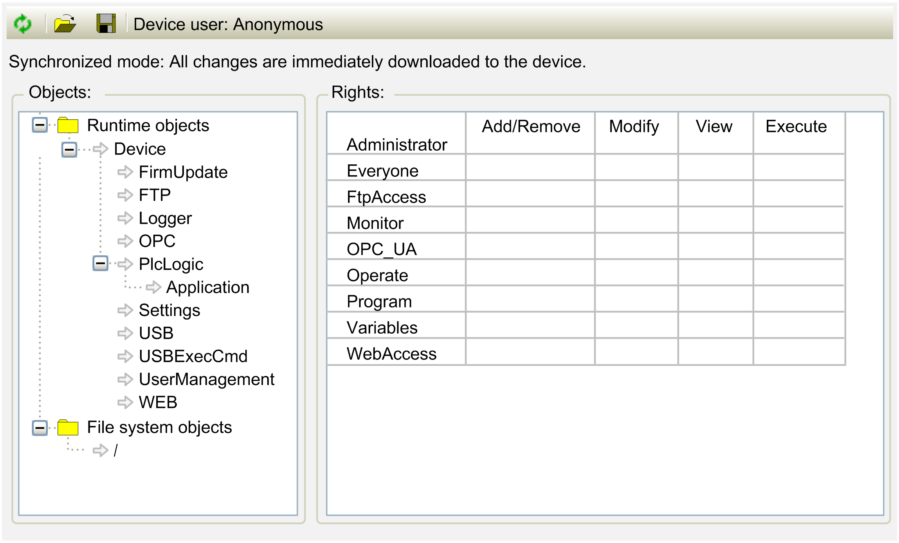

# Access Rights

## Overview

In the Access Rights view of the device editor, define the device access rights of device users to objects in the controller.

In order for the Access Rights view to be available in the device editor of controllers, activate the Show access rights page option in the Tools > Options > Device Editor [dialog box](../../../../../api/crossBook?lang=en-US&virtualBookName=SoMMenu&topicID=D_SE_0084057). Furthermore, Users and Groups management must be set up in the controller.

Example of an Access Rights view of the device editor

NOTE: Detailed information on the concept and use of device user management is provided in [*Handling of Device User Management* in the *Security* chapter](D-SE-0108435.html).

## Modifying Access Rights to Controller Objects in the Users and Groups Management of the Controller

If the controller supports device Users and Groups management, you can assign access rights as follows:

| Step | Action | Comment |
| --- | --- | --- |
| 1 | Double-click the controller node in the Devices tree. | **Result**: The device editor opens. |
| 2 | Select the Access Rights view. | – |
| 3 | Click the Synchronization button  to load the Access Rights management configuration from the controller to the editor. | If you are not logged in to the controller yet, then the dialog box Device User Login opens. It allows you to enter the user name and the password.  **Result**: The Access Rights management configuration of the controller is displayed in the editor. |
| 4 | In the Objects tree structure on the left-hand side, select the object. | **Result**: In the Rights area on the right-hand side, the access rights of the selected object are displayed in a table for the configured user groups. |
| 5 | In the Rights table, double-click the access right you want to modify. | If the selected object has child objects, a dialog box is displayed, prompting you whether you want to modify the access rights for the child objects at the same time. |
| 6 | Click Yes or No to modify the access rights of the child objects and to close the dialog box. | **Result**: The access rights are switched from allowed to not allowed or vice versa.  The symbol in the table cell is modified accordingly.  Rights that are set explicitly are displayed in the table by green or red symbols.  Rights that are inherited from a parent object are displayed in the table by gray symbols. |

## Toolbar of the Access Rights View

The toolbar provides the following elements:

| Element | Description |
| --- | --- |
| Synchronization | Click the Synchronization button to switch on / off the synchronization between the editor and the Access Rights management in the controller.  If Synchronization is not activated, then the editor contains an Access Rights management configuration that has been imported from disk, or it does not contain any configuration.  If Synchronization is activated, the data displayed in the editor is continuously synchronized with the Access Rights management configuration on the connected controller.  If you invoke Synchronization while the editor contains an Access Rights management configuration that is not synchronized with the device, you are prompted to decide what will be displayed in the editor:   * Upload from the device and overwrite the editor content: The Access Rights configuration from the controller is loaded to the editor. The contents of the editor is overwritten. * Download the editor content to the device and overwrite the user management there: The configuration from the editor is loaded to the controller. The contents of the controller is overwritten. |
| Load from disk | When you click the Load from disk button in the Access Rights view, the file type is by default set to *Device rights management* files (\*.drm). The existing configuration will be overwritten by the imported file. |
| Save to disk | When you click the Save to disk button in the Access Rights view, the file type is by default set to *Device rights management* files (\*.drm). For this file, a password does not have to be assigned before saving. |
| Device user | Name of the user who is logged into the controller. |

## Objects Area

In the Objects tree structure on the left-hand side, the objects are listed that allow actions to be executed in runtime mode. The objects are assigned by their object source. They are partially sorted in object groups. In the Rights area on the right-hand side, you can configure the access options of the selected object for a user group.

On the top level of the Objects tree structure there are two object categories grouped in folders:

* Runtime objects
* File system objects

Indented below the object categories, there are further subnodes. The subnode Device, for example, can, in turn, have the following subnodes:

* Logger
* PlcLogic
* Settings
* UserManagement

A description of the objects is provided in the paragraph [Overview of the Objects](#D-SE-0083877__D-SE-0083877.12).

## Rights Area

In general, access rights are inherited from the root node (Device or / ) to the subnodes. If a permission of a user group is denied or explicitly granted to a parent object, then this is also applied to the child objects.

In the Rights area on the right-hand side, the access rights of the selected object are displayed in a table. For every user group, it displays the rights configured for the possible actions on the selected object.

The following actions can be configured for the object:

* Add/Remove
* Modify
* View
* Execute

The symbols represent the access rights:

| Icon | Description |
| --- | --- |
|  | Access (action) is permitted explicitly. |
|  | Access (action) is denied explicitly. |
|  | The access right has been inherited from the parent object. |
|  | Access has not been permitted or denied explicitly, even for the parent object. No access is possible |
| No icon | Several objects with different access rights are selected. |

To modify an access right, click the symbol.

## Example

The Logger node in the Access Rights tab is created by the logger component and controls its access rights. It is located directly below the Runtime objects > Device node.

For this object, you can only grant View access rights.

By default, each object is assigned read access. Thus, every user can read the logger of a controller.

To deny this access right for a single user group (Service, for example), set the View right for the Logger object to .

## Printing the Access Rights Definition

To print the settings of the Access Rights view, run the command Print from the File menu or the command Document from the Project menu.

## Overview of the Objects

The following table provides an overview of general runtime objects. Consult the *Programming Guide* specific to your controller for controller-specific objects.

| Object | Description |
| --- | --- |
| Runtime objects > Device | |
| Logger | Online access to the logger is read only. Therefore, only the View access right can be granted or denied. |
| PlcLogic | Applications are inserted as child objects during download. If applications are deleted, the child object subnodes are also removed here. This allows for dedicated control of online access to the application.  The PlcLogic object allows you to assign access rights at a central place for all applications:   * The Administrator and Developer user groups have full access to the applications. * The Service and Watch user groups have read access (for example, for read-only monitoring of values).   Also refer to the table in the [*Access Rights for IEC Applications* paragraph](#D-SE-0083877__D-SE-0083877.13). |
| RemoteConnections | The RemoteConnections object allows you to configure additional external connections to the controller, such as access to the OPC UA server. |
| Settings | Online access to the configuration settings of a controller.  By default, the access right Modify is granted to the administrator exclusively. |
| UserManagement | Online access to the user management of a controller.  By default, the access right Modify is granted to the administrator exclusively. |
| X509 | Online access to the X.509 certificates:   * Read (View) * Write (Modify)   Each operation is inserted as a child object below X509 and one of the two access rights is assigned. This allows you to specify the access per operation. |
| FTP | Allows you to configure the access rights to the FTP server on the controller. |
| OPC | Allows you to configure the access rights to the controller using OPC UA. |
| USB | Allows you to configure the access rights to files on a USB storage device connected to the controller. |
| USBExecCmd | Allows you to configure the access rights for executing scripts located on a USB storage device connected to the controller. |
| WEB | Allows you to configure the access rights to the webserver on the controller. |
| File system objects > / | |
| – | The folders of the execution path of the controller are inserted below the / file system object. This allows you to grant specific rights to each folder of the file system. |

## Access Rights for Applications

The table indicates which action is affected when a specific access right is granted for an Application:

| Operation | Access rights | | | |
| --- | --- | --- | --- | --- |
| Add/ Remove | Execute | Modify | View |
| Login | – | – | – | X |
| Create | X | – | – | – |
| Create child object | X | – | – | – |
| Delete | X | – | – | – |
| Download / online change | X | – | – | – |
| Create boot application | X | – | – | – |
| Read variable | – | – | – | X |
| Write variable | – | – | X | X |
| Force variable | – | – | X | X |
| Set and delete breakpoint | – | X | X | – |
| Set next statement | – | X | X | – |
| Read call stack | – | – | – | X |
| Single cycle | – | X | – | – |
| Switch on flow control | – | X | X | – |
| Start / Stop | – | X | – | – |
| Reset | – | X | – | – |
| Restore retain variables | – | X | – | – |
| Save retain variables | – | – | – | X |
| **(X)** The access right must be set explicitly.  **(–)** The access right is not relevant. | | | | |

EIO0000002854.09