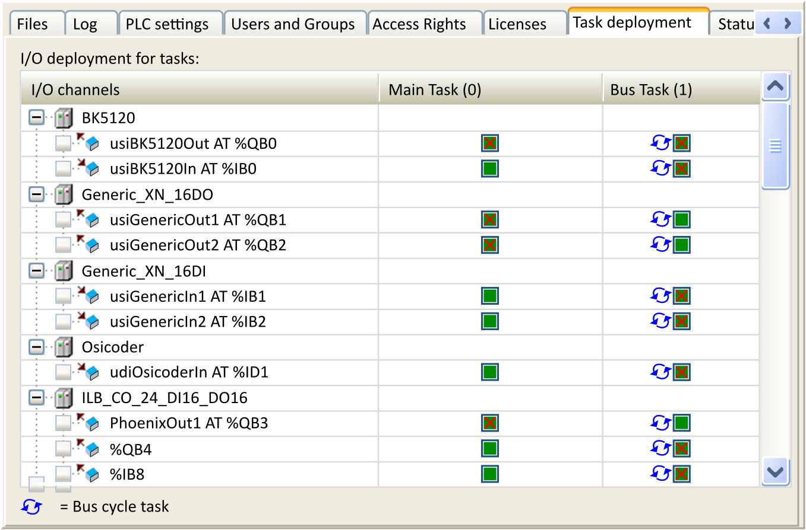

# Task Deployment

## Overview

The Task deployment view of the device editor shows a table with inputs/outputs and their assignment to the defined tasks. Before the information can be displayed, the project has to be compiled and the code has to be generated. This information helps in troubleshooting in case that the same input/output is updated in different tasks with different priorities.

Task deployment of the device editor

The table shows the tasks sorted by their task priority. Click the column heading (Main Task) to display only the variables assigned to this task. To show all variables again, click the first column (I/O channels).

To open the I/O mapping table of a channel, double-click the input or output.

A blue arrow indicates the task of the bus cycle.

In the example above, the variable usiBK5120Out AT %QB0 is used in 2 different tasks. In this situation, the output, set by one task, can be overwritten by the other task: this can lead to an undefined value. Writing output references in more than one task makes the program difficult to debug and may lead to unintended results in the operation of your machine or process.

| WARNING | |
| --- | --- |
|  | UNINTENDED EQUIPMENT OPERATION  Do not write to an output variable in more than one task.  Failure to follow these instructions can result in death, serious injury, or equipment damage. |

EIO0000002854.09