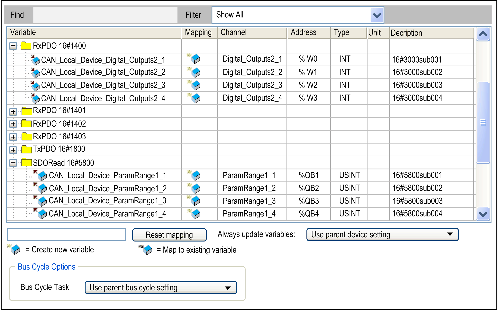
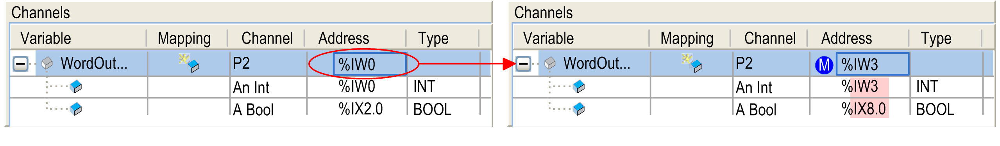
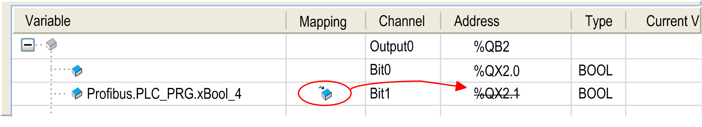
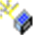

# Working with the I/O Mapping Dialog Box

## Overview

The following is an illustration of the I/O Mapping tab of the device editor:

## Description of the Elements in the Channels Area

The I/O Mapping tab provides the following elements in the Channels area if provided by the device:

| Element | Description |
| --- | --- |
| Channel | Symbolic name of the input or output channel of the device |
| Address | Address of the channel, for example: `%IW0` |
| Type | Data type of the input or output channel, for example: BOOL  If the data type is not standard, but a structure or bit field defined in the device description, it will be listed only if it is part of the IEC 61131–3 standard. It is indicated as IEC type in the device description. Otherwise, the entry of the table will be empty. |
| Default value | This column is only available if the option Set all outputs to default is selected for the parameter Behaviour for outputs in Stop in the PLC Settings [view of the device editor](D-SE-0083392.html#D-SE-0083392).  Default value that is assigned to the channel when the controller is set to STOP mode.  You can edit this field only if you are mapping to a new created variable or if no mapping is specified. When you are mapping to an existing variable, the initialization value of the variable is used as the default value.  NOTE: In case a “new” variable and an “existing” variable (by using the `AT` declaration) are mapped to the same output, the initialization value of the “existing” variable is used as default value.  NOTE: You can modify the default value using an online change. The new value will be applied when executing a Reset cold or Reset warm. |
| Unit | Unit of the parameter value, for example: ms for milliseconds |
| Description | Short description of the parameter |
| Current Value | This column is available only in online mode.  Present value of the parameter. |

NOTE: Inputs and outputs that are not used in the application are not read by the controller in online mode. To indicate that these inputs and outputs are not used, they are marked with a gray background. Any values that might appear in these gray lines are invalid.

| WARNING | |
| --- | --- |
|  | UNINTENDED EQUIPMENT OPERATION  Do not map other user variables in the I/O Mapping tab if you are using libraries for fieldbus communications that are reading/writing from/to direct addresses (`%I`, `%Q`).  Failure to follow these instructions can result in death, serious injury, or equipment damage. |

Consult the documentation of your fieldbus library to see if direct addresses are used.

## Modifying and Locking Addresses

This function is not available for all supported controllers. Consult the *Programming Guide* specific to your controller for further information.

You can modify and lock the displayed address of an output or input here in this tab. Use this to adapt the addressing to a given hardware configuration or to keep the address value even if the order of the modules is changed. By default, this would cause an automatic adaptation of the address values.

Consider that depending on the device description, you can only modify the address of the input or output, however, not that of its subelements (bit channels). Therefore, if an input or output is represented here in the mapping table with a subtree, you can edit only the address field of the uppermost entry (see the figure below: only the address field in the first line can be opened).

In order to fix the address value, select the entry in the Address column and press the SPACE bar to open the edit field. Either modify the value or leave it unmodified and close the edit field via the RETURN key. The address field is marked by an M symbol which indicates that the value has been modified.

If the value has been modified, the subsequent addresses (up to the next address) will be adapted correspondingly:

If you want to revert the modification of the value, reopen the address edit field, delete the address entry, and close with Enter. The address and the identified succeeding addresses will be set back to the values they had before the manual modification. The M symbol will be removed.

## Configuration of the I/O Mapping

Perform the I/O mapping by assigning the corresponding project variables to the device input and output channels each in the Variable column.

* The type of the channel is already indicated in the Variable column by a symbol:  for input,  for output. In this line, enter the name or path of the variable to which the channel should be mapped. You can either map on an existing project variable or define a new variable, which then will automatically be declared as a global variable.
* When mapping structured variables to outputs, the editor will prevent that both the structure variable (for example, on `%QB0`) and particular structure elements (for example, in this case on `%QB0.1` and `QB0.2` ) can be entered.

  This means: When there is a main output entry with a subtree of bit channel entries in the mapping table, then either in the line of the main entry a variable can be entered or in those of the subelements (bit channels) never in both.
* For mapping on an existing variable, specify the complete path. For example: <application name>.<pou path>.<variable name>';

  Example: `app1.plc_prg.ivar`

  For this purpose, it can be helpful to open the input assistant via the ... button. In the Mapping column, the  symbol will be displayed and the address value will be crossed out. This does not mean that this memory address does not exist any longer. However, it is not used directly because the value of the existing variable is managed on another memory location, and, especially in case of outputs, no other already existing variable should be stored to this address (`%Qxx` in the I/O mapping) in order to avoid ambiguities during writing the values.

See in the following example an output mapping on the existing variable `xBool_4`:

NOTE: When you are mapping to an existing variable, the initialization value of the variable is used as the default value. You can edit the Default value field only if you are mapping to a new created variable or if no mapping is specified.

* If you want to define a new variable, enter the desired variable name.

  Example: `bVar1`

  In this case, the symbol will be inserted in the Mapping column and the variable will be internally declared as a global variable. From here, the variable will be available globally within the application. The mapping dialog box is another place for the declaration of global variables.

  NOTE: Alternatively, an address can also be read or written within a program code, such as in ST (structured text).
* Considering the possibility of changes in the device configuration, do the mappings within the device configuration dialog box.

NOTE: If a UNION is represented by I/O channels in the mapping dialog box, it depends on the device whether the root element is mappable or not.

If a declared variable of a given data type is larger than that to which it is being mapped, the value of the variable being mapped will be assigned a truncated to the size of the mapped target variable.

For example, if the variable is declared as a WORD data type, and it is mapped to a BYTE, only 8 bits of the word will be mapped to the byte.

This implies that, for the monitoring of the value in the mapping dialog box, the value displayed at the root element of the address will be the value of the declared variable - as currently valid in the project. In the subelements below the root, the particular element values of the mapped variable will be monitored. However, only part of the declared value may be displayed among the subelements.

A further implication is when you map a declared variable to physical outputs. Likewise, if you map a data type that is larger than the output data type, the output data type may receive a truncated value such that it may affect your application in unintended ways.

| WARNING | |
| --- | --- |
|  | UNINTENDED EQUIPMENT OPERATION  Verify that the declared data type that is being mapped to physical I/O is compatible with the intended operation of your machine.  Failure to follow these instructions can result in death, serious injury, or equipment damage. |

| Element | Description |
| --- | --- |
| Reset mapping | Click this button to reset the mapping settings to the defaults defined by the device description file. |
| Always update variables | Definition if the I/O variables are updated in the [bus cycle task](D-SE-0083392.html#D-SE-0083392). The default value is defined in the device description.   * Use parent device settings: Update according to the settings of the parent device. * Enabled 1 (use bus cycle task if not used in any task): The I/O variables are updated in the bus cycle task if not used in another task. * Enabled 2 (always in bus cycle task): The variables are updated in every cycle of bus cycle task, regardless of whether they are being used or whether they are mapped to an input or to an output channel. |

## Bus Cycle Options

This configuration option is available for devices with cyclic calls before and after reading inputs or outputs. It allows you to set a device-specific [bus cycle task](D-SE-0083392.html#D-SE-0083392).

Per default, the parent bus cycle setting will be valid (Use parent bus cycle setting). Therefore, the Devices Tree will be searched for the next valid bus cycle task definition.

To assign a specific bus cycle task, select the desired one from the selection list. The list provides the tasks currently defined in the application task configuration.

| WARNING | |
| --- | --- |
|  | UNINTENDED EQUIPMENT OPERATION  Do not write to an output variable in more than one task.  Failure to follow these instructions can result in death, serious injury, or equipment damage. |

EIO0000002854.09