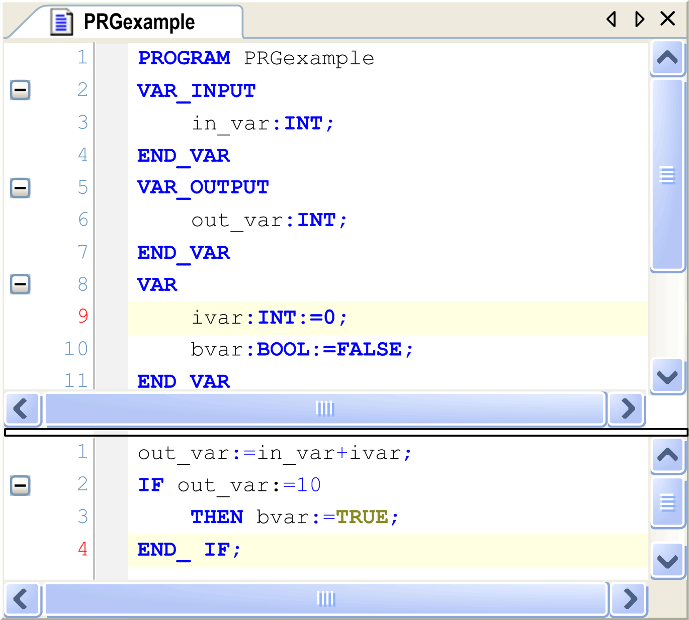
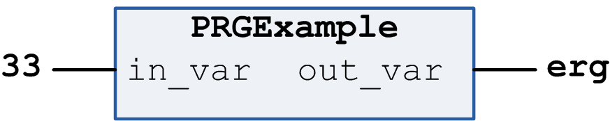

# Program

## Overview

A program is a POU object which returns one or several values during operation. All values are retained from the last time the program was run until the next. However, there are not separate instances of programs, unlike function blocks. When calling a function block, only the values in the given instance of the function block are modified. The modifications are only affected when the same instance is called again. Program value modifications will be retained until the program gets called again even if called from another POU.

## Adding a Program

To add a program to an existing application, select the application node in the Applications tree, click the green plus button, and execute the command POU.... As an alternative, right-click the Application node, and execute the command Add Object > POU from the contextual menu. To add an application-independent POU, select the Global node of the Applications tree, and execute the same commands.

In the Add POU dialog box select the Program option, enter a name for the program, and select the desired implementation language. Click Open to confirm. The editor view for the new program opens and you can start editing the program.

## Declaring a Program

Syntax:

PROGRAM <program name>

This is followed by the variable declarations of [input](D-SE-0083607.html#D-SE-0083607__D-SE-0083607.4), [output](D-SE-0083607.html#D-SE-0083607__D-SE-0083607.5), and program variables. Access variables are available as options as well.

Example of a program



## Calling a Program

A program can be called by another POU. However, a program call in a [Function](D-SE-0083408.html#D-SE-0083408) is not allowed. There are no instances of programs.

If a POU has called a program and if the values of the program have been modified, these modifications will be retained until the program gets called again. This applies even if it is called from within another POU. Consider that this is different from calling a function block. When calling a function block, only the values in the given instance of the function block are modified. The modifications are only affected when the same instance is called again.

In order to set input and/or output parameters in the course of a program call, in text language editors (for example, ST), assign values to the parameters after the program name in parentheses. For input parameters, use `:=` for this assignment, as with the [initialization of variables](D-SE-0083601.html#D-SE-0083601) at the declaration position. For output parameters, use  `=>`. See the following example.

If the program is inserted via the Input Assistant using the option Insert with arguments in the implementation view of a text language editor, it will be displayed automatically according to this syntax with all parameters, though you do not necessarily have to assign these parameters.

## Example for Program Calls

Program in IL:

```
CAL               PRGexample               (
         in_var:= 33                       )
LD                PRGexample.out_var       
ST                erg
```

Example with assigning the parameters (Input Assistant using the option Insert with arguments):

Program in IL with arguments:

```
CAL               PRGexample               (
         in_var:= 33                       ,
        out_var=> erg                      )
```

Example in ST

```
PRGexample(in_var:= 33);
erg := PRGexample.out_var;
```

Example with assigning the parameters (Input Assistant using the option Insert with arguments as described previously):

```
PRGexample (in_var:=33, out_var=>erg );
```

Example in FBD

Program in FBD:



EIO0000002854.09