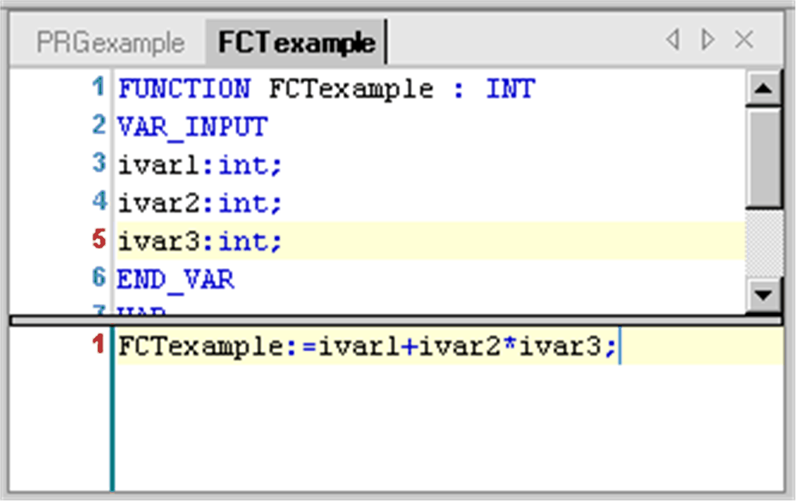
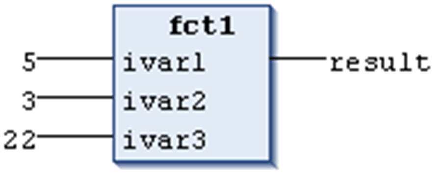

# Function

## Overview

A function is a POU which yields exactly one data element (which can consist of several elements, such as fields or structures) when it is processed. Its call in textual languages can occur as an operator in expressions.

## Adding a Function

To assign the function to an existing application, select the application node in the Applications tree, click the green plus button, and execute the command POU.... As an alternative, right-click the Application node, and execute the command Add Object > POU from the contextual menu. To add an application-independent POU, select the Global node of the Applications tree, and execute the same commands.

In the Add POU dialog box, select the Function option. Enter a Name (<function name>) and a Return Data Type (<data type>) for the new function and select the desired implementation language. To choose the return data type, click the button ... to open the Input Assistant dialog box. Click Open to confirm. The editor view for the new function opens and you can start editing.

## Declaring a Function

Syntax:

FUNCTION <function name> : <data type>

This is followed by the variable declarations of input and function variables.

Assign a result to the function. Therefore, the function name is used as an output variable.

Do not declare local variables as `RETAIN` or `PERSISTENT` in a function because this will have no effect.

Example of a function in ST: this function takes 3 input variables and returns the product of the last 2 added to the first one.



## Calling a Function

The call of a function in ST can appear as an operand in expressions.

In IL, you can position a function call only within actions of a step or within a transition.

Functions (in contrast to a program or function block) contain no internal state information, that is, invocation of a function with the same arguments (input parameters) always will yield the same values (output). For this reason, functions may not contain global variables and addresses.

## Example of Function Calls in IL

Function calls in IL;

```
LD               5
Fct              3               ,
                 22
ST               result
```

## Example of Function Calls in ST

```
result := fct1(5,3,22);
```

## Example of Function Calls in FBD

Function calls in FBD:



Example:

```
fun(formal1 := actual1, actual2); // -> error message
fun(formal2 := actual2, formal1 := actual1); // same semantics as the following:
fun(formal1 := actual1, formal2 := actual2);
```

According to the IEC 61131-3 standard, functions can have additional outputs. They can be assigned in the call of the function. In ST, for example, according to the following syntax:

out1 => <output variable 1> | out2 => <output variable 2> | ...further output variables

## Example

Function `fun` is defined with 2 input variables `in1` and `in2` and two output variables out1 and out2. The output values of `fun` are written to the locally declared variables `loc1` and `loc2`.

```
fun(in1 := 1, in2 := 2, out1 => loc1, out2 => loc2);
```

EIO0000002854.09