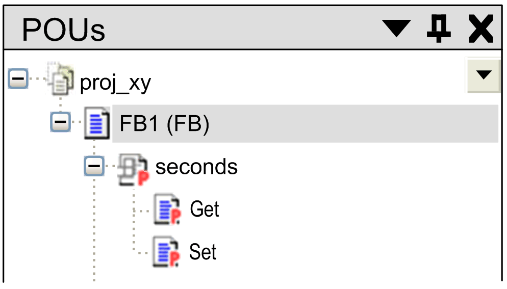

# Property

## Overview

A property in extension to the IEC 61131-3 standard is available as a means of object-oriented programming. It consists of a pair of accessor methods (`Get`, `Set`). They allow encapsulating a read or write access to variables declared inside of a POU or a GVL into a function call, while keeping the syntax of a variable access.

To insert a property as an object below a [program](D-SE-0083407.html#D-SE-0083407), a [function block](D-SE-0083417.html#D-SE-0083417), a [GVL](D-SE-0083428.html#D-SE-0083428), or an [interface](D-SE-0083411.html#D-SE-0083411) node, select the node in the Applications tree, click the green plus button, and execute the command Property. As an alternative, right-click the node and execute the command Add Object > Property from the contextual menu.

In the Add Property dialog box specify the Name, Return Type, desired Implementation Language, and optionally an Access Specifier.

The following access specifiers are available as for [methods](D-SE-0083409.html#D-SE-0083409__D-SE-0083409.3):

* PUBLIC
* PRIVATE
* PROTECTED
* INTERNAL
* ABSTRACT

NOTE: Properties can also be declared within interfaces.

Object-oriented programming is facilitated using inheritance within function blocks: When you execute Add Object on a function block that inherits from another function block, the Action, Method, Property, and Transition elements used in the base function block are listed for selection:

* Action, Method, Property, and Transition elements with Access specifier = PUBLIC, PROTECTED, and INTERNAL defined in the base function block are available for selection. You can adapt the definition for the inherited object. In the inherited object, the same Access specifier is assigned as to the source elements.
* Action, Method, Property, and Transition elements with Access specifier = PRIVATE are not available for selection because access is restricted to the base function block.

## `Get` and `Set` Accessors of a Property

Two special [methods](D-SE-0083409.html#D-SE-0083409), named accessor, are inserted automatically in the Applications tree below the property object. You can delete one of them if the property should only be used for writing or only for reading. An accessor, like a property (see previous paragraph), can get assigned an access modifier in the declaration part, or via the Add Object dialog box, when explicitly adding the accessor.

* The `Set` accessor is called when the property is written.

* The `Get` accessor is called when the property is read.

Example:

Function block `FB1` has a property `seconds` that uses a local variable `milli`. This variable is determined by the properties `Get` and `Set`:

`Get` implementation example

```
seconds := milli / 1000;
```

`Set` implementation example

```
milli := seconds * 1000;
```

You can write the property of the function block (`Set` method), for example by `fbinst.seconds := 22;`.

(`fbinst` is the instance of `FB1`).

You can read the property of the function block (`Get` method) for example by `testvar := fbinst.seconds;`.

In the following example, property `seconds` is assigned to function block `FB1`:



A property can have additional local variables but no additional inputs and - in contrast to a [function](D-SE-0083408.html#D-SE-0083408) or [method](D-SE-0083409.html#D-SE-0083409) - no additional outputs.

NOTE: When copying or moving a method or property from a POU to an interface, the contained implementations are deleted automatically. When copying or moving from an interface to a POU, you are requested to specify the desired implementation language.

## Monitoring a Property

A property can be monitored in online mode either with help of [inline monitoring](D-SE-0083511.html#D-SE-0083511__D-SE-0083511.3) or with help of a [watch list](D-SE-0083544.html#D-SE-0083544). The precondition for monitoring a property is the addition of the pragma `{attribute 'monitoring' := 'variable'}` (refer to the chapter [Attribute Monitoring](D-SE-0083639.html#D-SE-0083639)).

EIO0000002854.09