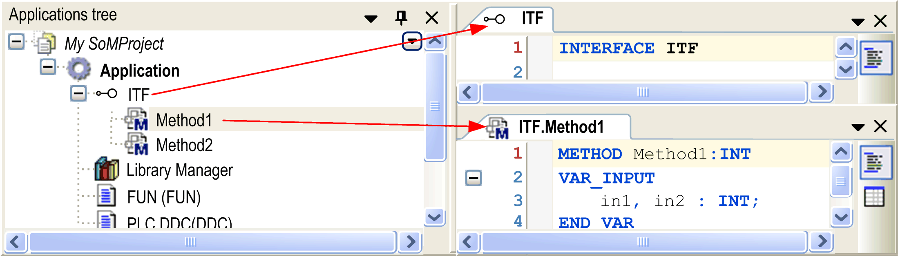
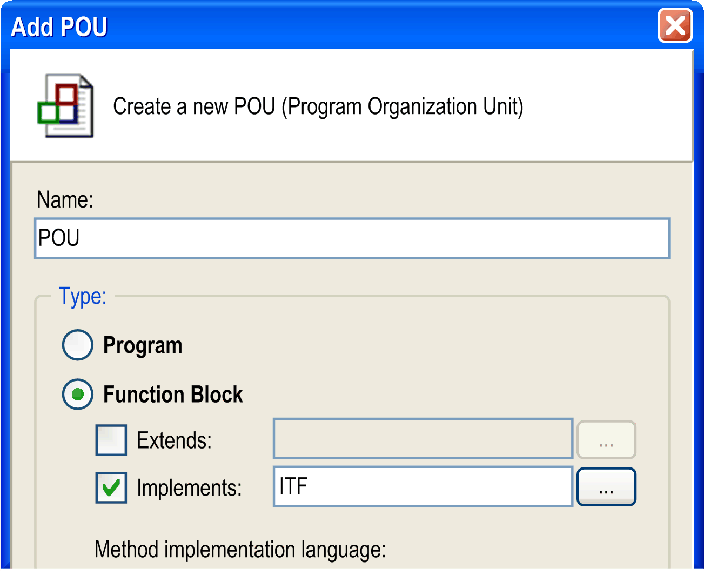
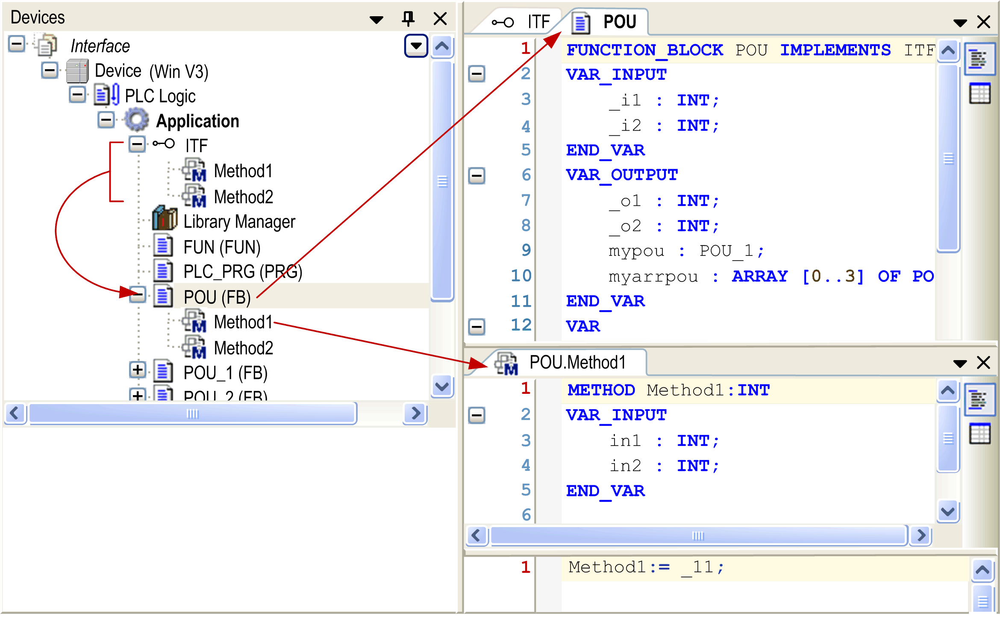
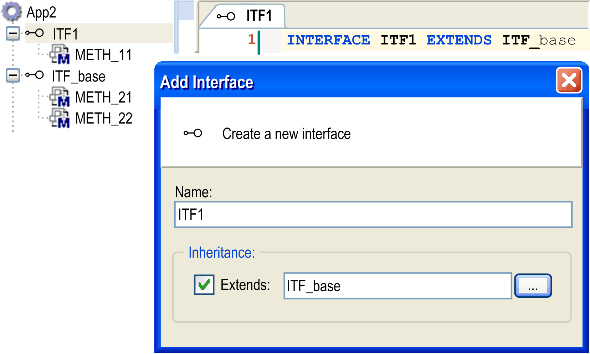

# Interface

## Overview

The use of interfaces is a means of object-oriented programming. An interface POU defines a set of [methods](D-SE-0083409.html#D-SE-0083409) and [properties](D-SE-0083410.html#D-SE-0083410) without an implementation. An interface can be described as an empty shell of a [function block](D-SE-0083417.html#D-SE-0083417). It must be [implemented](D-SE-0083422.html#D-SE-0083422) in the declaration of the function block in order to get realized in the function block instances. A function block can implement one or several interfaces.

The same method can be realized with identical parameters but different implementation code by different function blocks. Therefore, an interface can be used/called in any POU without the need that the POU identifies the particular function block that is concerned.

## Example of Interface Definition and Usage in a Function Block

An interface `IFT` is inserted below an application. It contains 2 methods `Method1` and `Method2`. Neither the interface nor the methods contain any implementation code. Just the declaration part of the methods is to be filled with the desired variable declarations:

Interface with 2 methods:



1 or multiple function blocks can now be inserted, implementing the above defined interface `ITF`.

Creating a function block implementing an interface



When function block `POU` is added to the Applications tree, the methods `Method1` and `Method2` are automatically inserted below as defined by `ITF`. Here they can be filled with function block-specific implementation code.

Using the interface in the function block definition



An interface can extend other interfaces by using `EXTENDS` (see following example [*Example for Extending an Interface*](#D-SE-0083411__D-SE-0083411.7)) in the interface definition.

## Interface Properties

An interface can also define an interface property, consisting of the accessor methods `Get` and/or `Set`. For further information on properties, refer to the chapter [*Property*](D-SE-0083410.html#D-SE-0083410). A property in an interface like the possibly included methods is just a prototype that means it contains no implementation code. Like the methods, it is automatically added to the function block, which implements the interface. There it can be filled with specific programming code.

## Considerations

Consider the following:

* It is not allowed to declare variables within an interface. An interface has no body (implementation part) and no actions. Just a collection of methods is defined within an interface and those methods are only allowed to have input variables, output variables, and input/output variables.

* Variables declared with the type of an interface are treated as references.

* A function block implementing an interface must have assigned methods and properties which are named exactly as they are in the interface. They must contain identically named inputs, outputs, and inputs/outputs.

NOTE: When copying or moving a method or property from a POU to an interface, the contained implementations are deleted automatically. When copying or moving from an interface to a POU, you are requested to specify the desired implementation language.

## Inserting an Interface

To add an interface to an application, select the Application node in the Applications tree, click the green plus button and select Add Other Objects... > Interface. Alternatively, execute the command Add Object > Interface. If you select the node Global before you execute the command, the new interface is available for all applications.

In the Add Interface dialog box, enter a name for the new interface (<interface name>). Optionally you can activate the option Extends: if you want the current interface to be an [extension](D-SE-0083421.html#D-SE-0083421) of another interface.

## Example for Extending an Interface

If `ITF1` extends `ITF_base`, all methods described by `ITF_base` will be automatically available in `ITF1`.

Extending an interface



Click Add to confirm the settings. The editor view for the new interface opens.

## Declaring an Interface

Syntax

INTERFACE <interface name>

For an interface extending another one:

INTERFACE <interface name> EXTENDS <base interface name>

Example

```
INTERFACE interface1 EXTENDS interface_base
```

## Adding the Desired Collection of Methods

To complete the definition of the interface, add the desired collection of methods. For this purpose, select the interface node in the Applications tree and execute the command Interface method.... The Add Interface Method dialog box opens for defining a method to be part of the interface. Alternatively, select the interface node in the Applications tree, click the green plus button and select Interface Method. Add as many methods as desired and remember that these methods are only allowed to have input variables, output variables, and input/output variables, but no body (implementation part).

EIO0000002854.09