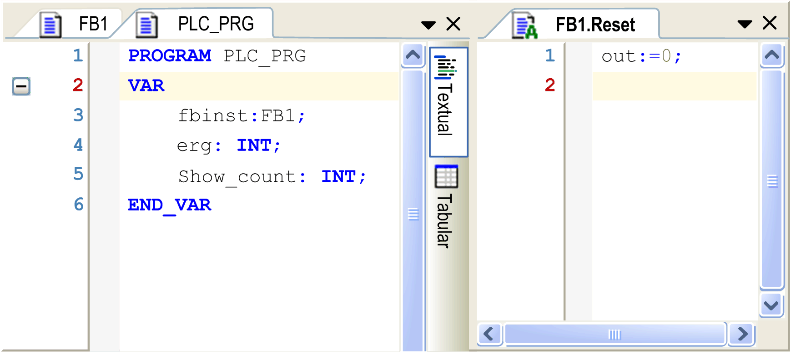
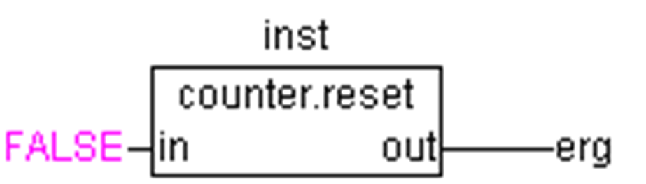

# Action

## Overview

You can define actions and assign them to [function blocks](D-SE-0083417.html#D-SE-0083417) and [programs](D-SE-0083407.html#D-SE-0083407). An action is an additional implementation. It can be created in a different language than the basic implementation. Each action is given a name.

An action works with the data of the function block or program to which it belongs. It uses the input/output variables and local variables defined and does not contain its own declarations.

## Example of an Action of a Function Block

The following illustration shows an action in FB



In this example, each call of the function block `FB1` increases or decreases the output variable `out`, depending on the value of the input variable `in`. Calling action `Reset` of the function block sets the output variable `out` to 0. The same variable `out` is written in both cases.

## Inserting an Action

To add an action, select the respective program or function block node in the Applications Tree or in the Global node of the Applications Tree, click the green plus button, and execute the command Action.... Alternatively, right-click the program or function block node, and execute the command Add Object > Action. In the Add Action dialog box, define the action Name and the desired Implementation Language.

Object-oriented programming is facilitated using inheritance within function blocks: When you execute Add Object on a function block that inherits from another function block, the Action, Method, Property, and Transition elements used in the base function block are listed for selection:

* Action, Method, Property, and Transition elements with Access specifier = PUBLIC, PROTECTED, and INTERNAL defined in the base function block are available for selection. You can adapt the definition for the inherited object. In the inherited object, the same Access specifier is assigned as to the source elements.
* Action, Method, Property, and Transition elements with Access specifier = PRIVATE are not available for selection because access is restricted to the base function block.

## Calling an Action

Syntax

```
<Program_name>.<Action_name>
```

or

```
<Instance_name>.<Action_name>
```

Consider the notation in FBD (see the following example).

If it is required to call the action within its own block, that is the program or function block it belongs to it is sufficient to use the action name.

## Examples

This section provides examples for the call of the above described action from another POU.

Declaration for all examples:

```
PROGRAM PLC_PRG
VAR
    Inst : Counter;
END_VAR
```

Call of action `Reset` in another POU, which is programmed in IL:

```
CAL Inst.Reset(In := FALSE)
LD Inst.out
ST ERG
```

Call of action `Reset` in another POU, which is programmed in ST:

```
Inst.Reset(In := FALSE);
Erg := Inst.out;
```

Call of action `Reset` in another POU, which is programmed in FBD:

Action in FBD



NOTE: The IEC standard does not recognize actions other than actions of the sequential function chart (SFC). These actions are an essential part containing the instructions to be processed at the particular steps of the chart.

EIO0000002854.09