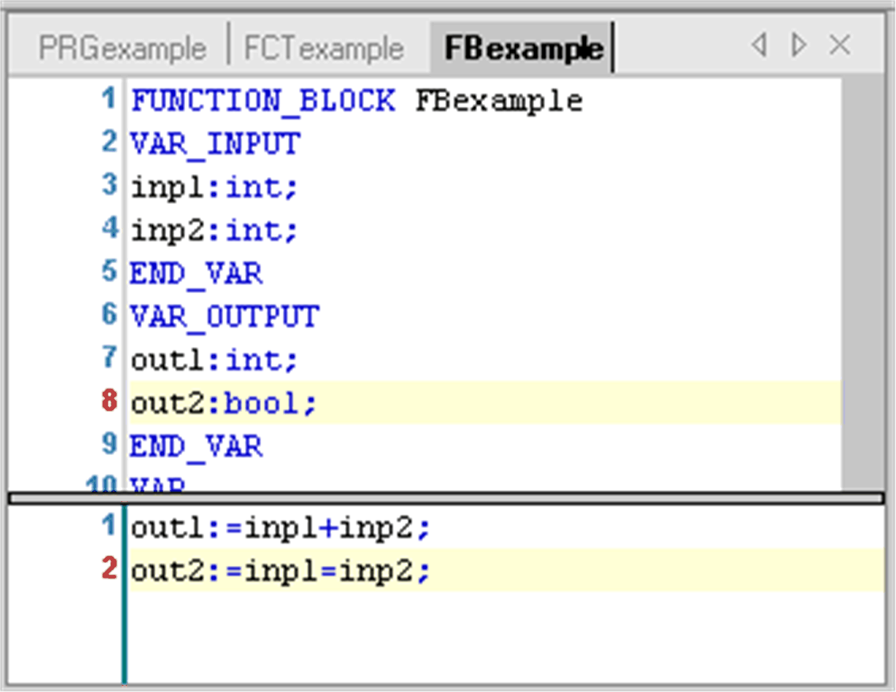

# General Information

## Overview

A function block is a [POU](D-SE-0083405.html#D-SE-0083405) which provides 1 or more values during the processing of a controller program. As opposed to a function, the values of the output variables and the necessary internal variables shall persist from one execution of the function block to the next. Therefore, invocation of a function block with the same arguments (input parameters) need not always yield the same output values.

In addition to the functionality described by standard IEC11631-3, object-oriented programming is supported and function blocks can be defined as [extensions](D-SE-0083421.html#D-SE-0083421) of other function blocks. They can include [interface](D-SE-0083422.html#D-SE-0083422) definitions concerning [Method invocation](D-SE-0083423.html#D-SE-0083423). Therefore, inheritance can be used when programming with function blocks.

A function block always is called via an [instance](D-SE-0083419.html#D-SE-0083419), which is a reproduction (copy) of the function block.

## Adding a Function Block

To add a function block to an existing application, select the respective node in the Applications tree, click the green plus button and select POU.... Alternatively you can right-click the node and execute the command Add Object > POU. To create a function block that is independent of an application, select the Global node of the Applications tree.

In the Add Object dialog box, select the option Function Block, enter a function block Name (<identifier>) and choose the desired Implementation Language.

Additionally, you can set the following options:

| Option | Description |
| --- | --- |
| Extends | Enter the name of another function block available in the project, which should be the base for the current one. For details, refer to [*Extension of a Function Block*](D-SE-0083421.html#D-SE-0083421). |
| Implements | Enter the names of [interfaces](D-SE-0083411.html#D-SE-0083411) available in the project, which should be implemented in the current function block. You can enter several interfaces separated by commas. For details, refer to [*Implementing Interfaces*](D-SE-0083422.html#D-SE-0083422). |
| Access specifier | For compatibility reasons, access specifiers are optional. Specifier PUBLIC is available as an equivalent for having set no specifier.  Alternatively, choose one of the options from the selection list:   * INTERNAL: The access on the function block is restricted to the current namespace (the library). * FINAL: Deriving access is not possible that is the function block cannot be extended by another one. Enables optimized code generation.  NOTE: The access specifiers are valid as of compiler version 3.4.4.0 and thus can be used as identifiers in earlier versions.  For further information, refer to the EcoStruxure Machine Expert/CODESYS compiler version mapping table in the corresponding . |
| Method implementation language | Choose the desired programming language for all method and property objects created via the interface implementation, independently from that set for the function block itself. |

Click Add to confirm the settings. The editor view for the new function block opens and you can start editing.

## Declaring a Function Block

Syntax

FUNCTION\_BLOCK <access specifier> <function block name> | EXTENDS <function block name> | IMPLEMENTS <comma-separated list of interface names>

This is followed by the declaration of the variables. You can also group the inputs and outputs for quick fading out and in when the function block is used in an FBD or LD editor. Also refer to the [chapter *Attribute Pingroup*](D-SE-0083648.html#D-SE-0083648).

## Example

`FBexample` shown in the following figure has 2 input variables and 2 output variables `out1` and `out2`.

`out1` is the sum of the 2 inputs, `out2` is the result of a comparison for equality.

Example of a function block in ST

EIO0000002854.09