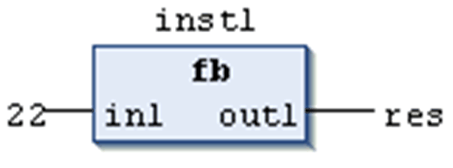

# Calling a Function Block

## Overview

[Function blocks](D-SE-0083418.html#D-SE-0083418) are called through a function block instance. Thus a function block instance has to be declared locally or globally. Refer to the chapter [*Function Block Instance*](D-SE-0083419.html#D-SE-0083419) for information on how to declare.

Then the desired function block variable can be accessed using the following syntax.

## Syntax

<instance name>.<variable name>

## Considerations

* Only the input and output variables of a function block can be accessed from outside of a function block instance, not its internal variables.
* Access to a function block instance is limited to the [POU](D-SE-0083405.html#D-SE-0083405) in which it was declared unless it was declared globally.
* At calling the instance, the desired values can be assigned to the function block parameters. See the following paragraph *Assigning Parameters at Call*.
* The input / output variables (`VAR_IN_OUT`) of a function block are passed as pointers.
* In SFC, function block calls can only take place in steps.
* The instance name of a function block instance can be used as an input parameter for a function or another function block.
* All values of a function block are retained until the next processing of the function block. Therefore, function block calls do not always return the same output values, even if done with identical arguments.

NOTE: If at least 1 of the function block variables is a remanent variable, the total instance is stored in the retain data area.

## Examples for Accessing Function Block Variables

Assume: Function block `fb` has an input variable `in1` of the type INT. See here the call of this variable from within program `prog`. See declaration and implementation in ST:

```
PROGRAM prog
VAR
inst1:fb;
END_VAR
inst1.in1:=22;   (* fb is called and input variable in1 gets assigned value 22 *)
inst1(); (* fb is called, this is needed for the following access on the output variable *)
res:=inst1.outl; (* output variable of fb is read *)
```

Example of a function block call in FBD:



## Assigning Parameters at Call

In the text languages IL and ST, you can set input and/or output parameters immediately when calling the function block. The values can be assigned to the parameters in parentheses after the instance name of the function block. For input parameters, this assignment takes place using `:=` as with the [initialization of variables](D-SE-0083601.html#D-SE-0083601) at the declaration position. For output parameters, `=>` is to be used.

## Example of a Call with Assignments

In this example, a timer function block (instance `CMD_TMR`) is called with assignments for the parameters `IN` and `PT`. Then the result variable `Q` is assigned to the variable `A`. The result variable is addressed with the name of the function block instance, a following point, and the name of the variable:

```
CMD_TMR(IN := %IX5, PT := T#100MS);
A:=CMD_TMR.Q;
```

## Example of Inserting Via Input Assistant with Arguments

If the instance is inserted via Input Assistant with the option With arguments in the implementation view of an ST or IL POU, it is displayed automatically according to the syntax showed in the following example with all of its parameters, though it is not necessarily required to assign these parameters.

For the previously mentioned example, the call would be displayed as follows.

```
CMD_TMR(in:=, pt:=, q=>)
-> fill in, e.g.: 
CMD_TMR(in:=bvar, pt:=t#200ms, q=>bres);
```

EIO0000002854.09