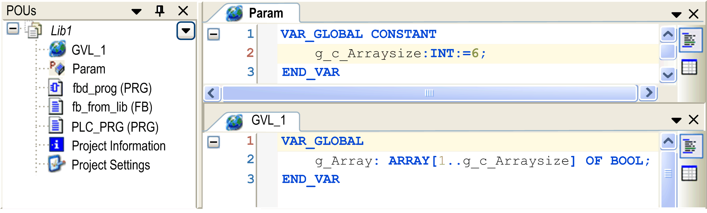
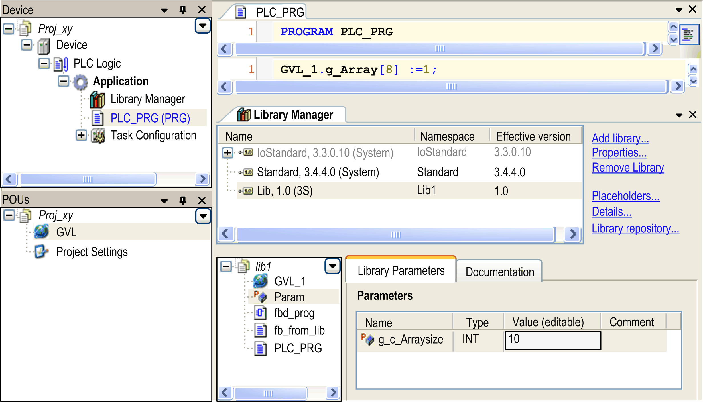

# Global Variable List - GVL

## Overview

A global variables list (GVL) is used to declare [global variables](D-SE-0083607.html#D-SE-0083607__D-SE-0083607.7). If a GVL is placed in the Applications tree, the variables will be available for the entire project. If a GVL is assigned to a certain application, the variables will be valid within this application.

To add a GVL to an existing application, select the application node in the Applications tree, click the green plus button and select Global Variable List.... Alternatively you can right-click the node and execute the command Add Object > Add Global Variable List.... If you select the Global node in these views, the new GVL object will application-independent.

Use the [GVL editor](D-SE-0083526.html#D-SE-0083526) to edit a global variable list.

The variables contained in a GVL can be defined to be available as [network variables](D-SE-0083822.html#D-SE-0083822) for a broadcast data exchange with other devices in the network. For this purpose, configure network properties (in the menu View > Properties > Network Variables or Network Variable Sender Properties) for the GVL.

NOTE: The maximum size of a network variable is 255 bytes. The number of network variables is not limited.

NOTE: Variables declared in GVLs get initialized before local variables of POUs.

## GVL for Configurable Constants (Parameter List) in Libraries

The value of a global constant provided via a library can be replaced by a value defined by the application. For this purpose, the constant has to be declared in a parameter list in the library. Then, when the library is included in the application, its value can be edited in the Parameter List tab of the Library Manager of the application. See the following example for a description on how to do in detail.

## Parameter List Handling

A library `lib1.library` provides an array variable `g_Array`. The size of the array variable is defined by a global constant `g_c_Arraysize`. The library is included in various applications, each needing a different array size. Therefore, you want to overwrite the global constant of the library by an application-specific value.

Proceed as follows: When creating `lib1.library`, define the global constant `g_c_Arraysize` within a special type of global variable list (GVL), the so-called parameter list. For this purpose, execute the command Add Object and add a parameter list object, in the current example named `Param`. In the editor of this object, which equals that of a standard GVL, insert the declaration of variable `g_c_Arraysize`.

Parameter list `Param` in library `Lib1.library`

Edit parameter `g_c_Arraysize` in the Library Manager of a project

Select the library in the upper part of the Library Manager to get the module tree. Select `Param` in order to open the tab Library Parameters showing the declarations. Select the cell in column Value (editable) and use the empty space to open an edit field. Enter the desired new value for `g_c_Arraysize`. It will be applied to the current, local scope of the library after having closed the edit field.

EIO0000002854.09