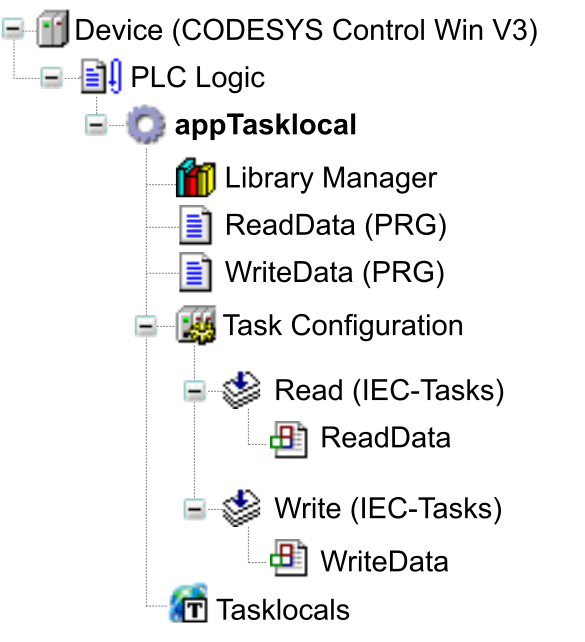

# Global Variable List - GVL (tasklocal)

## Overview

The [global variables](D-SE-0083607.html#D-SE-0083607__D-SE-0083607.7) declared in a Global Variable List (tasklocal) are cycle-consistent. In a task cycle, they are written by one specific task whereas other tasks have read-only access. It is taken into account that tasks can be interrupted by other tasks or can run simultaneously. This helps to provide consistency of variables, even if the application is running on a system with a multicore processor.

In contrast to the common global variable lists that allow multiple tasks to write simultaneously to the GVL variables within one task cycle, the tasklocal GVL provides for automatic synchronization by the compiler when multiple tasks are processing the same variables.

NOTE: As the synchronization of tasklocal variables is time and memory consuming, refer to [*Good Practices*](#D-SE-0106714__D-SE-0106714.8) for further technical information helping you to evaluate whether this solution fits to your application needs.

The object node  Global Variable List (tasklocal) represents tasklocal global variable lists. In addition to a common GVL object, it indicates the task that has exclusive write access to the variables within a task cycle.

NOTE: The values of tasklocal global variables cannot be modified in online mode with the Write Values command.

## Sample Application

The following sample application indicates the principle and functionality of tasklocal variables. It includes a writing program (WriteData) and a reading program (ReadData). The programs run in different tasks but they access the same data. This data is stored in a Global Variable List (tasklocal) to allow for a cycle-consistent processing. Also refer to the paragraph [*Instructions for Creating the Sample Application*](#D-SE-0106714__D-SE-0106714.10).

```
(* task-local GVL, object name: "Tasklocals" *)
VAR_GLOBAL
    g_diaData : ARRAY [0..99] OF DINT;
END_VAR

PROGRAM ReadData
VAR
    diIndex : DINT;
    bTest : BOOL;
    diValue : DINT;
END_VAR
bTest := TRUE;
diValue := TaskLocals.g_diaData[0];
FOR diIndex := 0 TO 99 DO
    bTest := bTest AND (diValue = Tasklocals.g_diaData[diIndex]);
END_FOR

PROGRAM WriteData
VAR
    diIndex : DINT;
    diCounter : DINT;
END_VAR
diCounter := diCounter + 1;
FOR diIndex := 0 TO 99 DO
    Tasklocals.g_diaData[diIndex] := diCounter;
END_FOR
```

In the program WriteData, the array g\_diaData is populated with values. The validity of these values is verified by the program ReadData. If the values are valid, the variable bTest is set to TRUE.

The array data is declared with the variable g\_diaData in the object Tasklocals of type Global Variable List (tasklocal). This helps the compiler to manage the synchronization of data access by the different tasks and helps to keep cycle consistency even when the accessing programs are called from different tasks. In the sample application, this has the effect that the variable bTest is constantly TRUE in the program ReadData.

NOTE: If the variable g\_diaData was declared as a common global variable instead, the variable bTest would be set to FALSE whenever one of the two tasks in the `FOR` loop is interrupted by the other task or both tasks run simultaneously (multicore controllers). This would not prevent the writer from changing the values while the reader is reading the list.

## Constraints for the Declaration

When you declare a Global Variable List (tasklocal), consider the following:

* Do not assign direct addresses using an AT declaration.
* Do not map tasklocal variables in the controller configuration.
* Do not declare pointers.
* Do not declare references.
* Do not instantiate function blocks.
* Do not declare tasklocal variables as both `PERSISTENT` and `RETAIN` at the same time.

NOTE: You cannot perform an online change of the application after you have modified the declarations in a Global Variable List (tasklocal).

Write attempts of tasks without write access are detected as an error by the compiler. However, as the compiler can only assign static calls to a task, not all write-access violations are detected. The call of a function block by using a pointer or an interface, for example, is not assigned to a task and is thus not detected. Moreover, if pointers point to tasklocal variables, data can be modified in a read task. This will not be detected as a runtime error. However, values that are modified by using pointer access are not copied back to the shared reference of variables.

## Advantages and Constraints of a Global Variable List (tasklocal)

The variables are located at a different address in the Global Variable List (tasklocal) for each task. For read access, this has the effect that `ADR(variable name)` yields a different address in each task.

The synchronization mechanism provides the following advantages:

* Cycle-consistent processing.
* No locked states: A task is not waiting for an action to be completed by another task.

Nevertheless, the following constraints apply:

* It is not possible to determine a time when a reading task will by all means receive a 1:1 copy of the writing task. In the example above, you cannot assume that each written copy is processed once by the reader. The copies can deviate because the reading task can edit the same array over multiple cycles, or the contents of the array can skip one or more values between two cycles. Both scenarios can occur and must be considered.
* Access to the shared variables of the writing task can be inhibited by each reading task for one cycle. This can have the effect that n reading tasks lead to a delay of n cycles of the writing task until the next update of the shared reference.
* In each task cycle, the writing task can prevent a reading task from getting a reading copy. Thus, it is not possible to specify a maximum number of cycles after which a reading task will definitely receive a copy.

This has to be considered, in particular, if slow running tasks are involved. Assuming that a task is running once an hour and is prevented from accessing the tasklocal variables, then the data it is processing is considerably outdated.

For the reading task to determine whether the list is up-to-date, you can add a time stamp to the tasklocal variables as follows:

1. Add a variable `g_timestamp` of type LTIME to the list of tasklocal variables.
2. Add the following code to the writing task:

   ```
   tasklocal.g_timestamp := LTIME();
   ```

## Good Practices

Tasklocal variables are designed for the use case of a single writer and multiple readers.

When you implement program code that is called by different tasks, tasklocal variables provide the following advantages:

* As indicated by the [sample application](#D-SE-0106714__D-SE-0106714.5), the application `appTasklocal` is extended by multiple reading tasks that access the same array and use the same functions.
* On multicore systems, you cannot synchronize tasks by priority. The tasklocal variables provide an alternative synchronization mechanism.

For the following use cases, tasklocal variables must not be used:

* When it is essential that a reading task is supplied with the newest copy of the variables.
* When a task produces data and another task processes the data (also known as Producer - Consumer dilemma).

  Select another type of synchronization for this configuration. For example, the producer can insert a flag to indicate that updated data is available. The consumer can insert a second flag to indicate that the data has been processed and is ready to receive new input. This has the advantage that both can work on the same data. The overhead for cyclic data copying is avoided. The consumer does not lose data generated by the producer.

## Monitoring

At runtime, it can happen that different copies of the Global Variable List (tasklocal) are available in the memory. When monitoring a position, not all available values can be displayed. For inline monitoring, the values of the shared reference are displayed in the watch list and in the visualization for a tasklocal variable.

For breakpoints, consider the following: When a task hits a breakpoint, the task is halted and the data of this task is displayed. In the meantime, the other tasks continue running which may change the shared copy. In the context of the halted task, however, the values remain unchanged and may therefore deviate from the updated values.

## Background: Technical Implementation

For a Global Variable List (tasklocal), the compiler creates a copy for each task, as well as a shared reference copy that is available for all tasks. Whenever a variable in the list is accessed from the code, the access refers to the tasklocal copy of the list.

At runtime, at the end of the writing task, the contents of the tasklocal list are written to the global list. At the beginning of a reading task, the contents of the shared reference global list are copied to the tasklocal copy.

The behavior is based on the following task synchronization strategy:

* As long as the writing task is writing a copy back to the shared reference, none of the reading tasks retrieves a copy.
* As long as a reading task is retrieving a copy from the shared reference, the writing task does not write back a copy.

## Instructions for Creating the Sample Application

The sample application contains a program `ReadData` that should access the same data that is written by the program `WriteData`. Both programs are running in different tasks. Data is provided in a Global Variable List (tasklocal) for being processed in a cycle-consistent manner.

As a prerequisite, create a new default project and open it in the editor.

| Step | Action | Result |
| --- | --- | --- |
| 1 | Rename the application node from Application to **appTasklocal**. | – |
| 2 | Below the **appTasklocal** node, add a program in ST named `ReadData`. | – |
| 3 | Below the **appTasklocal** node, add another program in ST named `WriteData`. | – |
| 4 | Below the Task Configuration node, rename the default task from MainTask to `Read`. | – |
| 5 | In the Configuration dialog box of the `Read` task, click the Add Call button to call the program `ReadData`. | – |
| 6 | Below the Task Configuration node, add another task named `Write` and add the call of the program `Write` to this task. | **Result**: Two tasks `Read` and `Write` are available as subnodes of the Task Configuration node. They call the programs `ReadData` and `WriteData`. |
| 7 | Select the **appTasklocal** node and add an object of type Global Variable List (tasklocal). | **Result**: The Add Global Variable List (tasklocal) dialog box opens. |
| 8 | Enter the Name `Tasklocals`. | – |
| 9 | Select the `Write` task from the Task with write access list. | **Result**: The tree structure for using tasklocal variables within an application is complete. Program the objects as described in the [sample application](#D-SE-0106714__D-SE-0106714.5). |



EIO0000002854.09