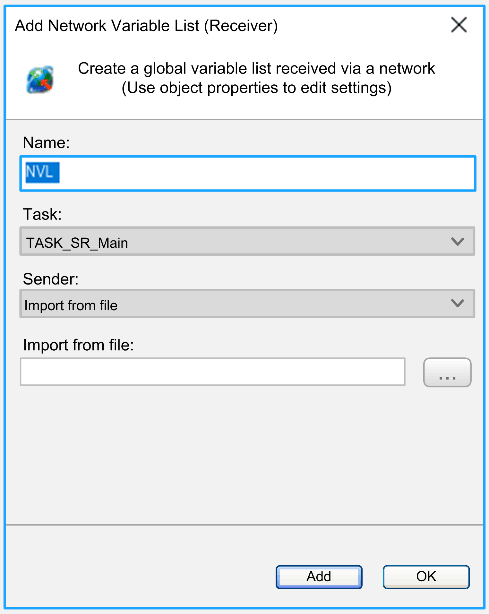
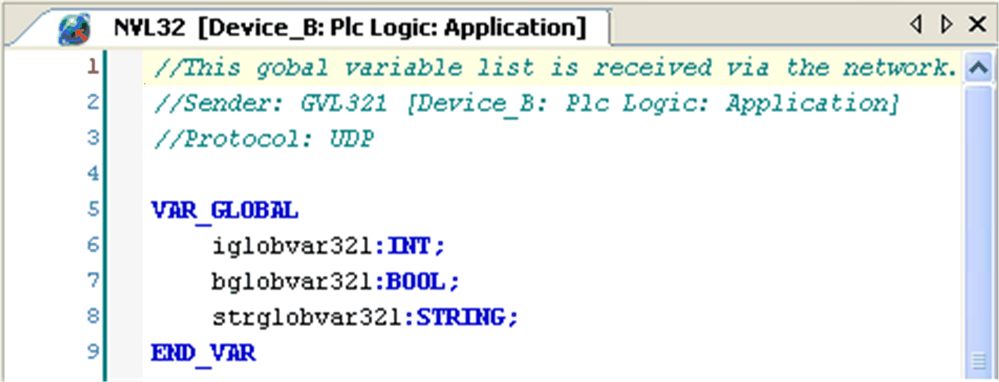

# Network Variable List (Receiver)

## Overview

A network variable list (receiver) is added to the Applications tree. It defines variables, which are specified as network variables in another device within the network.

NOTE: Consider the [Network Variables List (NVL) Rules](D-SE-0092554.html).

Thus you can add a network variable list (receiver) object to an application if a network variable list (sender) with special network properties (network variable list) is available in one of the other network devices. This is independent of whether defined in the same project or in different projects. If several of appropriate network variable lists (sender) are found within the present project for the present network, select the desired network variable list (sender) from a selection list Sender when adding a network variable list (receiver) via the dialog box Add Object > Network Variable List (Receiver). Network variable lists (sender) from other projects must be imported as described in this chapter.

Therefore, each network variable list (receiver) corresponds exactly to one network variable list (sender) in another device.

Dialog box Add Network Variable List (Receiver)



## Description of the Elements

When adding the network variable list (receiver), besides a Name, also define a Task, responsible for the handling of the network variables.

Alternatively to directly choosing a network variable list (sender) from another device, you can specify a network variable list (sender) export file \*.GVL with the option Import from file. This network variable list (sender) file has been generated previously from the network variable list (sender) via View > Properties > Link To File [dialog box](../../../../../api/crossBook?lang=en-US&virtualBookName=SoMMenu&topicID=D_SE_0083921). In any case this is necessary if the desired network variable list (sender) is defined within another project. For this purpose, select the option Import from file in the Sender selection list and enter the file path in the Import from file text field (or click the ... button to open the dialog for browsing in the file system).

You can modify the settings at a later time via the View > Properties > Network Settings [dialog box](../../../../../api/crossBook?lang=en-US&virtualBookName=SoMMenu&topicID=D_SE_0083921).

A network variable list (receiver) is displayed by the [NVL editor](D-SE-0083529.html#D-SE-0083529), but it cannot be modified. It displays the content of the corresponding network variable list (sender). If you modify the basic network variable list (sender), the network variable list (receiver) is updated accordingly.

A comment is added automatically at top of the declaration part of a network variable list (receiver), providing information on the sender (device path), the network variable list (sender) name, and the protocol type.

## Network Variable List Example

Network variable list



NOTE: Only arrays whose bounds are defined by a literal or a constant are transferred to the remote application. Constant expressions in this case are not allowed for bounds definition. Example: `arrVar : ARRAY[0..g_iArraySize-1] OF INT ;` is not transferred `arrVar : ARRAY[0..10] OF INT ;` is transferred

For further information, refer to the [*Network Communication* chapter](D-SE-0083822.html#D-SE-0083822).

## Example of a Simple Network Variable Exchange

In the following example, a simple network variable exchange is established. In the sender controller, a network variable list (sender) is created. In the receiver controller, the corresponding network variable list (receiver) is created.

Perform the following preparations in a default project, where a sender controller Dev\_Sender and a receiver controller Dev\_Receiver are available in the Devices tree:

* Create a POU (program) prog\_sender below the Application node of Dev\_Sender.
* Under the Task Configuration node of this application, add the task Task\_S that calls prog\_sender.
* Create a POU (program) prog\_rec below the Application node of Dev\_Receiver.
* Under the Task Configuration node of this application, add the task Task\_R that calls prog\_rec.

  NOTE: The 2 controllers must be configured in the same subnet of the Ethernet network.

## Defining the Network Variable List (Sender)

Step 1: Define a global variable list in the sender controller:

| Step | Action | Comment |
| --- | --- | --- |
| 1 | In the Applications tree, select the Application node of the controller Dev\_Sender and click the green plus button. Execute the command Add other objects > Network Variable List (Sender). | The Properties dialog box of the network variable list (sender) is displayed. |
| 2 | Enter the Name `GVL_Sender` and click Add to create a new global variable list. | The GVL\_Sender node appears below the Application node in the Applications tree and the editor opens on the middle of the screen. |
| 3 | In the editor, enter the following variable definitions:   ``` VAR_GLOBAL iglobvar:INT; bglobvar:BOOL; strglobvar:STRING; END_VAR ``` | – |

Step 2: Define the network properties of the network variable list (sender):

| Step | Action | Comment |
| --- | --- | --- |
| 1 | In the Applications tree, select the GVL\_Sender node, click the green plus button, and execute the command Properties... | The Properties - GVL\_Sender dialog box is displayed. |
| 2 | Open the Network properties tab and configure the parameters as indicated in the graphic: | – |
| 3 | Click OK. | The dialog box is closed and the network variable list (sender) network properties are set. |

## Defining the Network Variable List (Receiver)

Step 1: Define a global network variable list in the receiver controller:

| Step | Action | Comment |
| --- | --- | --- |
| 1 | In the Applications tree, select the Application node of the controller Dev\_Receiver, click the green plus button, and execute the command Global Network Variable List.... | The Add Global Network Variable List dialog box is displayed. |
| 2 | Configure the parameters as indicated in the graphic. | This global network variable list is the counterpart of the network variable list (sender) defined for the sender controller. |
| 3 | Click Open. | The dialog box is closed and the GNVL\_Receiver appears below the Application node of the Dev\_Receiver controller:  This network variable list (receiver) automatically contains the same variable declarations as the GVL\_Sender. |

Step 2: View and / or modify the network settings of the network variable list (receiver):

| Step | Action | Comment |
| --- | --- | --- |
| 1 | In the Devices tree, right-click the GNVL\_Receiver node and select the command Properties.... | The Properties - GNVL\_Receiver dialog box is displayed. |
| 2 | Open the Network settings tab. | – |

Step 3: Test the network variable exchange in online mode:

| Step | Action | Comment |
| --- | --- | --- |
| 1 | Under the Application node of the controller Dev\_Sender, double-click the POU prog\_sender. | The editor for prog\_sender opens on the right-hand side. |
| 2 | Enter the following code for the variable `iglobvar`: | – |
| 3 | Under the Application node of the controller Dev\_Receiver, double-click the POU prog\_rec. | The editor for prog\_rec opens on the right-hand side. |
| 4 | Enter the following code for the variable `ivar_local`: | – |
| 5 | Log on with sender and receiver applications within the same network and start the applications. | The variable `ivar_local` in the receiver gets the values of `iglobvar` as currently displayed in the sender. |

EIO0000002854.09