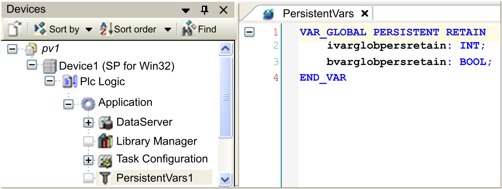

# Persistent Variables

## Overview

This object is a global variable list (GVL), which only contains persistent variables of an application. Thus it has to be assigned to an application. For this purpose, it has to be inserted in the Applications tree via selecting the respective node, clicking the green plus button, and selecting Add Other Objects > Persistent Variables....

Consult the *Programming Guide* specific to your controller for information on the behavior of remanent variables.

Only those variables which are declared with `VAR PERSISTENT` and which are contained in this list are persistent. The Add all Instance Paths [command](../../../../../api/crossBook?lang=en-US&virtualBookName=SoMMenu&topicID=D_SE_0084168) adds `PERSISTENT` declarations found in other POUs to the list.

NOTE: When a variable is added by using the command Add all Instance Paths, it consumes memory twice and requires more cycle time. Therefore, it is a good practice to declare persistent variables in the persistent variable list only.

Variables declared with `VAR PERSISTENT` are also retain variables. Retain variables have the capacity to keep their values after executing a Reset warm [command](../../../../../api/crossBook?lang=en-US&virtualBookName=SoMMenu&topicID=D_SE_0084003). The difference is, that persistent variables are only reinitialized upon executing the Reset origin [command](../../../../../api/crossBook?lang=en-US&virtualBookName=SoMMenu&topicID=D_SE_0084004) or by a new application download (after the application had been removed from the controller). An exception is made if you modified their names or data types.

Persistent variable list

For further information, refer to the description of [remanent variables](D-SE-0083608.html#D-SE-0083608__D-SE-0083608.3).

Also refer to the description of the special commands for [handling persistent variables](../../../../../api/crossBook?lang=en-US&virtualBookName=SoMMenu&topicID=D_SE_0084167).

Edit a persistent variable list in the persistence editor, which corresponds to the [GVL editor](D-SE-0083526.html#D-SE-0083526). The `VAR_GLOBAL PERSISTENT RETAIN` is already preset in the first line.

## Adding and Declaring Remanent Variables

When you add variables to an application, you can declare some of the variables as remanent variables. Remanent variables can retain their values in the event of power outages, reboots, resets, and application program downloads. There are multiple types of remanent variables, declared individually as retain or persistent, or in combination as retain-persistent.

Consult the *Programming Guide* specific to your controller for information on the memory size reserved for retain and persistent variables in the different controllers.

To add a global variable list called **Persistent Variables** to your application, proceed as follows:

| Step | Action |
| --- | --- |
| 1 | Select the respective application node in the Applications tree, click the green plus button, and select Add Other Objects > Persistent Variables....  Alternatively, you can right-click the application node, and execute the command Add Object > Persistent Variables.... |
| 2 | In the **Add Persistent Variables** dialog box type a name for this list in the Name text box. |
| 3 | Click **Add**.  **Result:** A persistent variable node is created in the Applications tree. For an example, refer to the *Overview* paragraph in this chapter. |

EIO0000002854.09