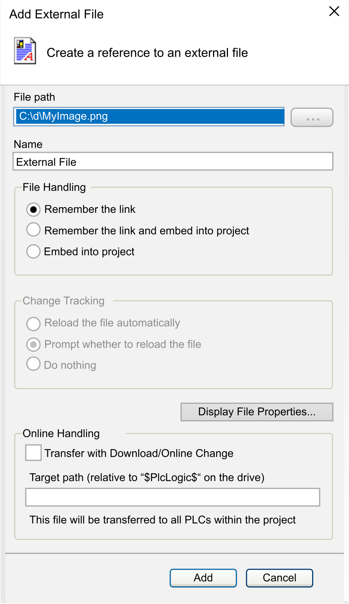

# External File

## Overview

To add an external file to the Global node of the Applications Tree or Tools Tree, select the Global node, click the green plus button and execute the commands Add other objects > External File....

NOTE: External files which are inserted in the Global node of the Applications tree or Tools tree are transferred to all controllers in the project during the download. This option has no effect on external files in libraries. These files are not transferred.

An external file inserted in the Devices tree is downloaded to the controller when an online change or a download is performed.

Click the ... button to open the dialog box for browsing a file. The path of this file is entered in the File path text box. In the Name text box, the name of the chosen file is entered automatically without extension. You can edit this field to define another name for the file under which it should be handled within the project.

Add External File dialog box:

## Description of the File Handling Section of the Dialog Box

Select one of the following options:

| Option | Description |
| --- | --- |
| Remember the link | The file will be available in the project only if it is available in the defined link path |
| Remember the link and embed into project | A copy of the file will be stored internally in the project but also the link to the external file will be recalled. As long as the external file is available as defined, the defined update options will be implemented accordingly. Otherwise just the file version stored in the project will be available. |
| Embed into project | Just a copy of the file will be stored in the project. There will be no further connection to the external file. When you open the external file (using the Edit > Object command), a temporary file is created for editing. |

## Description of the Change Tracking Section of the Dialog Box

If the external file is linked to the project, you can additionally select one of the options:

| Option | Description |
| --- | --- |
| Reload the file automatically | The file is updated within the project as soon as it has been changed externally. |
| Prompt whether to reload the file | A dialog box pops up as soon as the file has been changed externally. You can decide whether the file is updated also within the project. |
| Do nothing | The file remains unchanged within the project, even when it is changed externally. |

## Description of the Online Handling Section of the Dialog Box

| Option | Description |
| --- | --- |
| Transfer with Download/ Online Change | If selected, the external file is stored in the folder specified with Target path (relative to "$PlcLogic$" on the device) after download / online change.  NOTE: `$PlcLogic$` is a placeholder for the folder on the controller that contains the application.  NOTE: External files that are inserted in the Global node of the Applications Tree or Tools Tree are transferred to all controllers in the project during the download. This option has no effect on external files in libraries. These files are not transferred. |
| Target path (relative to "$PlcLogic$" on the device) | You can specify the target path as follows:   * For the `$PlcLogic$` root directory: Leave the input field blank. * Folder of the application (below `$PlcLogic$`)  Example for the "App123" application: `App123` * Nested folder structure below the application folder  Example: `App123/Sub01/SubSub01` * Using another available placeholder  Example for the visualization: `$visu$`   NOTE: The paths are case-sensitive.  NOTE: `$PlcLogic$` is a placeholder for the folder on the controller that contains the application. |

## Description of the Buttons

| Button | Description |
| --- | --- |
| Display File Properties... | This button opens the dialog box for the properties of a file. This dialog box also appears when you select the file object in the Applications Tree or Tools Tree and execute the command Properties. In the tab External file of this dialog box, you can display and modify the properties ([also refer to the Menu Commands Online Help](../../../../../api/crossBook?lang=en-US&virtualBookName=SoMMenu&topicID=D_SE_0083921)). |
| Add | After you have completed the settings, click the Add button to add the file to the Global node of the Applications Tree or Tools Tree. It is opened in the tool which is defined as default for the given file format. |

EIO0000002854.09