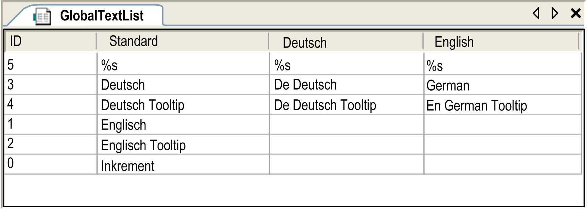
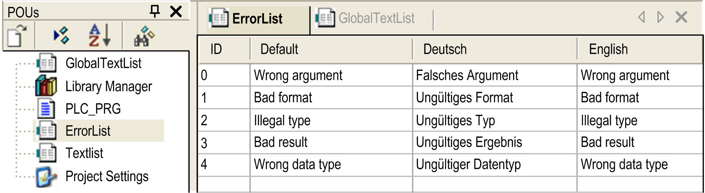
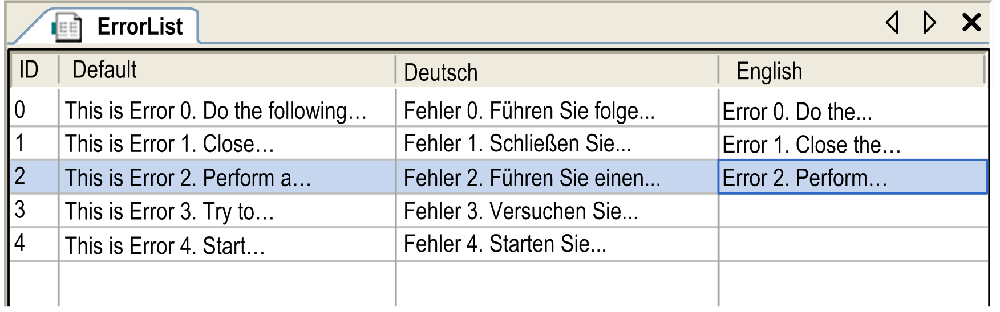
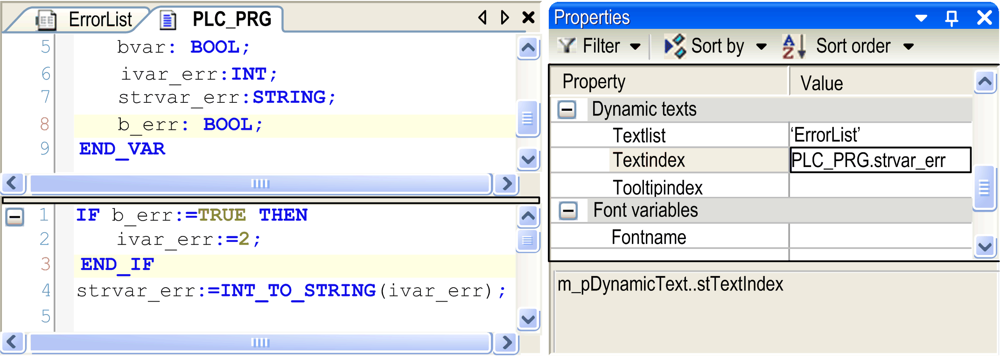
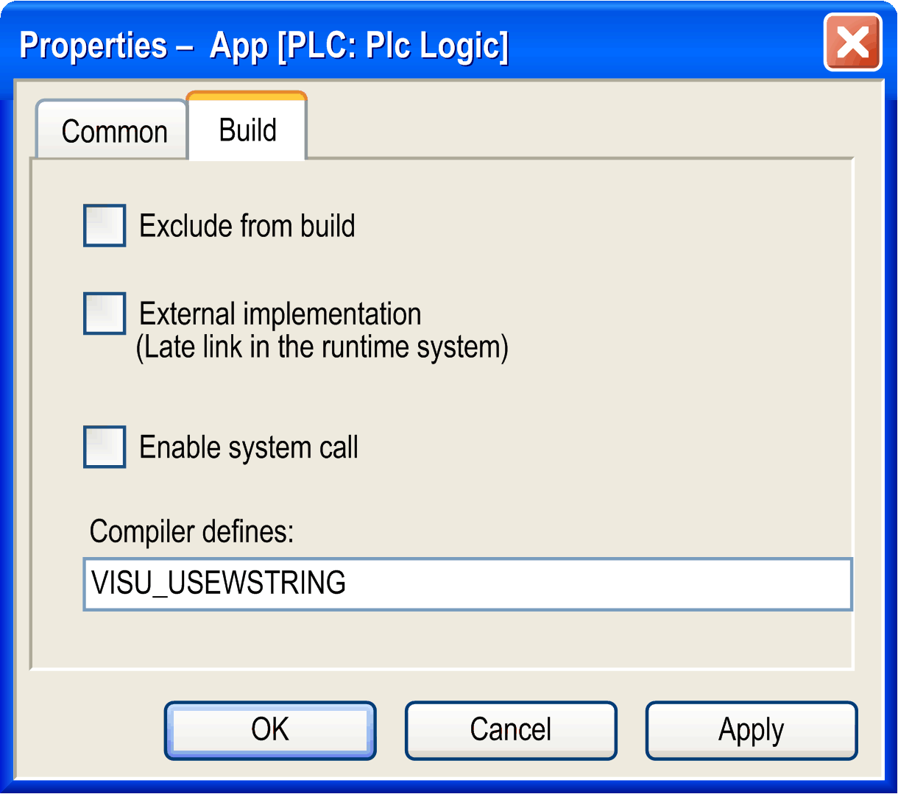

# Text List

## Overview

A text list is an object managed globally in the Global node of the Applications Tree or assigned to an application in the Applications Tree.

It serves the following purposes:

* Multi-language support for [static](#D-SE-0083432__D-SE-0083432.4) and [dynamic](#D-SE-0083432__D-SE-0083432.6) texts and tooltips in visualizations and in the alarm handling
* Dynamic text exchange

Text lists can be [exported and (re-) imported](#D-SE-0083432__D-SE-0083432.13). Export is necessary, if a language file in XML format has to be provided for a target visualization, but is also useful for [translations](#D-SE-0083432__D-SE-0083432.20).

Possible formats of text lists:

* Text
* XML

You can activate [support of Unicode](#D-SE-0083432__D-SE-0083432.12).

Each text list is uniquely defined by its namespace. It contains text strings which are uniquely referenced within the list by an identifier (ID, consisting of any sequence of characters) and a language identifier. The text list to be used is specified when configuring the text for a visualization element.

Depending on the language which is set in the visualization, the corresponding text string is displayed in online mode. The language used in a visualization is changed by a Change the language input. This is accomplished by a mouse action that you have configured on the given visualization element. Each text list must at least contain a default language, and optionally in other languages that you choose to define. If no entry is found which matches the set language, the default language entry of the text list is used. Each text can contain [formatting definitions](#D-SE-0083432__D-SE-0083432.14).

Basic structure of a text list

| Identifier (Index) | Default | <Language 1> | <Language 2> | .... <Language n> |
| --- | --- | --- | --- | --- |
| <unique string of characters> | <text abc in default language> | <text abc in language 1> | <text abc in language 2> | ... |
| <unique string of characters> | <text xyz in default language> | <text xyz in language 1> | <text xyz in language 2> | ... |

## Text List Types

There are two types of text usable in visualization elements and correspondingly there are two types of list:

* `GlobalTextList` for static texts
* Textlist for dynamic texts

## GlobalTextList for Static Texts

GlobalTextList is a special text list where the identifiers for the particular text entries are handled implicitly and are not editable. The list can be exported, edited externally and then reimported.

Static texts in a visualization, in contrast to dynamic texts, are not exchanged by a variable in online mode. The only option to exchange the language of a visualization element is via a Change the language input. A static text is assigned to a visualization element via property Text or Tooltip in category Texts. When the first static text is defined in a project, a text list object named GlobalTextList is added to the Global node of the Applications Tree. It contains the defined text string found in the column Default, and an automatically assigned integer number as the text identifier. For each static text that is created thereafter, the identifier number is incremented and assigned to the visualization element.

If a static text is entered into a visualization element (for example, if in a rectangle with property category of Texts, the string Text Example is specified), this text is looked up in the GlobalTextList.

* If the text is found (for example, ID 4711, Text Example), the element value 4711 of TextId will be assigned to an internal variable. This establishes the relationship between the element and the corresponding line in the GlobalTextList.
* If the text is not found, a new line is inserted in the GlobalTextList (for example, ID 4712, Text Example). In the element, the value 4712 is assigned to the internal variable.

NOTE: If it does not yet exist - you can create a global text list explicitly by the command Create Global Text List.

If you have exported, edited and reimported the GlobalTextList, it is validated as to whether the identifiers are still matching those which are used in the configuration of the respective visualization elements. If necessary, an implicit update of the identifiers used in the configuration will be implemented.

To update the ID numbers of the texts that are defined for a visualization, you can remove the GlobalTextList by right-clicking the node and executing the Delete command. Then open a visualization and execute the command Visualization > Create Global Text List. A new GlobalTextList node is created in the Applications tree with the static texts of the visualizations available in the project.

NOTE: In case your GlobalTextList contains translated strings, they will not be regenerated when the command Create Global Text List is executed.

## Example of a GlobalTextList

Create Global Text List

## Textlist for Dynamic Texts

Dynamic texts can be modified dynamically in online mode. The text index (ID), which is a string of characters, must be unique within the text list. In contrast to GlobalTextLists, you have to define it. Also in contrast to the GlobalTextList, create text lists for dynamic texts explicitly by selecting the Global node, clicking the green plus button, and executing the command Add other objects > Text List....

The available dynamic text lists are offered when configuring a visualization element via property Dynamic texts / Text list. If you specify a text list name combined with the text index (ID) - which can be entered directly or by entering a project variable which defines the ID string - the text can be modified in online mode.

A dynamic text list must be exported if it is needed as a language file for language switching in a target visualization. Specify the file path in the Visualization Options. Such as GlobalTextList, a dynamic text list can also be exported for external editing and reimported. In contrast to GlobalTextList, when you import dynamic text lists, there is no automatic check and update of the identifiers.

| NOTICE | |
| --- | --- |
|  | UNINTENDED MODIFICATION OF IDENTIFIERS  Do not modify the identifiers when editing the exported list.  Failure to follow these instructions can result in equipment damage. |

## Example of a Dynamic Text List Named ErrorList

Example ErrorList

## Detailed Example

This example explains how to configure a visualization element, which displays the corresponding message when an error is detected in an application that processes error events identified via numeric IDs assigned to an integer variable `ivar_err`.

Provide a dynamic textlist named ErrorList where the message texts for error IDs 0 to 4 are defined in languages German, English, and Default:

Within a table cell, you can add a line break by pressing the keyboard shortcut Ctrl + Enter.

To use the error IDs in the visualization configuration, define a STRING variable, for example `strvar_err`. To assign the integer value of `ivar_err` to `strvar_err`, use `strvar_err:=INT_TO_STRING(ivar_err);`.

`strvar_err` can be entered as Textindex parameter in the configuration of the Dynamic texts properties of a visualization element. This element will display the appropriate message in online mode.

The next example is for processing the error ID using project variables and configuration of a visualization element (Properties), which should display the appropriate message:

## Creating a Text List

* To create a [text list for dynamic texts](#D-SE-0083432__D-SE-0083432.6), add a Text List object to the project in the Applications Tree. To create an application-specific text list, select an application node. To create a global text list, select the Global node. Then click the green plus button of the selected node, and execute the command Add other objects > Text List.... When you have specified a list name and confirmed the Add Textlist dialog box, the new list is inserted below the selected node, and a text list editor view opens.
* To get a text list for [static texts](#D-SE-0083432__D-SE-0083432.4) (GlobalTextList), either assign a text in property Text in category Texts of a visualization object to get the list created automatically, or generate it explicitly by command Create Global Text List.
* To open an existing text list for editing, select the list object in the Applications Tree or Global node of the Applications Tree. Right-click the text list node and execute the command Edit Object, or double-click the text list node. Refer to the table *Basic structure of a text list* for how a text list is structured.
* For adding a new default text in a text list, either use the command Insert Text, or edit the respective field in the empty line of the list. To edit a field in a text list, click the field to select it and then click the field again or press SPACE to get an edit frame. Enter the desired characters and close the edit frame with RETURN.

## Support of Unicode Format

To use Unicode format, activate the respective option in the Visualization Manager. Further on, set a special compilation directive for the application: select the application in the Devices Tree, open the Properties dialog box, Build tab. In the Compiler defines field, enter `VISU_USEWSTRING`.

Dialog box with compiler definition

## Export and Import of Text Lists

Static and dynamic text lists can be exported as files in CSV format. Exported files can also be used for adding texts externally, for example by an external translator. However, only files available in text format (*\*.csv*) can be reimported.

See the description of the respective [text list commands](../../../../../api/crossBook?lang=en-US&virtualBookName=SoMMenu&topicID=D_SE_0084076).

Specify the folder in which the export files should be saved in the dialog box File > Project Settings > Visualization.

## Formatting of Texts

The texts can contain formatting definitions (`%s,%d`,…), which allow to include the present values of variables in a text. For the possible formatting strings, see the *Visualization* part of the online help.

When using text with formatting strings, the replacement is done in the following order:

* The actual text string to be used is searched via list name and ID.
* If the text contains formatting definitions, these are replaced by the value of the respective variable.

## Subsequent Delivery of Translated Texts

By inserting *GlobalTextList.csv* in the directory which is used for loading text files, a subsequent integration of translated texts is possible. When the bootproject is started up, the firmware detects that an additional file is available. The text is compared with that in the existing textlist files. New and modified texts are then applied to the textlist files. The updated textlist files will then be applied at the next startup.

## List Components for Text Input

Use the dialog box Tools > Options > Visualization, to specify a text template file. All texts of column Default of this file will be copied to a list, which will be used for the List Components functionality. A template file can be used which has been created before via the Export command.

## Multiple User Operations

By use of the source control, it is possible that multiple users work simultaneously on the same project. If a static text is modified in visualization elements by more than one user, it will cause modifications to the GlobalTextList (refer to [**GlobalTextList**](#D-SE-0083432__D-SE-0083432.4)). In this case, the Text-Ids may no longer be coherent with the visualization elements. Use the following error detection and correction methods:

* Use the command Check Visualization Text Ids, such errors may be detected in the visualizations.
* Use the command Update Visualization Text Ids, these errors may be resolved automatically. The affected visualizations as well as the GlobalTextList must have write permission.

## Use of Textlists for Changing Language in Visualizations

If an appropriate textlist is available, that is, a textlist defining several language versions for a text, then the language used for the texts in a visualization can be switched in online mode by an input on a visualization element. The Dynamic Texts properties of the element must specify the textlist to be used, and an OnMouse.. input action, Change the language, must be configured specifying the language which should be used after the mouse action has been performed.

NOTE: The language must be specified with exactly this string which is displayed in the column header of the respective textlist.

EIO0000002854.09