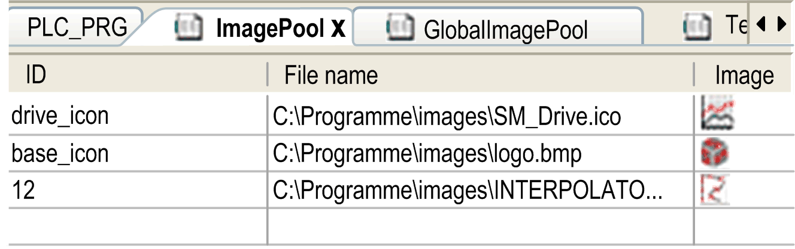

# Image Pool

## Overview

Image pools are tables defining the file path, a preview, and a string ID for each image. By specifying the ID and (for unique accessing) additionally the image file name, the image can be referenced, for example, when being inserted in a visualization (configuration of the properties of an image element, refer to [*Using Images Which are Managed in Image Pools*](#D-SE-0083433__D-SE-0083433.5) ).

In a library project, you can create an image pool. If you then declare the library to be a symbol library, you can use the images it contains inside your project visualizations. To achieve this, right-click the ImagePool node of the library project, select Properties, and set the Symbol library settings in the Image Pool tab (by clicking the button Mark library as symbol library and optionally selecting a Text list for symbol translation).

After you have added the library to your project, the image pool will appear (as you named it) in the ToolBox when a visualization editor is active.

NOTE: Reduce the size of an image file as much as possible before adding it to an image pool. Otherwise, the project size and the loading and storing efforts of visualization applications, including images, can become large.

## Structure of an Image Pool

Example of an image pool:

| Element | Description |
| --- | --- |
| ID | String ID (for example logo, y\_icon, 2);  A unique referencing of an image is achieved by the combination of image list name and ID (for example, List1.basic\_logo). |
| File name | Path of the image file (for example, *C:\programs\images\logo.bmp*).  Supported image formats:   * BMP * EMF * GIF * ICO * JPG * PNG * SVG * TIFF   The controller you are using may not support all image formats. Consult the *Programming Guide* specific to your controller for further information.  If the image file is stored in the directory for image files (as defined in Tools > Options > Visualization, you only have to enter the file name in this text box. |
| Image | Preview of the image. |
| Link type | Information on how the image file is linked to the project.  Specify the Link type when you add the image file manually in the dialog box Select image. Refer to the description [*Creating and Editing an Image Pool*](#D-SE-0083433__D-SE-0083433.4). |

NOTE: If the target system does not support images in the vector image format SVG, they are automatically converted to the format PNG during download. For information on the supported image formats, refer to the device descriptions provided by your hardware manufacturer.

## Creating and Editing an Image Pool

A project can contain several image pools. The automatically generated GlobalImagePool, as well as manually generated image pools.

GlobalImagePool

Add an image, which is not yet part of an image pool of the project, to a visualization. In doing so, enter in the element properties a static ID for the image. This results in the automatic creation of a GlobalImagePool which contains an entry for the respective image file. The Link type is Link to file.

Manually creating an empty image pool:

You can insert an image pool object below an application node or below the Global node of the Applications tree by clicking the green plus button and executing the commands Add other objects > Image Pool.... In the Add Image Pool dialog box, define a Name for the pool.

Adding an image file to an image pool

| Adding an image file to an image pool | Actions to be performed |
| --- | --- |
| By executing the command Insert Image | 1. Put the focus into the image pool editor. 2. Execute the Insert Image [command](../../../../../api/crossBook?lang=en-US&virtualBookName=SoMMenu&topicID=D_SE_0084164) from the contextual menu.  **Result**: A unique ID is entered automatically, which is editable. 3. Double-click the field File name in the new line to specify the path of the image file. 4. For this purpose, you can open the dialog box Select Image by clicking the  button. The edit fields and options of this dialog box are explained below this table.   NOTE: If you do not use the dialog box Select Image, but enter the image file path directly, then automatically the link type setting Remember the link is used. |
| By directly entering the file name | In the editor of the image pool, double-click the field File name of the first empty line. Enter - as described above for the first option (executing the command Insert Image) - the path of the desired image file.  **Result**: The file name is automatically entered as ID. |
| By drag&drop from the file system | In the local file system browser, select the desired image file and drag it into the image pool editor. Multiple selection is possible.  **Result**: The file name is automatically entered as ID.  The link type setting Remember the link is used automatically. |

Elements of the Select Image dialog box:

| Element | Description |
| --- | --- |
| Image File | Enter the path of the image file or click the  button for getting the standard dialog box for browsing the local file system. Select the desired file or files. Multiple selection is possible. |
| File Handling | Choose a link type:   * Remember the link: The file is only available in the project if it is available in the specified path. Files specified without path must be stored in the project folder. * Remember the link and embed into project: A copy of the file is stored internally in the project. The link to the specified path is stored as well. As long as the image file is available under the stored path, the update action as defined below, is valid. As soon as the image file is removed from the specified location, only the copy of the file stored internally in the project will be used. * Embed into project: Only a copy of the file is stored internally in the project. The link to the external path is not stored.   If you choose the option Remember the link and embed into project, you can select one of the following update actions in the Change Tracking section:   * Reload the file automatically. * Prompt whether to reload the file. * Do nothing. |

## Using Images Which Are Managed in Image Pools

If the ID of the image to be used is specified in multiple image pools:

* search order: If you choose an image managed in the GlobalImagePool, you do not need to specify the pool name. The search order for images corresponds to that for global variables:

  1. GlobalImagePool

  2. image pools assigned to the currently active application

  3. image pools in Global node of the Applications tree besides GlobalImagePool

  4. image pools in libraries
* unique accessing: You can directly call the desired image by adding the image pool name before the ID according to syntax: <pool name>.<image ID> (For an example, see `imagepool1.drive_icon` in the previous graphic.)

## Using an Image in a Visualization Element of Type Image

When inserting an image element in a visualization, you can define it to be a static image or a dynamic image. The dynamic image can be changed in online mode according to the value of a project variable:

Static images:

In the configuration of the element (property Static ID), enter the image ID or the image pool name + image ID. Consider in this context the remarks on search order and unique accessing in the previous paragraph.

Dynamic images:

In the configuration of the element (property Bitmap ID variable), enter the variable which defines the ID, for example, `PLC_PRG.imagevar`.

## Using an Image for the Visualization Background

In the background definition of a visualization, you can define an image to be displayed as visualization background. The image file can be specified as described previously for a visualization element by the name of the image pool and the image file name.

EIO0000002854.09