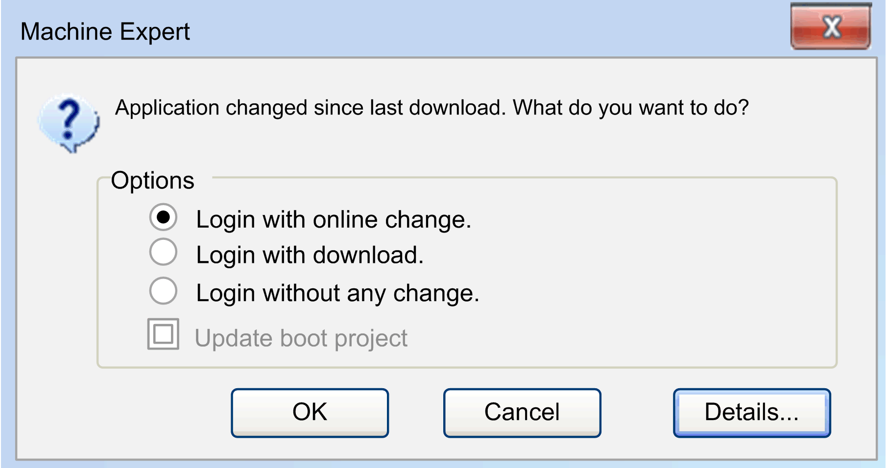
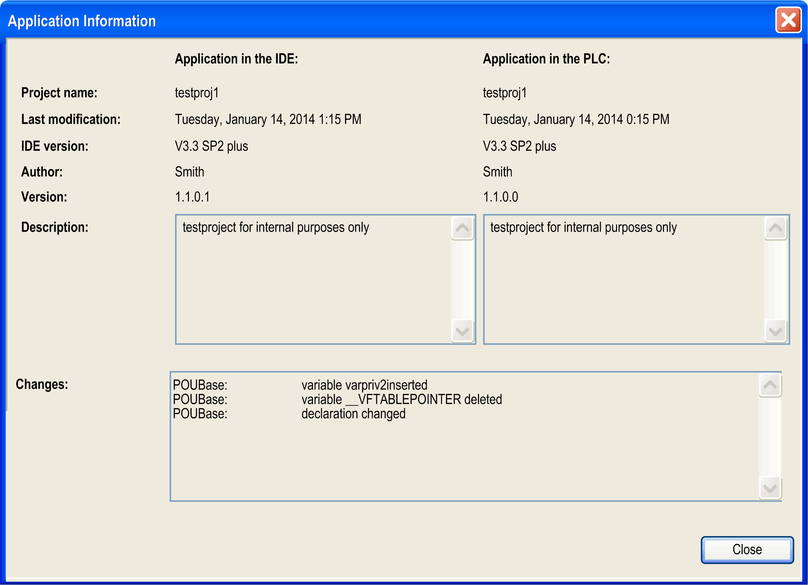
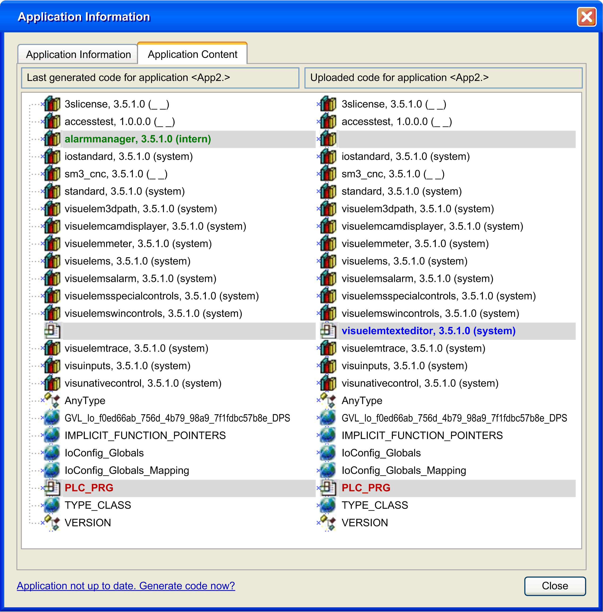
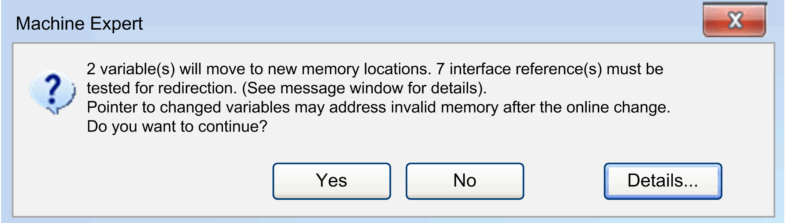
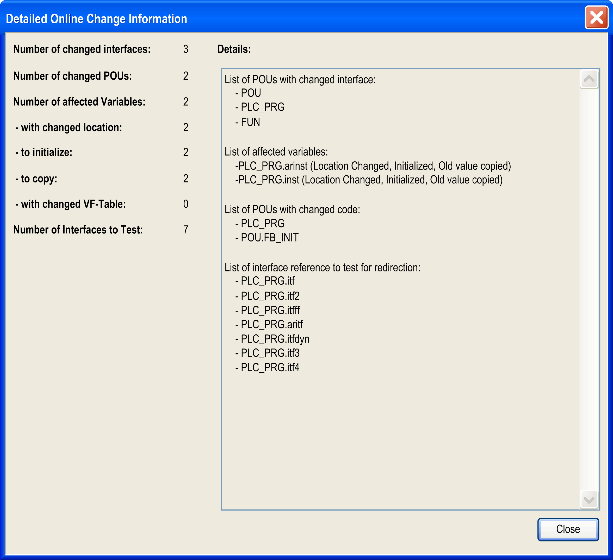

# Downloading an Application

## Introduction

To run an application, first connect the PC to the controller, then download the application to the controller.

Downloading a project allows you to copy the current project from EcoStruxure Machine Expert to the controller memory.

NOTE: Due to memory size limitation, some controllers are not able to store the application source but only a built application that is executed. Therefore, you are not able to upload the application source from the controller to a PC.

| WARNING | |
| --- | --- |
|  | UNINTENDED EQUIPMENT OPERATION  * Confirm that you have entered the correct device designation or device address in the Communication Settings dialog when downloading an application. * Confirm that machine guards and tags are in place such that any potential unintended machine operation will not result in personal injury or equipment damage. * Read and understand all user documentation of the software and related devices, as well as the documentation concerning equipment or machine operation.  Failure to follow these instructions can result in death, serious injury, or equipment damage. |

## Preconditions

Verify that your application meets the following conditions before downloading it to the controller:

* The active path is set for the correct controller.
* The application you want to download is active.
* The application is free of compilation errors.
* The Online > Operating Mode is set to Debug. For further information, refer to the [**Operating Modes** chapter in the Menu Commands Online Help](../../../../../api/crossBook?lang=en-US&virtualBookName=SoMMenu&topicID=D_SE_0084016).

## Boot Application

The boot application is the application that is launched on controller start. This application is stored in the controller memory. To configure the download of the boot application, right-click the Application node in the Devices view and select the Properties command.

At the end of a successful download of a new application, a message is displayed asking you if you want to create the boot application.

You can manually create a boot application in the following ways:

* In offline mode: Click Online > Create boot application to save the boot application to a file.
* In online mode, with the application being in STOP mode: Click Online > Create boot application to download the boot application to the controller.

## Operating Modes

The download method differs depending on the relationship between the loaded application and the application you want to download. The 3 cases are:

* Case 1: The application in the controller is the same as the one you want to load. In this case, no download occurs, you just connect EcoStruxure Machine Expert to the controller.
* Case 2: Modifications have been made to the application that is loaded in the controller in comparison to the application in EcoStruxure Machine Expert. In this case, you can specify if you want to download all or parts of the modified application or keep the application in the controller as it is.
* Case 3: A different or a new version of application is already available on the controller. In this case, you are asked whether this application should be replaced.
* Case 4: The application is not yet available on the controller. In this case, you are asked to confirm the download.

## Downloading Your Application to the Controller: Case 1

The application in the controller is the same as the one you want to load. In this case, no download occurs, you just connect EcoStruxure Machine Expert to the controller.

| Step | Action |
| --- | --- |
| 1 | To connect to the controller, select Online > Login to ’Application[YourApplicationName; Plc Logic]’. |
| 2 | You are connected to the controller. |

## Downloading Your Application to the Controller: Case 2

Modifications have been made to the application that is loaded in the controller in comparison to the application in EcoStruxure Machine Expert.

| Step | Action |
| --- | --- |
| 1 | To connect to the controller, select Online > Login to ’Application[YourApplicationName; Plc Logic]’. |
| 2 | In case you modified your application, and you want to reload it into the controller, the following message appears:    **Login with online change** Only the modified parts of an already running project is reloaded to the controller.  **Login with download** The whole modified application is reloaded to the controller.  **Login without any change** The modifications are not loaded.  NOTE: If you select the option Login without any change, the changes you perform in the EcoStruxure Machine Expert application are not downloaded to the controller. In this case, the information and status bar will show RUNNING as operational state and will indicate Program modified (Online change). This differs from the options Login with online change or Login with download, where the information and status bar indicates Program unchanged. In this case, monitoring of variables is possible, but the logic flow may be confusing because the values on function block outputs may not match to the values on the inputs.  **Examples**  In LD, contact states are monitored based on the affected variables. This may have the effect that a blue animated contact followed by a blue link (meaning true) is shown, although the coil connected to this contact shows it as false.In ST logic flow, an IF statement or a loop seems to be executed, but it is actually not executed because the condition expression is different in the project and on the controller. |
| 3 | Select the suitable option and click **OK**. |

NOTE: Consult the *Programming Guide* specific to your controller for important safety-related information concerning the downloading of applications.

## Downloading Your Application to the Controller: Case 3

A different or a new version of application is already available on the controller.

| Step | Action |
| --- | --- |
| 1 | To connect to the controller, select Online > Login to ’Application[YourApplicationName; Plc Logic]’. |
| 2 a | In case, the controller is not in RUN mode, and you want to load a different application than the one currently in the controller, the following message appears:  Refer to the hazard messages below before you click Yes to download the new application to the controller, or No to cancel the operation. |
| 2b | In case, the controller is in RUN mode, and you want to load a different application than the one currently in the controller, the following message appears:  Refer to the build messages below before you click Yes to download the new application to the controller, or No to cancel the operation. |

| WARNING | |
| --- | --- |
|  | UNINTENDED EQUIPMENT OPERATION  Verify that you have the correct application before confirming the download.  Failure to follow these instructions can result in death, serious injury, or equipment damage. |

If you click Yes, the application running in your controller will be overwritten.

## Downloading Your Application to the Controller: Case 4

The application is not yet available on the controller.

| Step | Action |
| --- | --- |
| 1 | To connect to the controller, select Online > Login to ’Application[YourApplicationName; Plc Logic]’. |
| 2 | In case the application is not yet available on the controller, you are asked to confirm the download. For this purpose, a dialog box with the following text displays:  Click Yes to download the application to the controller, or No to cancel the operation. |

NOTE: Consult the *Programming Guide* specific to your controller for important safety-related information concerning the downloading of applications.

## Online Change

The Online Change command modifies the running application program and does not affect a restart process:

* The program code can behave other than after a complete initialization because the machine keeps its state.
* Pointer variables keep their values from the last cycle. If there is a pointer on a variable, which has changed its size due to an online change, the value will not be correct any longer. Verify that pointer variables are reassigned in each cycle.

| WARNING | |
| --- | --- |
|  | UNINTENDED EQUIPMENT OPERATION  Thoroughly test your application code for proper operation before placing your system into service.  Failure to follow these instructions can result in death, serious injury, or equipment damage. |

NOTE: Consult the *Programming Guide* specific to your controller, chapter ***Controller States Description*** for specific information.

If the application project currently running on the controller has been changed in the programming system since it has been downloaded last, just the modified objects of the project will be loaded to the controller while the program keeps running.

In the Online Change Memory Reserve [view](D-SE-0087951.html#D-SE-0087951), you configure a memory reserve for the online change of function blocks. After you have made modifications on a function block and you perform an online change, it is no longer necessary to copy the instance variables of the function block to a new memory area.

NOTE: With EcoStruxure Machine Expert V2.2 and later versions, only one instance is allowed to log in to an application of a controller. An error message is displayed when a login attempt is made by a second instance.

## Implicit Online Change

When you try to log in again with a modified application (checked via the COMPILEINFO, which has been stored in the project folder during the last download), you are asked whether you want to make an online change, a download, or login without changing.

Login dialog box:

Description of the elements:

| Element | Description |
| --- | --- |
| Login with online change | This option is selected per default. If you confirm the dialog box by clicking OK, the modifications will be loaded and immediately displayed in the online view (monitoring) of the respective object or objects. |
| Login with download | Activate this option to load and initialize the application project completely. |
| Login without any change | Activate this option in order to keep the program running on the controller unchanged. Afterwards, an explicit download can be performed, thus loading the complete application project. It is also possible that you are asked again whether an online change should be performed at the next relogin. |
| Update boot project | This option is by default not selected.  To select this option, activate the option Implicit boot application on Online Change in the Boot Application tab of the Properties dialog box of the Application node.  A boot application is then automatically created with an online change. |
| Details | Click this button to obtain the Application Information dialog box (Project name, Last modification, IDE version, Author, Description) on the current application within the IDE (Integrated Development Environment, i.e., EcoStruxure Machine Expert) in comparison to that currently available on the controller. Refer to the following figure. |

Application Information dialog box

For further information, refer to the [*Login* chapter](D-SE-0083444.html#D-SE-0083444).

Application Content tab of the Application Information dialog box:

If the option Download Application Info is activated in the Application Build Options tab of the View > Properties [dialog box](../../../../../api/crossBook?lang=en-US&virtualBookName=SoMMenu&topicID=D_SE_0083921), this tab shows the following: The content of the application read from the controller is shown in the column Uploaded code for application <App2> and can be compared to the content of the application in the programming system. To update the left column Last generated code for application <App2> with the latest version of the application active in the programming system, click the button Application not up to date. Generate code now?. The contents of the applications are compared and different objects are marked with colors as they are in the Project > Compare [function](../../../../../api/crossBook?lang=en-US&virtualBookName=SoMMenu&topicID=D_SE_0083938). This more granular information can help you to evaluate the effects downloading the new application.

If the online change will affect considerable changes in download code, like for example possible moves of pointer addresses or necessary redirections of [interface references](D-SE-0083411.html#D-SE-0083411) another message box is displayed after you have confirmed the Online change dialog box with OK before download will be performed. It informs you about the effects you have to consider and provides the option to abort the online change operation.

NOTE: After having removed implicit check function (such as CheckBounds) from your application, no Online Change is possible, just a download. A corresponding message will appear.

Click the Details button in this message box to display detailed information, such as the number and a listing of changed interfaces, POUs, affected variables, and so on.

Detailed Online Change Information dialog box

## Explicit Online Change

Execute the command Online Change (by default in the Online menu) to explicitly perform an online change operation on a particular application.

An Online Change of a modified project is no longer possible after a Clean operation (Build > Clean all, Build > Clean). In this case, the information on which objects have been changed since the last download will be deleted. Therefore, only the complete project can be downloaded.

NOTE: Consider the following before executing the Online Change command:

* Verify that the changed code is free from logical errors.
* Pointer variables keep their value from the last cycle. If you point to a variable which now has been deplaced, the value will no longer be correct. For this reason, reassign pointer variables in each cycle.

## Information on the Download Process

When the project is loaded to the controller completely at Login or partially at Online Change, then the Messages view will show information on the generated code size, the size of global data, the needed memory space on the controller and in case of online change also on the affected POUs.

NOTE: In online mode, it is not possible to modify the settings of devices or modules. To change parameters of the devices, the application must be logged out. Depending on the bus system, there can be some special parameters which are allowed to be changed in online mode.

## Boot Application (Boot Project)

At each successful download, the active application is automatically stored in a file *<application name>.app* in the controller system folder, thus making it available as a boot application. The boot application is started automatically when the controller is started (booted). To make the download of the active application the boot application, you must execute the command Create boot application (available in the Online menu).

You can also create the [boot application while in offline mode](#D-SE-0083446__D-SE-0083446.4).

If you want to connect to the same controller from the programming system on different PC, or, retrieve the active application from a different PC, without the need of an online change or download, follow the steps described in the *Transferring Projects to Other Systems* paragraph.

## Transferring Projects to Other Systems

For transferring a project to another computer, use a [project archive](../../../../../api/crossBook?lang=en-US&virtualBookName=SoMMenu&topicID=D_SE_0083901).

You can transfer a project, which is already running on a controller *xy*, from the programming system on PC1 to that on PC2. To be able to reconnect from PC2 to the same controller *xy* without the need of an online change or download, verify the following project settings before creating a project archive.

Perform the following steps:

1. Verify that only libraries with definitive versions are included in the project, except for the pure interface libraries. (Open the Library Manager and check entries with an asterisk (\*) [instead of a fix version](../../../../../api/crossBook?lang=en-US&virtualBookName=SoLibref&topicID=D_SE_0081233).)
2. Ensure that a definitive compiler version is set in the Project Settings > Compile options [dialog box](../../../../../api/crossBook?lang=en-US&virtualBookName=SoMMenu&topicID=D_SE_0083949).
3. Make sure that a definite visualization profile is set in the Project Settings > Visualization Profile dialog box (for more information, refer to the *Visualization* part of the online help).
4. Verify that the application currently opened is the same as that already available on the controller. That is, the boot project (refer to the Online > Create boot application [command](../../../../../api/crossBook?lang=en-US&virtualBookName=SoMMenu&topicID=D_SE_0083995)) must be identical to the project in the programming system. If there is an asterisk behind the project title in the title bar of the programming system window, the project has been modified but not yet saved. In this case, it can differ from the boot project. If necessary, before transferring the project to another PC, create a (new) bootproject - for some controllers this is done automatically at a download - and then download and start the project on the controller.
5. Create the project archive with the following information: Download information files, Referenced devices, Referenced libraries, Visualization Profile.
6. Log out. If necessary, stop and restart controller *xy* before reconnecting from PC2.
7. Extract the project archive on PC2 with the same information options activated as listed in step 5.

NOTE: For login without online change, make sure that you use the EcoStruxure Machine Expert version that was used to create and download the application in the controller.

For further information, refer to the chapter *Project Archives Helping to Preserve Compatibility* in the Compatibility and Migration User Guide for EcoStruxure Machine Expert.

EIO0000002854.09