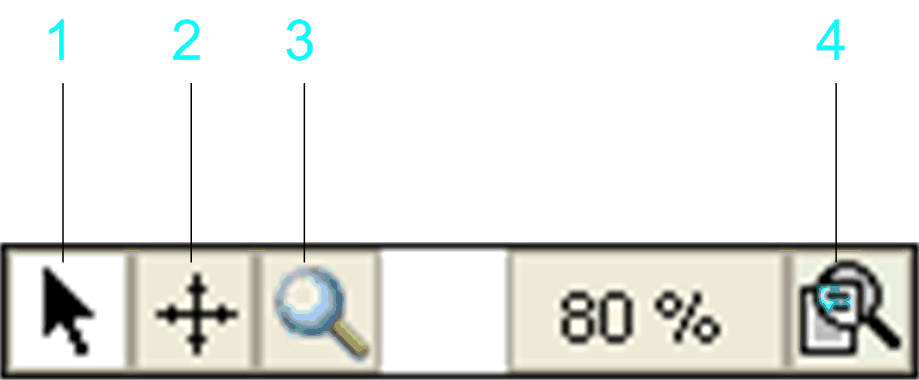

# Common Features of Graphic Editors

## Zooming, Panning, Magnifier Tools

The following zooming, panning, magnifier tools are available in the editors of all graphic programming languages.

The graphical editors for FBD, LD, CFC, and SFC provide a toolbar in the lower right corner of the editor window:

| Item number | Name | Description |
| --- | --- | --- |
| 1 | Back to standard editing mode | The pointer gets the usual shape of an arrow and you get back into the normal editing mode, in which you can select and edit elements in the editor window. |
| 2 | Panning tool | The pointer gets the shape of crossed arrows. You can click somewhere in the editor window and - while keeping the mouse-button pressed - shift the visible area of the chart within the window. |
| 3 | Magnifier tool | This function is useful when you have zoomed down the displayed chart to less than 100%. It opens a subwindow in the lower right corner of the editor window. As long as you move the pointer over your chart, this subwindow shows the respective part of the chart in 100% size.  If you now click the window, the subwindow closes and that segment of the chart which was shown in the subwindow, is displayed in 100% size. So, if you want to keep the previously set zoom factor, use the Back to standard editing mode button to get back to the normal editing mode. |
| 4 | Zooming tool | The zoom button opens a submenu where you can select one of the given zoom factors for the chart. To specify another value, click the ... button to open an edit dialog box. The current zoom factor is displayed to the left of the button. |

To zoom by mouse wheel, press the Ctrl key while scrolling the mouse wheel. The current zoom level is increased or decreased in steps of 10 percent.

You can drag function block declarations from the declaration part in the FBD and LD graphical editors to the editor view. To do this, select the full declaration (variable name and data type) and drag it to a suitable position in the editor view. In the ladder diagram, you can also drag Boolean declarations to the editor and insert them as contacts.

EIO0000002854.09