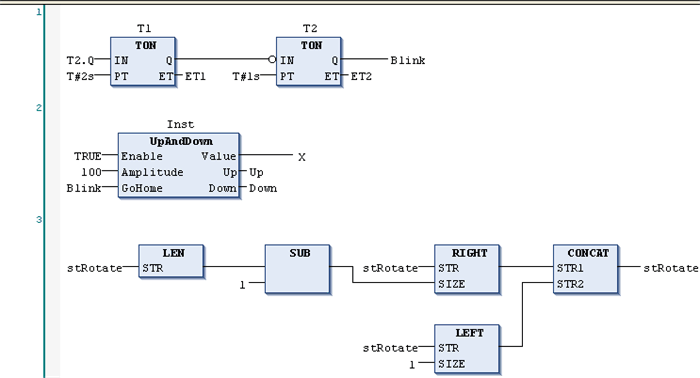

# Function Block Diagram (FBD) Language

## Overview

The Function Block Diagram is a graphically oriented programming language. It works with a list of networks. Each network contains a graphical structure of boxes and connection lines which represents either a logical or arithmetic expression, the call of a function block, a jump, or a return instruction.

FBD networks

EIO0000002854.09