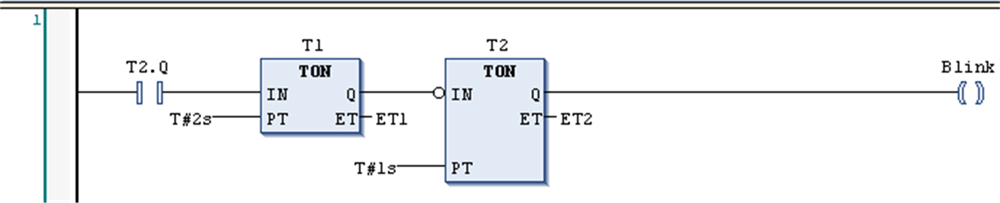

# Ladder Diagram (LD) Language

## Overview

The Ladder Diagram is a graphics-oriented programming language which resembles the structure of an electric circuit.

On the one hand, the Ladder Diagram is suitable for constructing logical switches, on the other hand it also allows you to create networks as in FBD. Therefore, the LD is useful for controlling the call of other POUs.

The Ladder Diagram consists of a series of networks, each being limited by a vertical current line (power rail) on the left. A network contains a circuit diagram made up of contacts, coils, optionally additional POUs (boxes), and connecting lines.

On the left side, there is 1 or a series of contacts passing from left to right the condition ON or OFF which corresponds to the boolean values TRUE and FALSE. To each contact a boolean variable is assigned. If this variable is TRUE, the condition will be passed from left to right along the connecting line. Otherwise, OFF will be passed. Thus, the coil or coils, which is/are placed in the right part of the network, receive an ON or OFF coming from left. Correspondingly the value TRUE or FALSE will be written to an assigned boolean variable.

Ladder Diagram network.

EIO0000002854.09