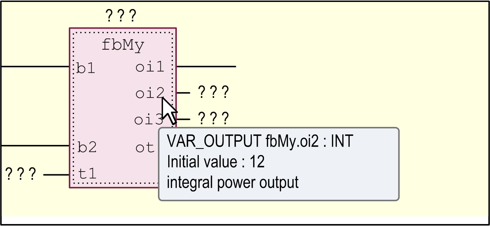
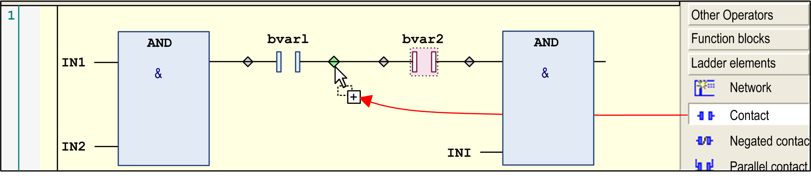
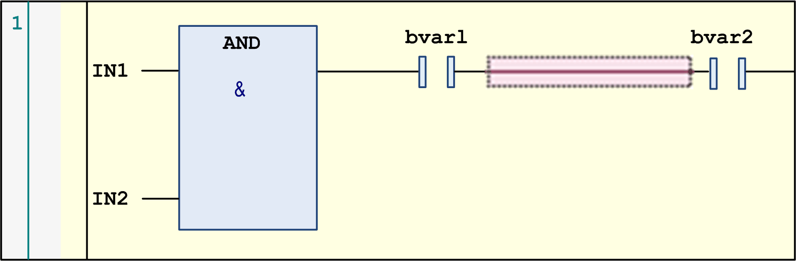
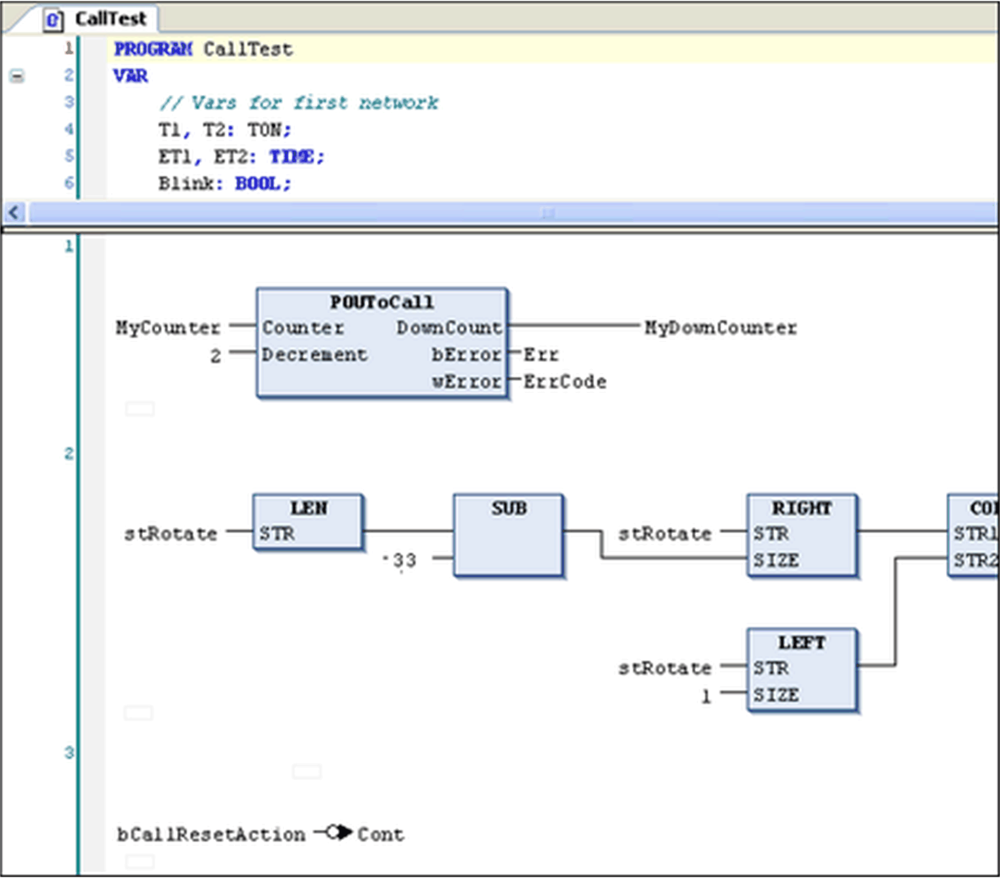
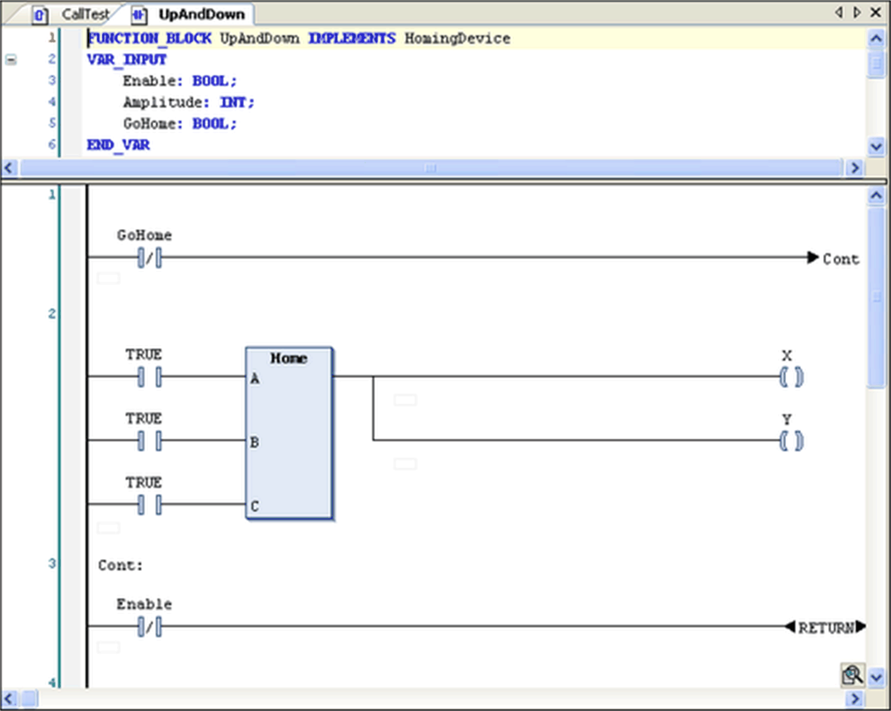

# Working in the FBD and LD Editor

## Overview

Networks are the basic entities in FBD and LD programming. Each network contains a structure that displays a logical or an arithmetical expression, a POU (function, program, function block call, and so on), a jump, a return instruction.

When you create a new object, the editor window automatically contains 1 empty network.

Refer to the general editor settings in the Options dialog box, category FBD/LD/IL for potential editor display options.

## Tooltip

Tooltips contain information on variables or box parameters.

The cursor being placed on the name of a variable or box parameter will prompt a tooltip. It shows the respective type. In case of function block instances the scope, name, datatype, initial value, and comment will be displayed. For IEC operators `SEL, LIMIT`, and `MUX` a short description on the inputs will display. If defined, the address and the symbol comment will be shown as well as the operand comment (in quotation marks in a second line).

Example: Tooltip on a POU output

## Inserting, Arranging, and Replacing Elements

* The commands for working in the editor are by default available in the [FBD/LD/IL menu](D-SE-0083470.html#D-SE-0083470). Frequently used commands are also available in the contextual menu. It depends on the current cursor position or the current selection (multiselection possible, see below [Selecting](#D-SE-0083467__D-SE-0083467.6)) which elements can be inserted via menu command.
* You can also drag elements with the mouse from the [**ToolBox**](D-SE-0083473.html#D-SE-0083473) to the editor window or from one position within the editor to another (drag and drop). For this purpose select the element to be dragged by a mouse-click, keep the mouse-button pressed and drag the element into the respective network in the editor view. As soon as you have reached the network, all possible insert positions for the respective type of element will be indicated by gray position markers. When you move the mouse-cursor on one of these positions, the marker will change to green and you can release the mouse-button in order to insert the element at that position.
* If you drag a function block, an operator, or a network from the [**ToolBox**](D-SE-0083473.html#D-SE-0083473) onto the up arrow or down arrow on the left-hand side of the editor, a new network is automatically created above or below the existing element.
* To replace an element by another one, draw another element on the position.
* To reposition an input connection or an output connection of a box, select the connection pin directly at the box and put it to the desired other position at the box via drag and drop.

Insert positions in LD editor

* You can use the cut, copy, paste, and delete commands, available in the Edit menu, to arrange elements. You can also copy an element by drag and drop: select the element within a network by a mouse-click, press the CTRL key and while keeping the mouse button and the key pressed, drag the element to the target position. As soon as that is reached (green position marker), a plus-symbol will be added to the cursor symbol. Then, release the mouse-button to insert the element.
* For possible cursor positions, refer to [*Cursor Positions in FBD, LD, and IL*](D-SE-0083469.html#D-SE-0083469).
* Inserting of EN/ENO boxes is handled diversely in the FBD and LD editor.

  Refer to the description of the Insert Box command for further information (Inserting of EN/ENO boxes is not supported in the IL editor).

## Navigating in the Editor

* You can use the ARROW keys to jump to the next or previous [cursor position](D-SE-0083469.html#D-SE-0083469). This is also possible between networks. The navigation with the ← and → key follows the signal flow which is normally from left to right and vice versa. In case of line breaks, the following cursor position can also be left under the currently marked position. If you press the ↑ or ↓ key the selection jumps to the next neighbor above or below the current position if this neighbor is in the same logical group (for example, a pin of a box). If no such group exists, it jumps to the nearest neighbor element above or below. Navigation through parallel connected elements is performed along the first branch.
* Press the HOME key to jump to the first element. Press the END key to jump to the last element of the network.
* Use the TAB key to jump to the next or previous [cursor position](D-SE-0083469.html#D-SE-0083469) within a network.
* Press CTRL + HOME to scroll to the begin of the document and to mark the first network.
* Press CTRL + END to scroll to the end of the document and to mark the last network.
* Press PAGE UP to scroll up 1 screen and to mark the topmost rectangle.
* Press PAGE DOWN to scroll down 1 screen and to mark the topmost rectangle.

## Selecting

* You can select an element, also a network, via taking the respective cursor position by a mouse-click or using the arrow or tab keys. Selected elements are indicated as red-shaded. Also refer to [*Cursor Positions in FBD, LD, and IL*](D-SE-0083469.html#D-SE-0083469).
* In the LD editor, you can also select the lines between elements in order to execute commands, for example, for inserting a further element at that position.

Selected line in LD editor

* Multi-selection of elements or networks is possible by keeping pressed the CTRL key while selecting the desired elements one after the other.

## Open a Function Block

If a function block is added to the editor, you can open this block with a double-click. Alternatively, you can use the command Browse - Go To Definition from the contextual menu.

FBD editor

LD editor

For information on the languages, refer to:

* [*Function Block Diagram - FBD*](D-SE-0083463.html#D-SE-0083463)
* [*Ladder Diagram - LD*](D-SE-0083464.html#D-SE-0083464)

EIO0000002854.09